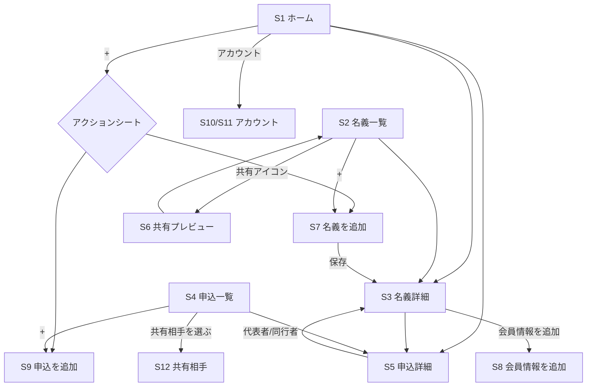
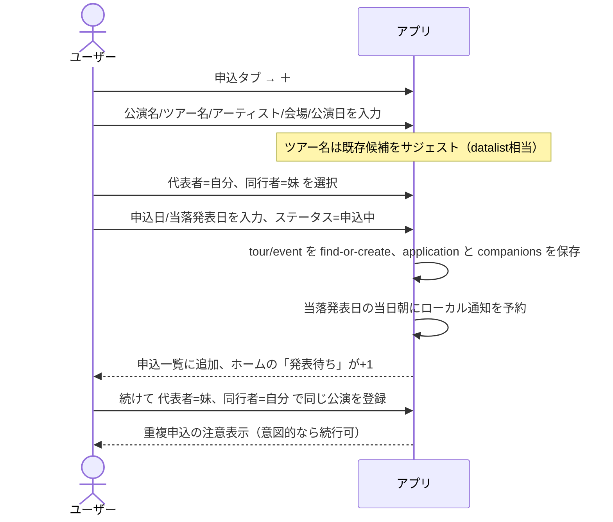
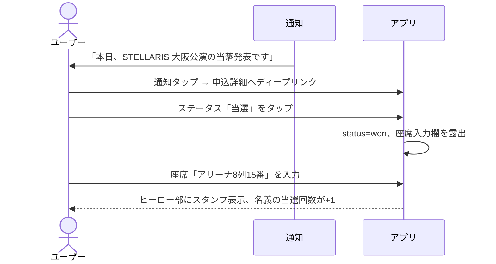
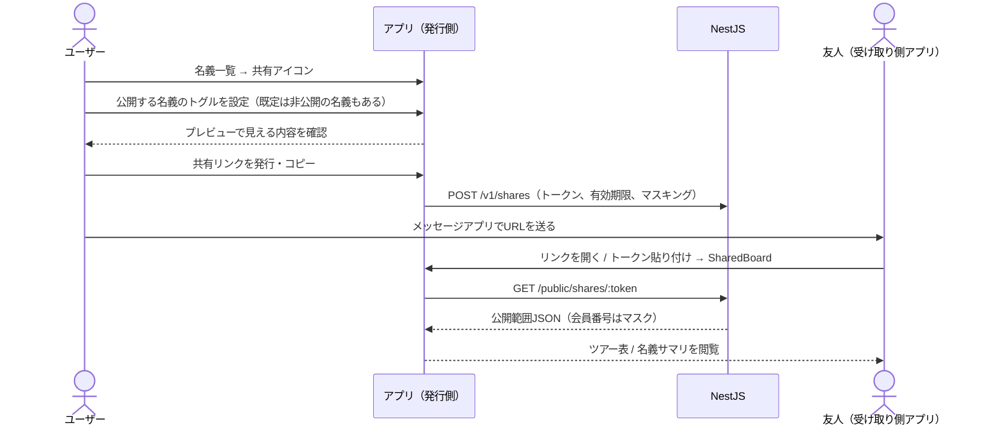

# 01. プロダクト概要・要件定義

> このドキュメントの位置づけ: モック `meigi-app-moc-dads.html` から読み取れる仕様を、開発可能な要件として言語化したものです。
> 全体の前提は [00-design-basis.md](./00-design-basis.md) を参照してください。技術的な実現方法は [02-architecture.md](./02-architecture.md) 以降で扱います。

---

## 1. 背景と課題

ライブやコンサートのチケットは、ファンクラブ（FC）先行抽選の当落に左右されます。
そのため熱心なファンは、自分のFC名義だけでなく、家族や友人の名義でも同じ公演に応募するという行動を取ります。
このとき次の管理負荷が発生します。

| 課題 | 具体的な失敗 |
|------|-------------|
| FCの年会費更新日が名義ごとにバラバラ | 更新を忘れ、いざ先行申込の時期に**名義が失効していて応募できない** |
| 誰の名義でどこに申し込んだか分からなくなる | 同じ公演に二重で申し込んでしまう / 逆に申し込んだつもりで漏れる |
| 当落と座席の記録が散逸する | 当日まで座席が分からない。次回以降の判断材料が残らない |
| 名義を貸してくれた人への説明ができない | 「私の名義、結果どうだった？」に即答できず、次回貸してもらえなくなる |

既存手段は「スプレッドシート」「メモアプリ」「スクリーンショット」で、
**更新期限のリマインドがない**・**共有が手作業**・**モバイルでの入力が苦痛**という点で不十分です。

---

## 2. ターゲットユーザー

### プライマリペルソナ: 「複数名義運用者」

- 20〜30代、アイドル・バンド・声優などのライブに年5〜20公演参戦
- FCに2〜4団体加入、名義は自分＋家族1〜2＋友人1〜2 で合計3〜5
- 年間のライブ関連支出は数万〜数十万円（**課金への抵抗が相対的に低い**）
- モックのサンプルデータ（本人・妹・友人2名 = 4名義、FC 3団体）がまさにこの像

### セカンダリペルソナ: 「名義を貸している人」

- 自分はそこまで熱心ではないが、家族・友人にFC名義を貸している
- 結果確認のためならアプリを入れてよい（自分で名義を運用するほどではない）
- → 共有は **トークン付きリンクを iOS アプリの SharedBoard で開く**（[04-api.md](./04-api.md) の公開共有経路）。**アプリ不要の独立 Web ビューは作らない**（2026-08-05 決定）

共有の正は「リンク発行 → 受け取り側がアプリで閲覧（必要なら write 編集）」である。

---

## 3. コアジョブと機能の対応

[00-design-basis.md](./00-design-basis.md) で定義した J1〜J4 を機能に展開します。

### J1: FCの更新期限を落とさない

| 要件 | 詳細 | モック該当 |
|------|------|-----------|
| R1-1 | 名義ごとに複数のFC会員情報を登録でき、それぞれに更新日・年会費・会員番号を持つ | `identities[].memberships[]` |
| R1-2 | 更新日までの残日数に応じて視覚的に警告する（期限切れ / 14日以内 / 30日以内 / それ以外） | `renewalBadge()` |
| R1-3 | ホームに「直近の参戦予定（当選分）」を公演日昇順で最大5件表示し、カウントダウンバッジを付ける | `screenHome()` の `upcoming` / `eventCountdownBadge` |
| R1-4 | 30日以内に更新期限を迎える件数をホームの指標に出す | `expiringCount` |
| R1-5 | 更新日の30日前 / 14日前 / 前日にローカル通知を送る | モック未実装（**追加要件**） |
| R1-6 | 更新期限が近い名義の一覧は、名義タブの「更新が近い順」ソートで辿れる | `screenIdentities` の `identitySort==='renewal'` |

> 旧モックにあったホームの「更新期限が近い名義」セクションは新モックで削除された。
> J1 のホーム接点は **指標カード（30日以内更新）＋ローカル通知＋名義タブのソート** で担保する。
> R1-2 の閾値はモックの実装値をそのまま採用（`d<0` 期限切れ / `d<=14` 警告 / `d<=30` 注意）。

### J2: 誰の名義でどこに申し込んだかを管理する

| 要件 | 詳細 | モック該当 |
|------|------|-----------|
| R2-1 | 申込には**代表者（FC名義で申し込む人）**を1名、**同行者**を0〜3名設定できる | `repIdentityId` / `companions[]`（追加フォームは最大3スロット） |
| R2-2 | 同行者は登録済み名義から選ぶか、氏名テキストで直接入力できる（名義未登録の人も記録できる） | `companions[].identityId` が null 許容 |
| R2-3 | 同じ公演に対し、代表者を入れ替えた複数の申込を登録できる | サンプル `id:101` と `id:109` が同一公演・代表者入替 |
| R2-4 | 申込をツアー単位でグルーピングし、公演×名義の表として俯瞰できる | `groupApplicationsByTour()` / `screenApplicationsTable()` |
| R2-5 | 公演名・アーティスト名・会場名で申込を検索できる | `state.appSearch` |
| R2-6 | ステータス（すべて / 下書き / 申込中 / 当選 / 落選）で絞り込める | `state.appFilter` |
| R2-7 | 名義詳細から、その名義が**代表者または同行者として関わった**すべての申込を見られる | `applicationsForIdentity()` |
| R2-8 | 同一公演・同一名義の重複申込を検知して注意喚起する | モック未実装（**追加要件**） |

> R2-7 は重要な仕様です。モックは「代表者として申込んだ回」と「同行者として名前が挙がった回」の**両方**を名義の履歴として集計しています。当選回数のカウント（`winCount()`）もこの定義に従います。

### J3: 当落と座席を記録する

| 要件 | 詳細 | モック該当 |
|------|------|-----------|
| R3-1 | ステータスは「下書き / 申込中 / 当選 / 落選」の4値（UI）。詳細画面でワンタップ切替。設計上は `cancelled` も保持するがモック未実装 | `setStatus()` / フィルタ「下書き」 |
| R3-2 | 座席はテキストで自由入力（例「アリーナ8列15番」「2階 B-12, B-13」）。詳細画面でインライン編集 | `saveSeat()` |
| R3-3 | ステータスを当選以外に変えても座席情報は消さない | `setStatus()` のコメントに明記 |
| R3-4 | 当落発表日を保持し、ホームに「当落発表待ち」を発表日の昇順で表示 | `resultDate` / `screenHome()` |
| R3-5 | 当落発表日の当日朝にローカル通知を送る | モック未実装（**追加要件**） |
| R3-6 | 名義ごとの当選回数・申込件数・当選率を集計する | `winCount()`、当選率は**追加要件** |
| R3-7 | ホームに「直近の参戦予定（当選かつ公演日が今日以降）」を表示する | `upcoming` |

> R3-2 の座席は自由入力を維持します。会場によって表記体系が全く異なるため、構造化を強制すると入力が破綻します。
> ただし将来の統計のために、構造化フィールド（ブロック/列/番）を任意で併設します（[03-database.md](./03-database.md)）。

### J4: 名義主・同行者と共有する

| 要件 | 詳細 | モック該当 |
|------|------|-----------|
| R4-1 | 名義ごとに「当落履歴を共有時に公開するか」を切り替えられる | `identity.historyVisible` |
| R4-2 | 共有相手に何が見えるかを事前にプレビューできる | `screenSharePreview()` |
| R4-3 | ツアー単位で申込表を共有できる。共有時に相手の**アカウントID**を記録できる（ACLではない） | `openShareRecipients` / `shareTour` / `sharedWith` |
| R4-4 | 共有相手は**トークン付きリンクをアプリの SharedBoard で開いて**閲覧できる（独立 Web ビューは作らない） | モックは `window.storage` で代替。実装は `SharedBoardView` + `GET /public/shares/:token` |
| R4-5 | 共有された表のステータス・座席を相手も編集でき、明示操作で同期される | `cycleSharedStatus()` / `saveSharedSeat()` → 実装は `PATCH /public/shares/:token/items/:item_key`（`permission:"write"`） |
| R4-6 | 会員番号は共有時に既定でマスキングされる | モック未実装（**追加要件・セキュリティ上必須**） |
| R4-7 | 各ユーザーは公開用ショートID（`ACC-XXXXXX`）を持ち、共有相手指定に使える | `generateAccountId` / アカウント設定 |

> R4-5 は Realtime ではなく **明示操作での同期**（共有ボード上の編集 → Public API）を採用する。モックの「自分の変更を反映」と同型で、常時接続は使わない。

### J5（横断）: 愛着を持てる体験

| 要件 | 詳細 | モック該当 |
|------|------|-----------|
| R5-1 | 名義ごとに「名義カラー」を設定でき、アバター・ツアー表の色分けになる | `identity.color` / ラベル「名義カラー」 |
| R5-2 | アプリ全体のテーマ色（背景・ナビ・ボタン）は**アカウント設定の背景カラー**で変更する。名義カラーとは独立 | `appTheme` / `applyTheme()` / `screenAccountSettings` |
| R5-3 | テーマ色は自動的にコントラスト比を担保する明度に補正される | `ensureDarkEnough()` |
| R5-4 | 名義に自由記述の備考を持てる（連絡手段、注意点） | `identity.note` |
| R5-5 | アバター画像は使わず、氏名の頭文字＋背景色で表現する | `row__avatar` |
| R5-6 | ホーム見出し等に使うアプリ表示名を変更できる（ストア正式名は固定） | `appName` / `saveAppName()` |
| R5-7 | アカウントにユーザーネームを持てる | `auth.username` |

> 旧仕様「推しカラーを選ぶとアプリ全体のテーマが変わる」は新モックで廃止された。
> R5-5 は意図的な設計（画像なしで Storage / モデレーションコストを回避）。詳細は [06-infrastructure.md](./06-infrastructure.md)。

---

## 4. 画面一覧

モックの画面を実装対象とします（2026-07-31 更新モック基準）。

| ID | 画面 | 遷移 | 主な内容 | モック関数 |
|----|------|------|---------|-----------|
| S1 | ホーム | タブ1 | 指標3種、直近の参戦予定（当選分）、当落発表待ち。左上でアカウントへ | `screenHome` |
| S2 | 名義一覧 | タブ2 | 並び替え（更新が近い順 / 当選が多い順 / 入会が古い順）、名義行 | `screenIdentities` |
| S3 | 名義詳細 | S1/S2 から push | プロフィール、名義カラー、備考、共有設定、FC会員情報、申込履歴 | `screenIdentityDetail` |
| S4 | 申込一覧 | タブ3 | リスト / ツアー表、検索、ステータス絞り込み（下書き含む） | `screenApplications` |
| S5 | 申込詳細 | S1/S3/S4 から push | チケット風ヒーロー、ステータス4ボタン、代表者・同行者・日付・座席 | `screenApplicationDetail` |
| S6 | 共有プレビュー | S2 から push | 名義ごとの公開設定、プレビュー、リンクコピー | `screenSharePreview` |
| S7 | 名義を追加 | modal | 氏名・関係性・入会日・名義カラー・メモ | `screenAddIdentity` |
| S8 | 会員情報を追加 | modal | FC名・会員番号・更新日・年会費 | `screenAddMembership` |
| S9 | 申込を追加 | modal | 公演情報＋代表者＋同行者最大3＋日付＋ステータス（下書き含む） | `screenAddApplication` |
| S10 | ログイン / 新規登録 | S1 から push（未ログイン時） | Google / メール+パスワード。本番は Apple を主軸に追加 | `screenLogin` |
| S11 | アカウント設定 | S1 から push（ログイン後） | ユーザーネーム、アカウントID、アプリ名、背景カラー、ログアウト | `screenAccountSettings` |
| S12 | 共有相手を選ぶ | ツアー表から modal | 相手アカウントID（カンマ区切り）。記録用でACLではない | `screenShareRecipients` |

### 画面遷移図

タブは3つ（ホーム / 名義 / 申込）。アカウントはタブではなくホーム左上からの push。モーダル表示中はタブバーを隠す。

詳細なモック差分は [10-mock-delta-2026-07-31.md](./10-mock-delta-2026-07-31.md)。

---

## 5. 主要ユースケースのフロー

### UC-1: 新しいツアーに家族分まとめて申し込んだ記録をつける

ここで重要なのは、**同一公演への代表者入替の重複申込を「エラーにしない」**ことです。
これは当選確率を上げるための正当な運用であり、サンプルデータ（`id:101`/`id:109`）もこのケースを表現しています。
検知して知らせるだけに留めます。

### UC-2: 当落発表日に結果を記録する

**この瞬間に広告を出してはいけません**（[07-monetization.md](./07-monetization.md)）。

### UC-3: 名義を貸してくれた友人に結果を伝える

モックの `historyVisible` が既定で友人名義について `false` になっている点（`id:3`, `id:4`）は、
**共有はオプトインである**という設計意図を示しています。この既定値を実装でも守ります。

---

## 6. 非機能要件

| 分類 | 要件 |
|------|------|
| プラットフォーム | iOS 17.0 以降。iPhone のみ（iPad は Phase 3 で検討）。ダークモード対応 |
| オフライン | **全画面がオフラインで閲覧・編集可能**。同期はオンライン復帰時 |
| 起動時間 | コールドスタートから初画面表示まで 1.5 秒以内 |
| レスポンス | 画面遷移 100ms 以内、リスト描画は名義50件 / 申込1,000件で滞りなし |
| アクセシビリティ | Dynamic Type 対応、コントラスト比 4.5:1 以上、タップ領域 44pt 以上、VoiceOver 対応。DADS のアクセシビリティ品質基準に準拠 |
| ローカライズ | 日本語のみ（Phase 1）。文言はカタログ化して将来の多言語化に備える |
| データ保全 | ユーザーデータの喪失をゼロに。削除は全てソフトデリート＋復元可能期間30日 |
| セキュリティ | 会員番号は暗号化保存。共有はトークンベースで失効可能。詳細は [08-compliance-risk.md](./08-compliance-risk.md) |
| 可用性 | 同期サーバー障害時もアプリは完全に動作する（ローカルファースト） |

---

## 7. 用語集

設計・実装・UI文言で表記を統一します。

| 日本語 | 英語（コード） | 定義 |
|--------|---------------|------|
| 名義 | identity | 申込に使う人格。自分・家族・友人など。FC会員情報を0件以上持つ |
| 関係性 | relation | 名義とユーザーの関係。本人(self) / 家族(family) / 友人(friend) / その他(other) |
| ファンクラブ | fan_club | アーティストの公式FC。例「STELLARIS OFFICIAL FAN CLUB」 |
| 会員情報 | membership | ある名義のあるFCへの加入情報。会員番号・更新日・年会費を持つ |
| 更新日 | renewal_on | FC会員資格の次回更新日。これを過ぎると失効 |
| ツアー | tour | 複数公演をまとめる単位。例「STELLARIS ARENA TOUR 2026」 |
| 公演 | event | 個別の日時・会場の公演。例「〜 -大阪公演-」 |
| 申込 | application | ある公演に対する1回の応募。代表者1名＋同行者0名以上 |
| 代表者 | rep_identity | FC名義で実際に申し込む人 |
| 同行者 | companion | 代表者の申込に同行する人 |
| 申込枠 | round_name | FC1次先行、FC2次、一般先行 等の抽選ラウンド |
| ステータス | status | 申込中(applied) / 当選(won) / 落選(lost) / 下書き(draft) / 取消(cancelled) |
| 当落発表日 | result_on | 抽選結果が発表される日 |
| 推しカラー | （廃止用語） | 新モックでは使わない。代わりに「名義カラー」「背景カラー」 |
| 名義カラー | identity.color | 名義の識別色。アバター・ツアー表のドット。アプリテーマには非連動 |
| 背景カラー | theme_color | アカウント設定で選ぶアプリ全体のテーマ色 |
| アプリ表示名 | app_display_name | ホーム見出し等。既定は「参戦名義帳」。ストア正式名とは別 |
| アカウントID | account_id | 公開用ショートID（`ACC-XXXXXX`）。共有相手指定に使用 |
| ユーザーネーム | username | アカウントの表示名 |
| 共有リンク | share_link | 閲覧範囲を限定したトークン付きURL。アプリの SharedBoard で開く。`permission` は `read` / `write` |

> UI文言は必ず日本語列の表記を使います（「ID」「エンティティ」等の実装語をユーザーに見せない）。

---

## 8. モックに対する変更・追加の一覧

設計にあたりモックから変更する点を明示します。実装時の判断根拠になります。

| # | 変更内容 | 理由 |
|---|---------|------|
| C1 | `applications` にべた書きされていた ツアー名 / 公演名 / アーティスト / 会場 を **tours / events / artists / venues に正規化** | ツアー表・重複検知・統計をSQLで解けるようにする。同じ公演の情報がレコード間で食い違うのを防ぐ |
| C2 | ローカル通知（更新期限・当落発表日）を**追加** | J1 の価値の中核。モックはブラウザのため未実装だが、これがないとアプリを開く理由が生まれない |
| C3 | 会員番号を**暗号化保存 + 既定で下4桁表示**に変更 | 他人の機微情報を平文で持つリスクを排除（[08](./08-compliance-risk.md)） |
| C4 | 重複申込の**検知と注意表示**を追加 | J2 の失敗パターンへの直接的な対処 |
| C5 | 申込枠（`round_name`）を**追加** | 実運用ではFC1次/2次/一般先行を区別する必要があり、これがないと同一公演の複数申込を区別できない |
| C6 | 共有を `window.storage`（Claude artifact 依存）から **トークン付きリンク + アプリ内 SharedBoard** に変更。**独立 Web ビューは作らない** | 受け取り側も iOS アプリで閲覧・編集する（2026-08-05） |
| C7 | 共同編集（write）は Public API + SharedBoard で実装済み | 当初 Phase 2 想定だったが先行実装。Realtime は使わない |
| C8 | ステータスに `draft` / `cancelled` を追加 | 「申込予定をメモ」「取消」。**下書きは新モックでUI実装済**。取消は設計のみ |
| C9 | 名義の並び順（`sort_order`）を追加 | ユーザーが手動で並べ替えたいという要求は必ず出る |
| C10 | 申込に `ticket_count` / `price_yen` を追加 | 支出把握。他者への請求・送金・出品にはつなげない（[08](./08-compliance-risk.md)） |
| C11 | 認証はモックの Google/メールに加え **Sign in with Apple を本番必須** | App Store Guideline 4.8。詳細は [10-mock-delta-2026-07-31.md](./10-mock-delta-2026-07-31.md) |
| C12 | 共有の共同編集はモック先行 → **アプリ内 SharedBoard + `permission:"write"` で実装** | `shared_with` は記録用メタ（ACLではない） |
