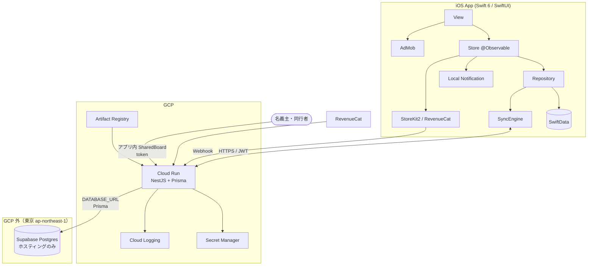
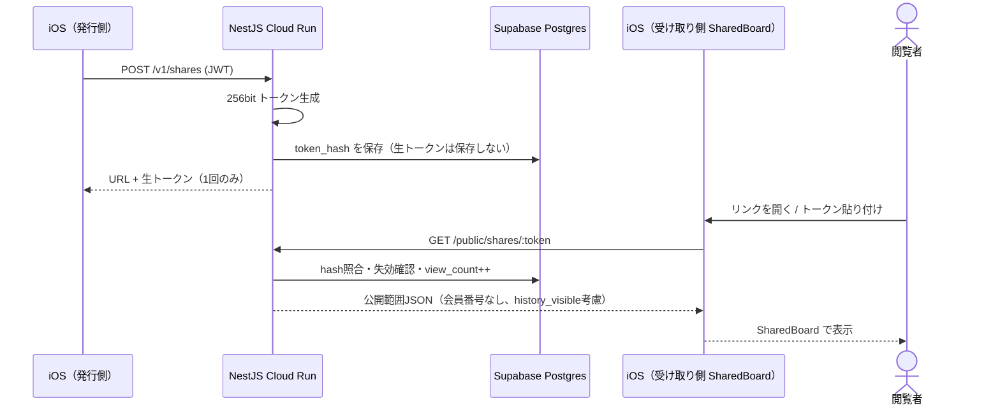

# 02. アーキテクチャ・技術スタック選定

> このドキュメントの位置づけ: システム全体の構造と、技術選定の判断根拠（ADR）を記録します。
> 前提は [00-design-basis.md](./00-design-basis.md)、要件は [01-product-overview.md](./01-product-overview.md) を参照してください。
>
> **2026-07-31 更新**: BE を Supabase BaaS から **NestJS + GCP Cloud Run** に切り替えました（ユーザー指定）。
> **2026-07-31 更新**: DB の正を Cloud SQL から **Supabase PostgreSQL（ホスティングのみ）** に変更。NestJS + Prisma が唯一の DB クライアント（`DATABASE_URL` 接続）。Supabase Auth / PostgREST / Realtime / Storage / Edge Functions は使わない。
> **2026-08-01 更新**: NestJS アプリ内レイヤを **Controller → UseCase → Service → Prisma** に確定（ADR-009）。
> **2026-08-05 更新**: 共有閲覧は **iOS アプリ内 SharedBoard** が正。アプリ不要の Next.js 共有 Web は作らない。

---

## 1. アーキテクチャを規定した制約

| 制約 | 内容 | アーキテクチャへの帰結 |
|------|------|----------------------|
| **X1: 個人〜2名体制** | 運用に人手を割けない | NestJS はモジュールを小さく保ち、ジョブ/Realtimeを持たない |
| **X2: インフラ費を極小に** | ユーザー数0の段階で月額を払いたくない | Phase 0 はサーバーなし。Phase 1 は Cloud Run scale-to-zero + **Supabase Free**（Postgres ホスティングのみ）で DB 常時課金を避ける |
| **X3: 共有はアプリ内 SharedBoard** | 独立 Web ビューは作らない（2026-08-05） | NestJS の公開 API（`/public/shares/:token`）を iOS が token のみで叩く |
| **X4: BEは NestJS、実行は Cloud Run** | ユーザー指定 | 認可・課金・共有はアプリ層。DBは PostgreSQL |

---

## 2. 全体構成（Phase 1）



### NestJS モジュール構成

```
apps/api (NestJS)
├── auth/          Sign in with Apple 検証、JWT発行・リフレッシュ
├── users/         profiles, entitlements
├── identities/    名義 CRUD + プラン上限
├── memberships/   FC会員情報
├── tours/         tours / events
├── applications/  申込 + companions、tour/event find-or-create
├── sync/          pull / push（差分同期）
├── shares/        共有リンク発行・公開解決
├── billing/       RevenueCat Webhook
├── stats/         集計（ビュー or クエリ）
└── health/        /health（Cloud Run 用）
```

### NestJS アプリ内レイヤ（Controller / UseCase / Service / Prisma）

```
HTTP Request
  → Controller（DTO・Guard・ステータスコード）
    → UseCase（1エンドポイント＝1ユースケースのオーケストレーション）
      → Service（ドメイン知識・認可の正・再利用ロジック）
        → Prisma（DB アクセス）
```

| 層 | 責務 | このアプリでの例 |
|----|------|------------------|
| **Controller** | HTTP・DTO 検証・Guard・ステータスコード。ビジネス判断は書かない | `POST /v1/identities`、JWT から `userId` 取得 |
| **UseCase** | 横断フローのオーケストレーション。複数 Service を呼ぶ | 名義作成：上限チェック → 作成 → レスポンス整形 |
| **Service** | ドメイン知識・認可（`ownerId`）・再利用ロジック。Prisma を直接使う | `IdentitiesService.create`、共有マスキング |
| **Prisma** | DB アクセス。Repository 抽象は Phase 1 では置かない | `prisma.identity.findFirst(...)` |

**運用ルール**

1. Prisma は **Service まで**。Controller / UseCase から直接叩かない
2. 単純 CRUD は UseCase を省略し `Controller → Service` でもよい
3. 同期・共有発行・課金 Webhook・名義上限など横断処理は UseCase を厚くする
4. Service 同士の相互注入による循環依存を避ける（必要なら UseCase 側で組み立てる）
5. Domain Entity / Repository のフルクリーンアーキテクチャは採用しない（X1: 少人数体制）

モジュール内の典型ディレクトリ:

```
identities/
├── identities.controller.ts
├── use-cases/
│   └── create-identity.use-case.ts   # 省略可（単純 CRUD）
├── identities.service.ts
├── dto/
└── identities.module.ts
```

詳細な決定根拠は [ADR-009](#adr-009-nestjs-は-controller--usecase--service--prisma)。

### クライアント側レイヤ

```
View → Store → Repository(protocol) → LocalStore(SwiftData)
                                    → ApiClient(NestJS /v1)
                                    → SyncEngine
```

UIは常に SwiftData のみを読む（ローカルファースト）。NestJS は SyncEngine 経由でのみ触る。

---

## 3. ADR

### ADR-001: NestJS + Cloud Run + Supabase Postgres を採用する

**ステータス**: 採用（ユーザー指定）

**決定**
- API: NestJS (TypeScript) + Prisma
- 実行: GCP Cloud Run（コンテナ、`minScale=0`）
- DB: **Supabase PostgreSQL（ホスティングのみ）**。NestJS + Prisma が唯一の DB クライアント（`DATABASE_URL` 接続。本番は connection pooler 推奨）
- リージョン: 東京（`ap-northeast-1`）
- Phase 1 既定: Supabase Free。初期代替候補として Neon Free も可
- Cloud SQL は将来 GCP 一体運用や規模拡大時のオプション（Phase 1 既定ではない）

**理由**
1. ユーザーが NestJS / Cloud Run を希望している
2. プラン上限・共有マスキング・Webhook 署名検証を Service / Guard に明示実装できる
3. Cloud Run はトラフィックが無い時間帯の課金を抑えやすい
4. Supabase Free の Postgres ホスティングなら DB 常時課金を避けられる（X2 に合致）
5. Prisma + PostgreSQL で `03-database.md` のスキーマ・ビューをそのまま使える
6. Supabase Auth / PostgREST / Realtime / Storage / Edge Functions は使わず、BaaS ロックインを避けつつ安価な Postgres を得られる

**トレードオフ（受け入れる）**
- Supabase BaaS 直結より実装量が増える（Auth・認可・マイグレーション・デプロイを自前管理）
- DB が GCP 外（Supabase）に置かれるため、Cloud Run とのネットワークレイテンシ・運用分散が生じる
- Supabase Free は容量・接続数に制限あり。MAU 増加時は Supabase Pro（≈$25/月）または Cloud SQL への移行を検討
- Cloud Run のコールドスタート（同期はBGなのでUX影響は限定的）

**却下した隣接案**
| 案 | 理由 |
|----|------|
| Supabase BaaS 直結（Auth / PostgREST / RLS） | ユーザーが NestJS + Cloud Run を希望。認可・課金をアプリ層で制御したい |
| Cloud SQL を Phase 1 既定 | アイドルでも月額が発生し X2 に反する。規模拡大時のオプションとして保留 |
| NestJS on GKE | 初期運用が重い。Cloud Run で足りる |
| NestJS on Compute Engine 常駐 | scale-to-zero できず X2 に反する |
| NestJS + Firestore | 集計要件と相性が悪い。Postgres を維持 |

---

### ADR-002: 認可は NestJS が正、RLS は任意の二重防衛

**ステータス**: 採用

NestJS が DB への唯一のクライアントになるため、認可はサービス層で行う。

```typescript
// 例: 名義取得
async findOne(userId: string, id: string) {
  const row = await this.prisma.identity.findFirst({
    where: { id, ownerId: userId, deletedAt: null },
  });
  if (!row) throw new NotFoundException();
  return row;
}
```

- すべてのユーザーデータクエリに `ownerId = currentUser.id` を付与する（共有公開APIを除く）
- Prisma のミドルウェア / 拡張で `ownerId` の付け忘れを検知する方針を推奨
- Postgres RLS は「アプリバグ時の最終防衛」として後から足せる。Phase 1 必須ではない
- `entitlements` の更新は Billing モジュール（Webhook）のみ。クライアント向け PATCH は提供しない

---

### ADR-003: ローカルファースト（SwiftData が読み取りの唯一の源）

**ステータス**: 採用（変更なし）

Phase 0（サーバーなし）→ Phase 1（NestJS同期）へ UI を書き換えずに移行する。
保存の成功はローカル保存完了をもって返す（楽観的更新）。

---

### ADR-004: 同期は updated_at ベースの Last-Write-Wins

**ステータス**: 採用（変更なし）

- 全テーブルに `updated_at` / `deleted_at`
- `updated_at` は**サーバー（NestJS）が `now()` で確定**
- クライアント生成 UUID（v7）で冪等 upsert
- エンドポイント: `POST /v1/sync/pull`, `POST /v1/sync/push`（詳細は [04-api.md](./04-api.md)）

---

### ADR-005: プッシュ通知はローカル通知が第一選択

**ステータス**: 採用（変更なし）

FC更新期限・当落発表日は端末側でスケジュール。
Cloud Scheduler / APNs バッチは Phase 2（共有ボード更新通知）まで持たない。

---

### ADR-006: 共有はトークン付きURL + NestJS 公開API（iOS SharedBoard）

**ステータス**: 採用（2026-08-05: 閲覧クライアントは iOS SharedBoard。独立 Web ビューは廃止）



---

### ADR-007: Phase 0 をサーバーなしでリリースする

**ステータス**: 採用（変更なし）

Cloud Run / Supabase Postgres を契約する前に、SwiftData のみで PMF を検証する。
機種変更対策として JSON エクスポート/インポートを Phase 0 に含める。

---

### ADR-008: 認証は NestJS 自前 JWT（Identity Platform は使わない）

**ステータス**: 採用

1. iOS が Sign in with Apple で identity token を取得
2. `POST /v1/auth/apple` に送信
3. NestJS が Apple の公開鍵で検証し、`users` / `profiles` / `entitlements(free)` を upsert
4. 自前の access JWT（短命）+ refresh token（DBまたはhttpOnly相当の安全な保存）を返す

**Identity Platform / Firebase Auth を使わない理由**: 追加課金とベンダー依存を増やさず、Apple 検証だけで足りるため。

---

### ADR-009: NestJS は Controller → UseCase → Service → Prisma

**ステータス**: 採用（2026-08-01）

**決定**
- アプリ内レイヤは **Controller / UseCase / Service / Prisma** の基本3層 + ORM
- 認可の正は **Service**（ADR-002 と整合）
- Phase 1 では Prisma 上に Repository 抽象を置かない
- 単純 CRUD は UseCase 省略可。横断フロー（sync / shares / billing / プラン上限）は UseCase を必須とする

**理由**
1. プラン上限・共有マスキング・Webhook・同期 LWW をユースケース単位でテストしやすい
2. NestJS 標準の Controller/Service に UseCase を足すだけで、学習コストが低い
3. フルクリーンアーキテクチャ（Domain Entity / Port / Adapter）は X1（個人〜2名）に対して過剰

**運用ルール**
- Prisma は Service まで。Controller / UseCase から直接叩かない
- UseCase は薄いオーケストレータ。空の中継層にしない
- Service が Prisma の薄いラッパーだけにならないよう、認可・上限・マスキングをここに集約する
- UseCase 同士の相互注入で循環依存を作らない

**却下した隣接案**
| 案 | 理由 |
|----|------|
| Controller → Service のみ | sync / shares / billing の横断オーケストレーションが Service に肥大化する |
| フルクリーンアーキテクチャ + Repository | 少人数体制で抽象が増えすぎる。Prisma がその役割を兼ねる |
| Controller から Prisma 直叩き | 認可漏れ・テスト困難。ADR-002 に反する |

モジュール構成・ディレクトリ例は [NestJS アプリ内レイヤ](#nestjs-アプリ内レイヤcontroller--usecase--service--prisma) を参照。

---

## 4. 同期サイクル（概要）

1. **プル**: 各テーブル `updated_at > cursor` を NestJS が返す（`deleted_at` 含む）
2. **マージ**: LWW。ローカル未送信があれば `updated_at` 比較
3. **プッシュ**: 未送信キューを `POST /v1/sync/push` でバッチ upsert
4. **カーソル更新**: レスポンスの `serverTime` / 最大 `updated_at`

トリガ: 起動 / フォアグラウンド復帰 / 編集後デバウンス(3秒) / BGAppRefreshTask。定期ポーリングはしない。

---

## 5. プラン上限の強制

| 層 | 役割 |
|----|------|
| iOS | UX用の事前判定。4件目追加でペイウォール |
| NestJS | 正。`CreateIdentityUseCase` → `IdentitiesService.create` で `entitlements` を見て 3+bonus を超えたら `PLAN_LIMIT_IDENTITY` |
| DB | CHECK やトリガは任意。アプリ層を正とする |

オフラインで超過作成した名義は同期時に拒否し、**データを消さず**「同期できない名義」として明示する。

---

## 6. 技術スタック一覧（確定版）

| レイヤ | 技術 |
|--------|------|
| クライアント | Swift 6 / SwiftUI / SwiftData / iOS 17+ |
| API | NestJS（Controller / UseCase / Service）+ Prisma + class-validator |
| 実行 | GCP Cloud Run |
| DB | Supabase PostgreSQL 15+（ホスティングのみ。NestJS + Prisma が唯一のクライアント） |
| 秘密情報 | Secret Manager |
| イメージ | Artifact Registry |
| 共有ボード | iOS SharedBoard → NestJS `GET/PATCH /public/shares/:token`（独立 Web ビューは作らない） |
| 課金 | StoreKit 2 + RevenueCat → NestJS Webhook |
| 広告 | AdMob |
| 監視 | Sentry + Cloud Logging |
| CI/CD | GitHub Actions + Xcode Cloud |

---

## 7. 未決事項

| # | 論点 | 選択肢 | 決定期限 |
|---|------|--------|---------|
| Q1 | ~~会員番号の暗号化鍵~~ | **2026-08-20 撤回**（`docs/08-compliance-risk.md` §2.3）。会員番号は暗号化せず全桁を平文で保存するため本論点自体が消滅 | — |
| Q2 | Phase 1 直後のDB | **Supabase Free（推奨）** / Neon Free / 本番安定時は Supabase Pro or Cloud SQL | Phase 1 着手時 |
| Q3 | ORM | Prisma（推奨）/ TypeORM | Phase 1 着手時 |
| Q4 | refresh token 保存 | **決定済み**: `refresh_tokens` DBテーブル + 回転式 opaque token（`sha256`ハッシュのみ保存、生値は発行時のみ返す）。実装済み（`apps/api/src/auth/`） | Phase 1 |
