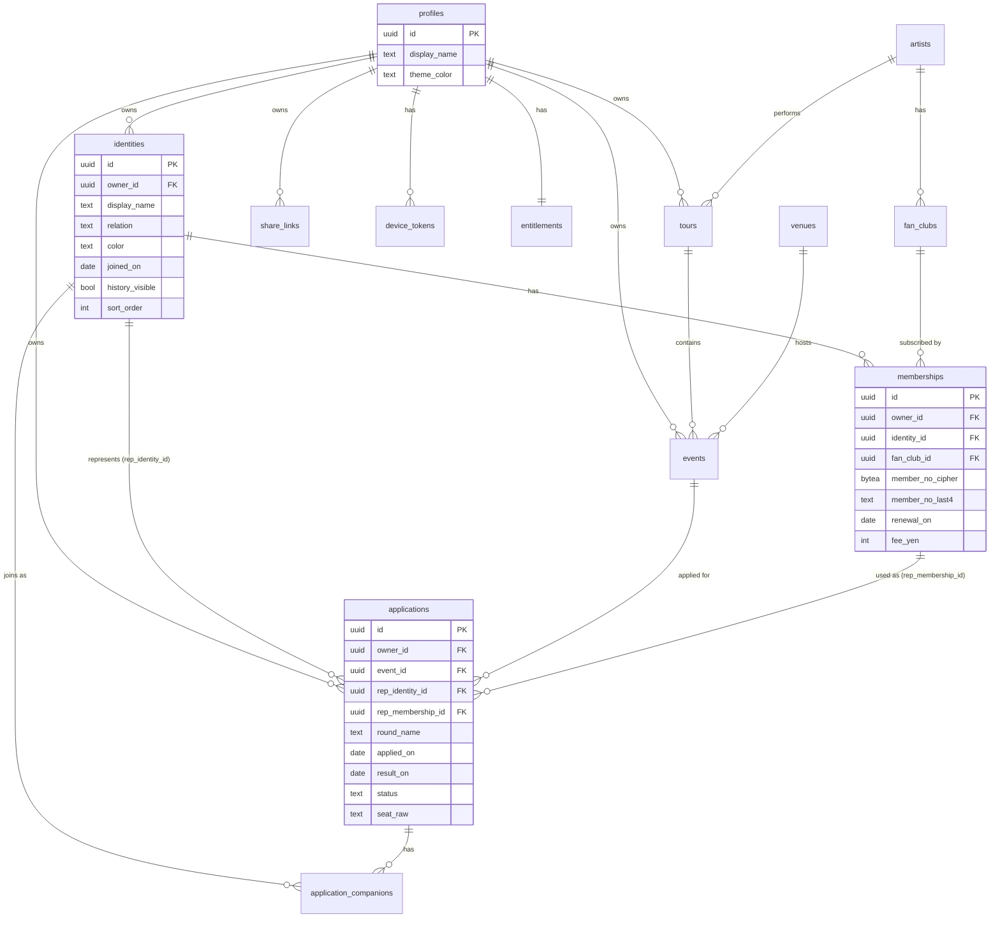

# 03. データベース設計

> このドキュメントの位置づけ: PostgreSQL（Cloud SQL）のスキーマ、インデックス、ビュー、マイグレーション方針を定義します。
> 前提は [00-design-basis.md](./00-design-basis.md)、アーキテクチャ判断は [02-architecture.md](./02-architecture.md) を参照してください。
> クライアント側（SwiftData）の対応モデルは [05-ios-client.md](./05-ios-client.md) にあります。
>
> **2026-07-31 更新**: BE は NestJS + Prisma。DBクライアントは NestJS のみ。
> 認可の正はアプリケーション層。本章の RLS 記述は **任意の二重防衛** として残す（Phase 1 必須ではない）。

---

## 0. NestJS 前提での読み替え

| 旧（Supabase案） | 新（NestJS + Cloud Run） |
|------------------|--------------------------|
| PostgREST がクライアントから直叩き | NestJS REST `/v1` のみが DB に触る |
| RLS が認可の正 | NestJS Guard / Service が認可の正 |
| `auth.uid()` | JWT の `sub`（NestJS が検証した user id） |
| Edge Functions | NestJS の Controller（Webhook・共有発行） |
| Supabase Auth | `POST /v1/auth/apple` で自前ユーザー発行 |
| マイグレーション `supabase/migrations` | Prisma Migrate（または同等の SQL マイグレーション） |

テーブル・カラム・ビュー（`v_identity_stats` 等）の意味は変更しません。
Prisma schema は本章の DDL を 1 対 1 で写像します。`auth.users` への FK は
NestJS 管理の `users`（または `profiles.id`）テーブルに読み替えてください。

```sql
-- NestJS 版: profiles は auth.users ではなく自前 users を参照
create table users (
  id              uuid primary key,           -- クライアント/サーバー発行 UUID
  apple_sub       text unique,                -- Sign in with Apple の subject（主軸）
  google_sub      text unique,                -- Google（任意）
  email           text,                       -- メール認証時など
  created_at      timestamptz not null default now(),
  updated_at      timestamptz not null default now()
);
-- profiles に追加（モック 2026-07-31 反映）:
--   account_id text unique           -- ACC-XXXXXX（公開用）
--   username text
--   app_display_name text            -- ホーム見出し。既定「参戦名義帳」
--   theme_color text                 -- アプリ背景テーマ（identities.color とは別）
-- profiles.id references users(id)
```

> モック再レビューの詳細は [10-mock-delta-2026-07-31.md](./10-mock-delta-2026-07-31.md)。
> `identities.color` は名義識別色のみ（テーマ非連動）。
> **共有は 2026-08-07 にアカウント招待制へ移行決定**（`share_links.shared_with_account_ids` は廃止、`share_recipients` が ACL の実体）。
> 本ファイル §4.9 は移行前の記述。正は [`./plans/share-account-invites/api-contract-delta.md`](./plans/share-account-invites/api-contract-delta.md) §0.4。
---

## 1. 設計原則

| 原則 | 内容 | 理由 |
|------|------|------|
| P1 | 主キーは **UUID v7**、クライアントが生成する | オフライン作成と冪等な upsert のため（[02-architecture.md](./02-architecture.md) ADR-004） |
| P2 | 全テーブルに `created_at` / `updated_at` / `deleted_at` を持つ | 差分同期とソフトデリートのため。`deleted_at` がないと「削除」を同期できない |
| P3 | `updated_at` は**サーバーの `now()`** で確定する（トリガ） | 端末時計のずれによる LWW の誤判定を防ぐ |
| P4 | ユーザーデータのテーブルは `owner_id` を**非正規に持つ** | RLS が親テーブルを毎回JOINせずに判定でき、ポリシーが単純かつ高速になる |
| P5 | 全テーブルで RLS を有効化する。例外を作らない | 有効化漏れが即データ漏洩になるため、CI で検査する |
| P6 | 機微情報（FC会員番号）は暗号化して保存し、表示用に下4桁のみ平文で持つ | [08-compliance-risk.md](./08-compliance-risk.md) |
| P7 | 集計はビューで定義し、クライアントで再実装しない | 集計ロジックの二重管理を避ける |
| P8 | 命名は `snake_case`、テーブル名は複数形、真偽値は `is_` / `has_` を付けない（`history_visible` 等の形容詞形を許容） | 一貫性 |

### P4 の補足（`owner_id` の非正規化）

`memberships` は `identities` に属し、`identities` が `owner_id` を持つので、
理屈上 `memberships` に `owner_id` は不要です。しかし RLS を

```sql
-- 非正規化しない場合：毎回サブクエリが必要
using (exists (select 1 from identities i where i.id = identity_id and i.owner_id = auth.uid()))
```

と書くことになり、ポリシー評価が重くなります。`owner_id` を持てば

```sql
using (owner_id = auth.uid())
```

で済みます。整合性はトリガで担保します（後述 `trg_inherit_owner`）。
**意図的な非正規化**であり、この判断は全子テーブルに一貫して適用します。

---

## 2. ER図



---

## 3. 列挙型（ENUM）

Postgres の `enum` 型ではなく **`text` + `CHECK` 制約** を採用します。

理由: `enum` への値追加は `ALTER TYPE` が必要で、トランザクション内での扱いに制約があります。
また PostgREST 経由でクライアントが扱う際、`text` の方が扱いが素直です。
値の増減が予想される（`status` に `transferred` を足す等）ため、変更容易性を優先します。

```sql
-- 名義の関係性
-- self: 本人 / family: 家族 / friend: 友人 / other: その他
-- 申込ステータス
-- draft: 下書き（申込予定のメモ）
-- applied: 申込中
-- won: 当選
-- lost: 落選
-- cancelled: 取消（申込自体を取り消した）
```

UI 表示との対応（[01-product-overview.md](./01-product-overview.md) の用語集と一致させる）:

| DB値 | UI表示 | モックの文字列 |
|------|--------|---------------|
| `draft` | 下書き | （なし・追加） |
| `applied` | 申込中 | `申込中` |
| `won` | 当選 | `当選` |
| `lost` | 落選 | `落選` |
| `cancelled` | 取消 | （なし・追加） |

---

## 4. DDL

### 4.1 共通の下地

```sql
-- 拡張
create extension if not exists "pgcrypto";      -- gen_random_bytes, digest
create extension if not exists "pg_trgm";       -- 公演名の部分一致検索

-- 共通トリガ関数: updated_at をサーバー時刻で確定する（原則 P3）
create or replace function set_updated_at()
returns trigger language plpgsql as $$
begin
  new.updated_at := now();
  -- created_at はクライアントに書き換えさせない
  if tg_op = 'UPDATE' then
    new.created_at := old.created_at;
  end if;
  return new;
end $$;

-- 共通トリガ関数: owner_id を親から継承・改竄防止（原則 P4）
create or replace function inherit_owner_from_identity()
returns trigger language plpgsql as $$
begin
  select owner_id into new.owner_id from identities where id = new.identity_id;
  if new.owner_id is null then
    raise exception 'parent identity not found or not owned' using errcode = '42501';
  end if;
  return new;
end $$;
```

### 4.2 profiles

```sql
create table profiles (
  id            uuid primary key references auth.users(id) on delete cascade,
  display_name  text,
  theme_color   text not null default '#0017C1'
                  check (theme_color ~ '^#[0-9A-Fa-f]{6}$'),
  locale        text not null default 'ja_JP',
  timezone      text not null default 'Asia/Tokyo',
  onboarded_at  timestamptz,
  created_at    timestamptz not null default now(),
  updated_at    timestamptz not null default now()
);

-- auth.users 作成時に自動で profiles を作る
create or replace function handle_new_user()
returns trigger language plpgsql security definer set search_path = public as $$
begin
  insert into profiles (id) values (new.id) on conflict do nothing;
  insert into entitlements (user_id, plan) values (new.id, 'free') on conflict do nothing;
  return new;
end $$;

create trigger on_auth_user_created
  after insert on auth.users
  for each row execute function handle_new_user();
```

`theme_color` の CHECK は、モックの `applyTheme()` が16進6桁を前提にしているため、
不正な値がクライアントのカラー計算を壊さないようDB側で保証します。

### 4.3 マスタ系（artists / fan_clubs / venues）

```sql
create table artists (
  id          uuid primary key,
  name        text not null,
  name_kana   text,
  is_master   boolean not null default false,   -- true: 運営が整備した共有マスタ
  created_by  uuid references auth.users(id) on delete set null,
  created_at  timestamptz not null default now(),
  updated_at  timestamptz not null default now(),
  deleted_at  timestamptz
);

create table fan_clubs (
  id          uuid primary key,
  artist_id   uuid references artists(id) on delete set null,
  name        text not null,                    -- 例: STELLARIS OFFICIAL FAN CLUB
  is_master   boolean not null default false,
  created_by  uuid references auth.users(id) on delete set null,
  created_at  timestamptz not null default now(),
  updated_at  timestamptz not null default now(),
  deleted_at  timestamptz
);

create table venues (
  id          uuid primary key,
  name        text not null,                    -- 例: 大阪城ホール
  prefecture  text,
  is_master   boolean not null default false,
  created_by  uuid references auth.users(id) on delete set null,
  created_at  timestamptz not null default now(),
  updated_at  timestamptz not null default now(),
  deleted_at  timestamptz
);

create unique index artists_master_name_uniq   on artists(name)    where is_master;
create unique index fan_clubs_master_name_uniq on fan_clubs(name)  where is_master;
create unique index venues_master_name_uniq    on venues(name)     where is_master;
```

**マスタとユーザー定義の混在について**

初期はマスタが空でも動作します。ユーザーが「STELLARIS OFFICIAL FAN CLUB」と入力すれば
`is_master=false, created_by=<自分>` のレコードが作られます。
運営がマスタを整備した段階で、ユーザー定義レコードをマスタへ寄せる名寄せバッチを走らせられる余地を残しています。

この方式を採る理由: 入力の自由度を殺さずに、将来の入力補完（Q3）への道を残すためです。
最初からマスタ必須にすると、マスタにないFCを登録できず使えないアプリになります。

### 4.4 identities（名義）

```sql
create table identities (
  id               uuid primary key,
  owner_id         uuid not null references auth.users(id) on delete cascade,
  display_name     text not null check (length(display_name) between 1 and 60),
  relation         text not null default 'other'
                     check (relation in ('self','family','friend','other')),
  color            text not null default '#0017C1'
                     check (color ~ '^#[0-9A-Fa-f]{6}$'),
  joined_on        date,
  note             text check (note is null or length(note) <= 2000),
  history_visible  boolean not null default false,   -- 共有時に当落履歴を公開するか
  sort_order       integer not null default 0,
  created_at       timestamptz not null default now(),
  updated_at       timestamptz not null default now(),
  deleted_at       timestamptz
);

create index identities_owner_idx on identities(owner_id) where deleted_at is null;
create index identities_sync_idx  on identities(owner_id, updated_at);

create trigger identities_set_updated_at
  before insert or update on identities
  for each row execute function set_updated_at();
```

`history_visible` の既定値は **`false`** です。
モックのサンプルデータでは本人・家族が `true`、友人が `false` になっていますが、
**共有はオプトインであるべき**なので、DB既定値は最も安全な `false` にします。
アプリ側で「本人（relation='self'）を作成するときだけ true を明示的に渡す」実装にします。

### 4.5 memberships（FC会員情報）

```sql
create table memberships (
  id                 uuid primary key,
  owner_id           uuid not null references auth.users(id) on delete cascade,
  identity_id        uuid not null references identities(id) on delete cascade,
  fan_club_id        uuid references fan_clubs(id) on delete set null,
  fan_club_name_raw  text not null,               -- 入力揺らぎ保持・マスタ未紐付け時の表示名
  member_no_cipher   bytea,                       -- 会員番号（暗号化）
  member_no_last4    text check (member_no_last4 is null or length(member_no_last4) <= 4),
  rank               text,                        -- 会員種別（プレミアム等）
  renewal_on         date,                        -- 次回更新日
  fee_yen            integer check (fee_yen is null or fee_yen between 0 and 1000000),
  auto_renew         boolean not null default false,
  note               text check (note is null or length(note) <= 2000),
  created_at         timestamptz not null default now(),
  updated_at         timestamptz not null default now(),
  deleted_at         timestamptz
);

create index memberships_identity_idx on memberships(identity_id) where deleted_at is null;
create index memberships_renewal_idx  on memberships(owner_id, renewal_on)
  where deleted_at is null and renewal_on is not null;
create index memberships_sync_idx     on memberships(owner_id, updated_at);

create trigger memberships_inherit_owner
  before insert or update of identity_id on memberships
  for each row execute function inherit_owner_from_identity();

create trigger memberships_set_updated_at
  before insert or update on memberships
  for each row execute function set_updated_at();
```

**会員番号の扱い（重要）**

- `member_no_cipher`: クライアント側で暗号化した bytea。**サーバーは復号できない**（Q1 で (a) を採る場合）
- `member_no_last4`: 一覧表示用。モックは `No. STL-04821` と全桁表示していますが、
  設計では既定を下4桁表示（`No. ****4821`）に変更します（[01-product-overview.md](./01-product-overview.md) C3）
- そもそも**入力を任意**とし、「会員番号を保存しない」選択ができるようにします

`memberships_renewal_idx` は部分インデックスです。
更新期限の照会（J1）が最頻のクエリなので、`deleted_at is null and renewal_on is not null` で絞った専用インデックスを持ちます。

### 4.6 tours / events（ツアー・公演）

```sql
create table tours (
  id               uuid primary key,
  owner_id         uuid not null references auth.users(id) on delete cascade,
  artist_id        uuid references artists(id) on delete set null,
  artist_name_raw  text,
  name             text not null check (length(name) between 1 and 200),
  created_at       timestamptz not null default now(),
  updated_at       timestamptz not null default now(),
  deleted_at       timestamptz
);

-- 同一ユーザー内で同名ツアーの重複を防ぐ（find-or-create の一意キー）
create unique index tours_owner_name_uniq on tours(owner_id, name) where deleted_at is null;
create index tours_sync_idx on tours(owner_id, updated_at);

create table events (
  id               uuid primary key,
  owner_id         uuid not null references auth.users(id) on delete cascade,
  tour_id          uuid not null references tours(id) on delete cascade,
  name             text not null check (length(name) between 1 and 200),
  venue_id         uuid references venues(id) on delete set null,
  venue_name_raw   text,
  event_date       date,
  starts_at        timestamptz,
  created_at       timestamptz not null default now(),
  updated_at       timestamptz not null default now(),
  deleted_at       timestamptz
);

create index events_tour_idx  on events(tour_id) where deleted_at is null;
create index events_date_idx  on events(owner_id, event_date) where deleted_at is null;
create index events_sync_idx  on events(owner_id, updated_at);
create index events_name_trgm on events using gin (name gin_trgm_ops);
```

**ツアーと公演を分ける理由**

モックは `applications` に `tour` / `event` / `venue` / `eventDate` を文字列でべた書きし、
`groupApplicationsByTour()` で文字列一致でグルーピングしていました。この方式には次の問題があります。

1. 同じ公演を2回申し込むと会場名・日付が別レコードに重複保存され、**片方だけ修正すると食い違う**
2. ツアー名のタイポでグループが分裂する
3. 「この公演には合計何名義で申し込んだか」が文字列一致に依存する

正規化により、ツアー表（R2-4）と重複検知（R2-8）が単純な JOIN と `group by` で解けます。

**ツアーが不要なケースの扱い**: 単独公演（モックの「ORBIT 5th Anniversary LIVE」）も
必ず `tours` レコードを作ります（公演名と同名のツアー）。
モックの `const tour = document.getElementById('a-tour').value.trim() || event;` と同じ挙動です。
`tour_id` を NULL 許容にすると、集計クエリが常に NULL 分岐を持つことになり複雑化するため、この方式を採ります。

`events_name_trgm` は公演名の部分一致検索（R2-5）用です。
モックは `a.event.includes(q)` で全件走査していましたが、件数が増えると遅くなるため trigram インデックスを張ります。

### 4.7 applications（申込）

```sql
create table applications (
  id                 uuid primary key,
  owner_id           uuid not null references auth.users(id) on delete cascade,
  event_id           uuid not null references events(id) on delete cascade,
  rep_identity_id    uuid not null references identities(id) on delete restrict,
  rep_membership_id  uuid references memberships(id) on delete set null,
  round_name         text,                       -- FC1次 / FC2次 / 一般先行 等
  applied_on         date,
  result_on          date,
  status             text not null default 'applied'
                       check (status in ('draft','applied','won','lost','cancelled')),
  seat_raw           text,                       -- 自由入力（例: アリーナ8列15番）
  seat_block         text,                       -- 任意の構造化（将来の統計用）
  seat_row           text,
  seat_no            text,
  ticket_count       integer not null default 1 check (ticket_count between 1 and 20),
  price_yen          integer check (price_yen is null or price_yen between 0 and 10000000),
  note               text check (note is null or length(note) <= 2000),
  created_at         timestamptz not null default now(),
  updated_at         timestamptz not null default now(),
  deleted_at         timestamptz
);

create index applications_owner_idx    on applications(owner_id) where deleted_at is null;
create index applications_event_idx    on applications(event_id) where deleted_at is null;
create index applications_rep_idx      on applications(rep_identity_id) where deleted_at is null;
create index applications_status_idx   on applications(owner_id, status) where deleted_at is null;
create index applications_result_idx   on applications(owner_id, result_on)
  where deleted_at is null and status = 'applied';
create index applications_sync_idx     on applications(owner_id, updated_at);

create trigger applications_set_updated_at
  before insert or update on applications
  for each row execute function set_updated_at();
```

**`rep_identity_id` を `on delete restrict` にしている理由**

名義を削除したときに申込履歴が消えると、当選実績という最も価値のあるデータが失われます。
名義の削除はソフトデリート（`deleted_at`）で行い、物理削除は許しません。
`restrict` は「もし物理削除が試みられたら止める」安全網です。

**`price_yen` の設計上の制約（重要）**

このフィールドは**自分の支出記録のためだけ**に存在します。
他ユーザーへの請求・送金・出品につながる機能は一切実装しません。
これは App Store 審査での「転売支援アプリ」認定を避けるための設計上の防波堤です（[08-compliance-risk.md](./08-compliance-risk.md)）。
UI 上も「チケット代（自分用のメモ）」というラベルにします。

**重複申込に UNIQUE 制約を張らない理由**

`(event_id, rep_identity_id, round_name)` の重複は**正当な運用**です。
モックのサンプル `id:101`（代表=自分、同行=妹）と `id:109`（代表=妹、同行=自分）は
同一公演・同一ラウンドですが代表者が違います。さらに「同じ名義で1次と2次の両方に出す」もあります。
制約で弾くのではなく、後述の `v_duplicate_applications` ビューで検知して**知らせるだけ**にします。

### 4.8 application_companions（同行者）

```sql
create table application_companions (
  id              uuid primary key,
  owner_id        uuid not null references auth.users(id) on delete cascade,
  application_id  uuid not null references applications(id) on delete cascade,
  identity_id     uuid references identities(id) on delete set null,  -- NULL可
  display_name    text not null check (length(display_name) between 1 and 60),
  position        integer not null default 0,
  created_at      timestamptz not null default now(),
  updated_at      timestamptz not null default now(),
  deleted_at      timestamptz
);

create index app_companions_app_idx      on application_companions(application_id) where deleted_at is null;
create index app_companions_identity_idx on application_companions(identity_id)    where deleted_at is null;
create index app_companions_sync_idx     on application_companions(owner_id, updated_at);
```

`identity_id` を NULL 許容にしているのは、モックの
`companions.push({ identityId:null, name:compNameText })` に対応します。
名義として登録していない人（一度きりの同行者）を氏名テキストだけで記録できる必要があります。

`display_name` は `identity_id` がある場合も**スナップショットとして保存**します。
名義の表示名を後から変えても、当時の申込記録の表示が変わらない方が自然だからです。
表示時は `identity_id` があればそちらの現在名を優先し、なければ `display_name` を使います。

### 4.9 share_links（共有リンク）

```sql
create table share_links (
  id               uuid primary key,
  owner_id         uuid not null references auth.users(id) on delete cascade,
  scope_type       text not null check (scope_type in ('tour','identity_summary')),
  scope_id         uuid,                          -- tour の場合は tours.id
  token_hash       text not null,                 -- sha256(token) の hex。生トークンは保存しない
  permission       text not null default 'read' check (permission in ('read')),
  mask_member_no   boolean not null default true,
  expires_at       timestamptz,
  revoked_at       timestamptz,
  view_count       integer not null default 0,
  last_viewed_at   timestamptz,
  created_at       timestamptz not null default now(),
  updated_at       timestamptz not null default now()
);

create unique index share_links_token_uniq on share_links(token_hash);
create index share_links_owner_idx on share_links(owner_id) where revoked_at is null;
```

- `permission` は現状 `read` のみ。Phase 2 で `edit` を足す拡張点として型を用意しています
- `token_hash` のみを保存し、生トークンはクライアントに一度だけ返します（[02-architecture.md](./02-architecture.md) ADR-006）
- `mask_member_no` の既定は `true`

### 4.10 課金・通知

```sql
create table entitlements (
  user_id                uuid primary key references auth.users(id) on delete cascade,
  plan                   text not null default 'free' check (plan in ('free','plus')),
  product_id             text,
  store                  text check (store is null or store in ('app_store','play_store','promo')),
  expires_at             timestamptz,
  in_grace_period        boolean not null default false,
  revenuecat_customer_id text,
  bonus_identity_slots   integer not null default 0,   -- リワード広告による一時的な枠
  bonus_expires_at       timestamptz,
  updated_at             timestamptz not null default now()
);

create table device_tokens (
  id          uuid primary key,
  user_id     uuid not null references auth.users(id) on delete cascade,
  token       text not null,
  platform    text not null default 'ios' check (platform in ('ios')),
  locale      text,
  timezone    text,
  created_at  timestamptz not null default now(),
  updated_at  timestamptz not null default now()
);

create unique index device_tokens_token_uniq on device_tokens(token);
```

`bonus_identity_slots` は [07-monetization.md](./07-monetization.md) のリワード広告（動画視聴で30日間+1名義枠）に対応します。
上限判定関数がこれを加味します。

---

## 5. プラン上限の強制

[02-architecture.md](./02-architecture.md) の「5. プラン上限の強制」の実装です。

```sql
-- 現在の名義上限を返す
create or replace function current_identity_limit(p_user uuid)
returns integer language sql stable security definer set search_path = public as $$
  select case
    when e.plan = 'plus' and (e.expires_at is null or e.expires_at > now()) then 2147483647
    when e.plan = 'plus' and e.in_grace_period then 2147483647
    else 3 + case when e.bonus_expires_at > now() then e.bonus_identity_slots else 0 end
  end
  from entitlements e where e.user_id = p_user;
$$;

-- INSERT 時に上限を強制する
create or replace function enforce_identity_limit()
returns trigger language plpgsql security definer set search_path = public as $$
declare
  v_count integer;
  v_limit integer;
begin
  select count(*) into v_count
    from identities where owner_id = new.owner_id and deleted_at is null;
  v_limit := coalesce(current_identity_limit(new.owner_id), 3);
  if v_count >= v_limit then
    raise exception 'identity limit reached (limit=%, current=%)', v_limit, v_count
      using errcode = 'P0001', hint = 'PLAN_LIMIT_IDENTITY';
  end if;
  return new;
end $$;

create trigger identities_enforce_limit
  before insert on identities
  for each row when (new.deleted_at is null)
  execute function enforce_identity_limit();
```

`hint = 'PLAN_LIMIT_IDENTITY'` により、クライアントはエラーメッセージの文字列マッチではなく
機械可読なコードで「上限到達」を判定できます（[04-api.md](./04-api.md) のエラー規約）。

**注意**: ソフトデリートした名義は上限にカウントしません（`deleted_at is null` で数えている）。
これは「名義を整理すれば無料枠内に収まる」という納得できる挙動にするためです。

---

## 6. RLS ポリシー（任意・二重防衛）

> NestJS が唯一の DB クライアントである現行方針では、**本章の RLS は Phase 1 必須ではない**。
> 認可の正は NestJS Guard / Service（`owner_id = currentUser.id`）。
> アプリバグ時の最終防衛として後付けする場合に、以下を流用する。
> `auth.uid()` は NestJS 利用時は `SET LOCAL request.jwt.claim.sub = ...` 相当が無いため、
> RLS を入れるなら **DBロールをアプリ用に分離し、セッション変数で user id を渡す**方式に読み替えること。

### 6.1 有効化

```sql
alter table profiles                enable row level security;
alter table identities              enable row level security;
alter table memberships             enable row level security;
alter table tours                   enable row level security;
alter table events                  enable row level security;
alter table applications            enable row level security;
alter table application_companions  enable row level security;
alter table share_links             enable row level security;
alter table entitlements            enable row level security;
alter table device_tokens           enable row level security;
alter table artists                 enable row level security;
alter table fan_clubs               enable row level security;
alter table venues                  enable row level security;
```

### 6.2 所有者ポリシー（ユーザーデータ）

```sql
-- profiles: 自分の行のみ
create policy profiles_select on profiles for select using (id = auth.uid());
create policy profiles_update on profiles for update using (id = auth.uid()) with check (id = auth.uid());

-- 所有者パターン（identities / memberships / tours / events / applications /
--                application_companions / share_links / device_tokens に同形で適用）
create policy identities_select on identities for select
  using (owner_id = auth.uid());
create policy identities_insert on identities for insert
  with check (owner_id = auth.uid());
create policy identities_update on identities for update
  using (owner_id = auth.uid()) with check (owner_id = auth.uid());
create policy identities_delete on identities for delete
  using (owner_id = auth.uid());
```

`with check` を必ず併記する点が重要です。
`using` だけだと「他人の `owner_id` に書き換える UPDATE」を防げません。

同形のポリシーを全ユーザーデータテーブルに適用するため、生成スクリプトを用意します。

```sql
do $$
declare t text;
begin
  foreach t in array array['memberships','tours','events','applications',
                           'application_companions','share_links','device_tokens']
  loop
    execute format($f$
      create policy %1$s_select on %1$s for select using (owner_id = auth.uid());
      create policy %1$s_insert on %1$s for insert with check (owner_id = auth.uid());
      create policy %1$s_update on %1$s for update using (owner_id = auth.uid())
                                             with check (owner_id = auth.uid());
      create policy %1$s_delete on %1$s for delete using (owner_id = auth.uid());
    $f$, t);
  end loop;
end $$;
```

### 6.3 entitlements（クライアントから書き換え不可にする）

```sql
-- 読み取りのみ許可。書き込みは Edge Function（service_role）だけ
create policy entitlements_select on entitlements for select using (user_id = auth.uid());
-- insert/update/delete のポリシーは作らない = 一般ユーザーは書けない
```

これは決定的に重要です。`entitlements` をクライアントが更新できたら、
誰でも `plan = 'plus'` に書き換えて課金を回避できます。
RevenueCat Webhook を受ける Edge Function が `service_role` キーで更新します。

### 6.4 マスタ系（読み取りは全員、作成は認証ユーザー、編集は作成者のみ）

```sql
create policy artists_select on artists for select using (true);
create policy artists_insert on artists for insert
  with check (auth.uid() is not null and is_master = false and created_by = auth.uid());
create policy artists_update on artists for update
  using (created_by = auth.uid() and is_master = false)
  with check (created_by = auth.uid() and is_master = false);
-- fan_clubs / venues も同形
```

`is_master = false` の強制により、ユーザーが勝手に公式マスタを作ったり書き換えたりできません。

### 6.5 共有リンク経由の匿名アクセス

anon ロールにテーブルへの直接 SELECT 権限を**与えません**。
代わりに `SECURITY DEFINER` 関数だけを公開します。

```sql
revoke all on all tables in schema public from anon;

create or replace function rpc_resolve_share(p_token text)
returns jsonb language plpgsql security definer set search_path = public as $$
declare
  v_link share_links;
  v_result jsonb;
begin
  select * into v_link from share_links
   where token_hash = encode(digest(p_token, 'sha256'), 'hex')
     and revoked_at is null
     and (expires_at is null or expires_at > now());

  if v_link is null then
    raise exception 'share link not found or expired' using errcode = 'P0002', hint = 'SHARE_INVALID';
  end if;

  update share_links
     set view_count = view_count + 1, last_viewed_at = now()
   where id = v_link.id;

  if v_link.scope_type = 'tour' then
    select jsonb_build_object(
      'scope_type', 'tour',
      'tour', jsonb_build_object('id', t.id, 'name', t.name),
      'items', coalesce(jsonb_agg(
        jsonb_build_object(
          'event_name',  e.name,
          'venue',       coalesce(v.name, e.venue_name_raw),
          'event_date',  e.event_date,
          'round_name',  a.round_name,
          -- history_visible = false の名義は名前を伏せる
          'rep_name',    case when ri.history_visible then ri.display_name else '非公開の名義' end,
          'companions',  (select coalesce(jsonb_agg(ac.display_name), '[]'::jsonb)
                            from application_companions ac
                           where ac.application_id = a.id and ac.deleted_at is null),
          'status',      a.status,
          'seat',        case when ri.history_visible then a.seat_raw else null end
        ) order by e.event_date
      ), '[]'::jsonb)
    ) into v_result
    from tours t
    join events e       on e.tour_id = t.id and e.deleted_at is null
    join applications a on a.event_id = e.id and a.deleted_at is null
    join identities ri  on ri.id = a.rep_identity_id
    left join venues v  on v.id = e.venue_id
   where t.id = v_link.scope_id and t.deleted_at is null
   group by t.id, t.name;

  elsif v_link.scope_type = 'identity_summary' then
    select jsonb_build_object(
      'scope_type', 'identity_summary',
      'items', coalesce(jsonb_agg(
        case when i.history_visible then
          jsonb_build_object('name', i.display_name, 'visible', true,
                             'won_count', s.won_count, 'application_count', s.application_count)
        else
          jsonb_build_object('name', i.display_name, 'visible', false)
        end order by i.sort_order
      ), '[]'::jsonb)
    ) into v_result
    from identities i
    left join v_identity_stats s on s.identity_id = i.id
   where i.owner_id = v_link.owner_id and i.deleted_at is null;
  end if;

  return v_result;
end $$;

grant execute on function rpc_resolve_share(text) to anon;
```

このポリシーは3つのことを同時に達成します。

1. anon はテーブルを直接触れない（関数以外の経路がない）
2. `history_visible = false` の名義は関数の中で伏せられる（モックの共有プレビューの挙動と一致）
3. 会員番号はそもそもこの関数のレスポンスに含まれない（設計で漏らさない）

なお `identity_summary` のスコープでは、非公開の名義も**名前だけは見せて「非公開」と表示**します。
これはモックの共有プレビュー（`is-hidden` クラスで名前をグレー表示）と同じ挙動です。
「何件の名義があるか」は隠さない方が、名義主に対する誠実さの表現になります。

### 6.6 RLS のテスト

RLS のバグは即データ漏洩です。pgTAP でテストを書き、CI で実行します（[06-infrastructure.md](./06-infrastructure.md)）。

```sql
-- tests/rls_identities_test.sql
begin;
select plan(4);

-- ユーザーA として振る舞う
set local role authenticated;
set local request.jwt.claims to '{"sub":"aaaaaaaa-0000-0000-0000-000000000001"}';

select is(
  (select count(*) from identities where owner_id = 'bbbbbbbb-0000-0000-0000-000000000002'),
  0::bigint, '他人の名義は1件も見えない');

select throws_ok(
  $$ insert into identities (id, owner_id, display_name)
     values (gen_random_uuid(), 'bbbbbbbb-0000-0000-0000-000000000002', 'なりすまし') $$,
  '42501', null, '他人のowner_idでの作成は拒否される');

select throws_ok(
  $$ update entitlements set plan = 'plus' where user_id = 'aaaaaaaa-0000-0000-0000-000000000001' $$,
  null, null, 'entitlements は自分の行でも更新できない');

-- 全テーブルで RLS が有効か（有効化漏れの検出）
select is(
  (select count(*) from pg_tables t
    where t.schemaname = 'public'
      and not exists (select 1 from pg_class c
                       where c.relname = t.tablename and c.relrowsecurity)),
  0::bigint, 'public スキーマの全テーブルで RLS が有効');

select * from finish();
rollback;
```

最後のテストが特に重要です。**新しいテーブルを追加して RLS を忘れると CI が落ちる**ようにします。

---

## 7. ビュー（集計）

### 7.1 v_identity_stats（名義ごとの実績）

```sql
create or replace view v_identity_stats as
with involved as (
  -- 代表者としての申込
  select a.owner_id, a.rep_identity_id as identity_id, a.id as application_id, a.status
    from applications a
   where a.deleted_at is null and a.status <> 'draft'
  union
  -- 同行者としての申込（モックの applicationsForIdentity と同じ定義）
  select a.owner_id, ac.identity_id, a.id, a.status
    from applications a
    join application_companions ac on ac.application_id = a.id and ac.deleted_at is null
   where a.deleted_at is null and a.status <> 'draft' and ac.identity_id is not null
)
select
  identity_id,
  owner_id,
  count(*)                                              as application_count,
  count(*) filter (where status = 'won')                as won_count,
  count(*) filter (where status = 'lost')               as lost_count,
  count(*) filter (where status = 'applied')            as pending_count,
  round(
    count(*) filter (where status = 'won')::numeric
    / nullif(count(*) filter (where status in ('won','lost')), 0) * 100, 1
  )                                                      as win_rate_percent
from involved
group by identity_id, owner_id;
```

`union`（`union all` ではない）を使っているのは、
「同一申込で代表者かつ同行者」という不整合データがあっても二重計上しないためです。

`win_rate_percent` の分母は `won + lost` です。`applied`（まだ発表前）を分母に入れると
申込直後に当選率が下がって見え、指標として意味をなさなくなります。

### 7.2 v_upcoming_renewals（更新期限）

```sql
create or replace view v_upcoming_renewals as
select
  m.id                as membership_id,
  m.owner_id,
  m.identity_id,
  i.display_name      as identity_name,
  i.color             as identity_color,
  coalesce(fc.name, m.fan_club_name_raw) as fan_club_name,
  m.renewal_on,
  (m.renewal_on - current_date) as days_until,
  case
    when m.renewal_on < current_date          then 'expired'
    when m.renewal_on - current_date <= 14    then 'warning'
    when m.renewal_on - current_date <= 30    then 'soon'
    else 'ok'
  end                 as urgency,
  m.fee_yen
from memberships m
join identities i     on i.id = m.identity_id and i.deleted_at is null
left join fan_clubs fc on fc.id = m.fan_club_id
where m.deleted_at is null and m.renewal_on is not null;
```

`urgency` の閾値はモックの `renewalBadge()` の実装値と厳密に一致させています
（`d<0` → expired、`d<=14` → warning、`d<=30` → soon）。
UI とサーバーで閾値がずれると表示が食い違うため、**DBを唯一の定義箇所**にします。

### 7.3 v_tour_matrix（ツアー×名義のマトリクス）

モックの `screenApplicationsTable()` が表示する表のデータ源です。

```sql
create or replace view v_tour_matrix as
select
  t.id                as tour_id,
  t.owner_id,
  t.name              as tour_name,
  e.id                as event_id,
  e.name              as event_name,
  coalesce(v.name, e.venue_name_raw) as venue_name,
  e.event_date,
  a.id                as application_id,
  a.round_name,
  a.status,
  a.seat_raw,
  a.result_on,
  ri.id               as rep_identity_id,
  ri.display_name     as rep_name,
  ri.color            as rep_color,
  (select string_agg(coalesce(ci.display_name, ac.display_name), '、' order by ac.position)
     from application_companions ac
     left join identities ci on ci.id = ac.identity_id
    where ac.application_id = a.id and ac.deleted_at is null) as companion_names
from tours t
join events e        on e.tour_id = t.id  and e.deleted_at is null
join applications a  on a.event_id = e.id and a.deleted_at is null
join identities ri   on ri.id = a.rep_identity_id
left join venues v   on v.id = e.venue_id
where t.deleted_at is null;
```

`coalesce(ci.display_name, ac.display_name)` により、
名義として登録済みの同行者は**現在の表示名**を、未登録の同行者は保存時のテキストを使います（4.8 の設計通り）。

### 7.4 v_duplicate_applications（重複申込の検知）

要件 R2-8 に対応します。

```sql
create or replace view v_duplicate_applications as
select
  a.owner_id,
  a.event_id,
  e.name                    as event_name,
  a.rep_identity_id,
  i.display_name            as rep_name,
  coalesce(a.round_name, '') as round_name,
  count(*)                  as application_count,
  array_agg(a.id)           as application_ids
from applications a
join events e     on e.id = a.event_id and e.deleted_at is null
join identities i on i.id = a.rep_identity_id
where a.deleted_at is null and a.status in ('draft','applied')
group by a.owner_id, a.event_id, e.name, a.rep_identity_id, i.display_name, coalesce(a.round_name, '')
having count(*) > 1;
```

**同一の代表者・同一公演・同一ラウンド**で2件以上ある場合のみ検知します。
代表者が違う重複（モックの `id:101` / `id:109`）は正当な運用なので検知対象外です。
この線引きが仕様の要点です。

### 7.5 ビューと RLS

ビューは既定で作成者の権限で実行されます（`security_invoker` が無効な場合）。
Postgres 15 以降では明示的に有効化して、**ビュー経由でも RLS が効くように**します。

```sql
alter view v_identity_stats        set (security_invoker = on);
alter view v_upcoming_renewals     set (security_invoker = on);
alter view v_tour_matrix           set (security_invoker = on);
alter view v_duplicate_applications set (security_invoker = on);
```

これを忘れると、ビュー経由で全ユーザーのデータが見えます。**最も危険な設定漏れ**なので、
6.6 の pgTAP テストにビューのアクセステストも追加します。

---

## 8. データ量の見積り

Supabase Free 枠（DB 500MB）で何ユーザー収容できるかを算出します（[06-infrastructure.md](./06-infrastructure.md) で使用）。

| テーブル | 1ユーザーあたり行数（想定） | 1行のサイズ目安 | 小計 |
|----------|------------------------|---------------|------|
| profiles | 1 | 200 B | 0.2 KB |
| identities | 4 | 300 B | 1.2 KB |
| memberships | 6 | 400 B | 2.4 KB |
| tours | 8 / 年 | 250 B | 2.0 KB |
| events | 20 / 年 | 350 B | 7.0 KB |
| applications | 40 / 年 | 500 B | 20.0 KB |
| application_companions | 30 / 年 | 250 B | 7.5 KB |
| share_links | 3 | 300 B | 0.9 KB |
| entitlements / device_tokens | 2 | 300 B | 0.6 KB |
| **合計（1年分）** | | | **約 42 KB** |
| インデックス込み（×2.0 と仮定） | | | **約 84 KB** |

500 MB ÷ 84 KB ≒ **約 6,000 ユーザー（1年分のデータ）**。
実際には WAL・システムカタログ・ソフトデリート済み行が加わるため、
**安全側で 3,000〜4,000 ユーザーで Pro（8GB）への移行を検討**する、という判断ラインになります。

画像を持たない設計（[01-product-overview.md](./01-product-overview.md) R5-5）が
この試算を成立させています。アバター画像を1枚100KBで持つと、1ユーザーあたり4枚で400KB、
DBサイズ試算が10倍近く悪化し、さらに帯域とCDNのコストが乗ります。

---

## 9. マイグレーション運用

### ディレクトリ構成

```
supabase/
  migrations/
    20260801000000_init_extensions.sql
    20260801000100_create_profiles.sql
    20260801000200_create_masters.sql
    20260801000300_create_identities.sql
    20260801000400_create_memberships.sql
    20260801000500_create_tours_events.sql
    20260801000600_create_applications.sql
    20260801000700_create_share_links.sql
    20260801000800_create_entitlements.sql
    20260801000900_create_views.sql
    20260801001000_enable_rls.sql
    20260801001100_create_functions.sql
  seed.sql          -- 開発用のサンプルデータ（モックのデータをそのまま投入）
  tests/
    rls_test.sql
    limit_test.sql
    view_test.sql
```

### ルール

| ルール | 内容 |
|--------|------|
| 前進のみ | ロールバック用の down マイグレーションは書かない。誤りは新しいマイグレーションで直す |
| 破壊的変更の2段階化 | カラム削除は「① クライアントが使わなくなるリリースを出す → ② 次のマイグレーションで削除」の2段階。クライアントは即時更新されないため必須 |
| 追加は NULL 許容 or DEFAULT 付き | 旧クライアントの INSERT が失敗しないようにする |
| RLS はテーブル作成と同じマイグレーションで | 有効化漏れを構造的に防ぐ |
| 適用は CI から | ローカルから本番へ手で流さない（[06-infrastructure.md](./06-infrastructure.md)） |

### seed データ

開発時は**モックのサンプルデータをそのまま投入**します。
モックが表現している境界ケース（同一公演の代表者入替、同行者が名義未登録、`history_visible=false` の名義、
期限切れ間近の会員情報）がそのままテストケースになるため、これは価値の高い資産です。

---

## 10. Phase 2 で追加するテーブル（共同編集）

現時点では作りませんが、拡張方向を明示しておきます。
これにより Phase 1 のスキーマが Phase 2 の障害にならないことを確認できます。

```sql
-- 共有ボード：複数ユーザーが1つのツアー表を共同編集する
create table boards (
  id          uuid primary key,
  owner_id    uuid not null references auth.users(id) on delete cascade,
  name        text not null,
  created_at  timestamptz not null default now(),
  updated_at  timestamptz not null default now(),
  deleted_at  timestamptz
);

create table board_members (
  board_id    uuid not null references boards(id) on delete cascade,
  user_id     uuid not null references auth.users(id) on delete cascade,
  role        text not null check (role in ('owner','editor','viewer')),
  joined_at   timestamptz not null default now(),
  primary key (board_id, user_id)
);

-- 各ユーザーの applications をボードに載せる
create table board_entries (
  board_id        uuid not null references boards(id) on delete cascade,
  application_id  uuid not null references applications(id) on delete cascade,
  added_by        uuid not null references auth.users(id) on delete cascade,
  created_at      timestamptz not null default now(),
  primary key (board_id, application_id)
);
```

**Phase 2 の認可設計の要点**

`applications` の RLS は `owner_id = auth.uid()` なので、
ボードのメンバーは他人の申込を**そのままでは読めません**。ここで2つの選択肢があります。

| 選択肢 | 内容 | 評価 |
|--------|------|------|
| (a) RLS ポリシーを緩める | `or exists (select 1 from board_entries be join board_members bm ... )` を SELECT ポリシーに追加 | ポリシーが複雑化し、評価コストも上がる。列単位の書き込み制限（status/seat のみ許可）が RLS では表現できない |
| (b) RPC 経由に限定する | ボード上のデータ読み書きは `rpc_board_view` / `rpc_board_update_status` のみ。`applications` の RLS は変えない | **推奨**。列単位の制限を関数内で強制でき、Phase 1 の安全性を壊さない |

(b) を採る前提なので、Phase 1 のスキーマに手戻りは発生しません。
