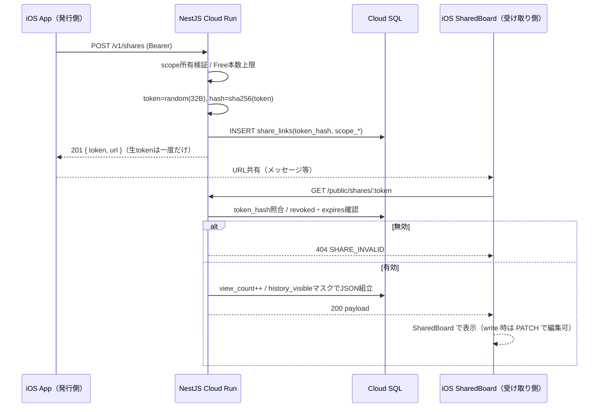

# 04. API設計（NestJS / Cloud Run / Prisma）

> このドキュメントの位置づけ: iOS・課金Webhookとバックエンドの契約を定義する。共有閲覧は **iOS SharedBoard**（独立 Web ビューは作らない）。
> 関連: [00-design-basis.md](./00-design-basis.md)（BE記載のSupabaseは無視し本章はNestJS前提）、
> [02-architecture.md](./02-architecture.md)、[03-database.md](./03-database.md)（テーブル・ビュー・ステータスを踏襲）、
> [05-ios-client.md](./05-ios-client.md)、[06-infrastructure.md](./06-infrastructure.md)、[07-monetization.md](./07-monetization.md)。

---

## 1. API戦略

### 1.1 確定スタック

| レイヤ | 採用 |
|--------|------|
| FW / ORM | NestJS (TypeScript) + **Prisma**（TypeORM可だが本章はPrisma） |
| DB | PostgreSQL（Cloud SQL）。スキーマは03を踏襲 |
| デプロイ | GCP Cloud Run（コンテナ、scale-to-zero） |
| 認証 | Apple identity tokenをNestで検証 → **自前JWT**（access + refresh）。`users`/`profiles`はNest管理 |
| 認可 | Guard / **Service** で `owner_id = currentUser.id`。共有はトークン検証のみ。層構成は [02 ADR-009](./02-architecture.md#adr-009-nestjs-は-controller--usecase--service--prisma) |
| RLS | Nestが唯一のDBクライアント。**アプリ層認可が主**、RLSはdefense-in-depth任意 |
| 課金 | Nest Controller（RevenueCat Webhook）→ UseCase → Service |
| 共有ボード | iOS SharedBoard → `GET/PATCH /public/shares/:token`（Bearer 不要・token のみ。独立 Web ビューは作らない） |
| アプリ内レイヤ | **Controller → UseCase → Service → Prisma**（単純 CRUD は UseCase 省略可） |

### 1.2 方針

自前RESTにする理由: (1) iOS更新が遅いためDBスキーマを抽象化、(2) 名義上限・共有・LWWを単一実装で改竄防止、(3) ホーム等の集約を1往復に畳む、(4) Cloud Runで水平スケール。

| 規約 | 内容 |
|------|------|
| バージョン | `/v1` プレフィックス（公開共有のみ `/public`） |
| パス | kebab-case・複数形 |
| JSON | snake_case（DB列と一致） |
| 日付 | `YYYY-MM-DD` / 時刻はISO8601 UTC |
| ID | UUID v7を**クライアント生成**（冪等upsert） |
| ページング | `limit` + `cursor`（オフセット禁止） |

### 1.3 モジュール構成

アプリ内レイヤは **Controller → UseCase → Service → Prisma**（詳細は [02-architecture.md](./02-architecture.md) ADR-009）。
単純 CRUD は UseCase 省略可。`sync` / `shares` / `billing` など横断処理は UseCase を必須とする。

```
api/src/
  auth/          # Apple検証, JWT, Guard, refresh/logout
  identities/    # 名義CRUD + PLAN_LIMIT_IDENTITY
  memberships/   # FC会員CRUD
  tours/         # ツアー + matrix
  events/        # 公演（主経路はapplicationsのfind-or-create）
  applications/  # 申込+companions、tour/eventを1TXで確保
  sync/          # pull / push
  shares/        # トークン発行
  public/        # GET /public/shares/:token
  billing/       # RevenueCat Webhook
  home/          # summary / stats
  health/        # /health, /readyz
  prisma/ common/
```

各モジュールの典型構成:

```
identities/
├── identities.controller.ts
├── use-cases/                 # 横断・複合処理のみ（省略可）
├── identities.service.ts      # 認可・Prisma・ドメインロジック
├── dto/
└── identities.module.ts
```

---

## 2. 認証・認可

```
iOS --Sign in with Apple--> identityToken
iOS -> POST /v1/auth/apple -> NestがApple JWKS検証
     -> users/profiles/entitlements upsert -> access + refresh
以降 Authorization: Bearer <access_token>
```

```typescript
// AuthGuard（APP_GUARD グローバル）。@Public は apple/refresh/public shares/webhook/health のみ
canActivate(ctx: ExecutionContext): boolean {
  if (this.reflector.getAllAndOverride<boolean>('isPublic',
    [ctx.getHandler(), ctx.getClass()])) return true;
  const req = ctx.switchToHttp().getRequest();
  const token = req.headers.authorization?.replace(/^Bearer\s+/i, '');
  if (!token) throw new AppError('UNAUTHENTICATED', 'missing bearer', 401);
  try {
    req.user = { id: this.jwt.verify<{ sub: string }>(token, {
      secret: process.env.JWT_ACCESS_SECRET }).sub };
    return true;
  } catch {
    throw new AppError('UNAUTHENTICATED', 'invalid access token', 401);
  }
}
```

サービス層は常に `owner_id: userId` を付与（クライアントから受け取らない）。
`entitlements` 書き込みはBillingのみ。RLSは任意で接続時 `SET app.current_user_id`。

---

## 3. 主要エンドポイント

共通: `Authorization: Bearer <access>` / `Content-Type: application/json` / 任意 `X-Request-Id`。

> **実装状況（2026-08-05時点）**: `auth` / `me` / `identities` / `memberships` / `tours` / `events` / `applications` / `shares` / `public` / `home` / `stats` / `sync` / `billing`（RevenueCat Webhook）は実装済み（`apps/api/src/`）。**契約の正は [docs/plans/backend-domain-modules/api-contract.md](./plans/backend-domain-modules/api-contract.md)**（本章より新しい）。以下 §3.1〜3.8 は実装済み分をその契約に合わせて更新した。

### 3.1 Auth

**`POST /v1/auth/apple`**（Public）

```json
// req
{ "identity_token": "eyJraWQiOi...", "nonce": "optional" }
// 200
{
  "access_token": "eyJhbGciOi...",
  "refresh_token": "dGhpcy1pcy...",
  "expires_in": 3600,
  "token_type": "Bearer",
  "user": {
    "id": "018f3c2a-7b1e-7c90-9d2a-1a2b3c4d5e6f",
    "account_id": "ACC-3F9A21",
    "display_name": null,
    "plan": "free",
    "is_new": true
  }
}
```

`account_id`（docs/10 M3）と `is_new`（iOSの初回オンボーディング分岐用）をレスポンスに含む。
エラー: `AUTH_APPLE_INVALID` 401 / `VALIDATION_ERROR` 400。
処理: JWKS検証（実装は`node:crypto`によるRS256検証。`jose`はjestのCJS環境と非互換のため不採用） → `apple_sub` でusers find-or-create → profiles(account_id採番)/entitlements(free) → JWT。Appleの`email`は初回のみ保存し、以降`null`が来ても上書きしない。

**`POST /v1/auth/refresh`**（Public） — **回転式**: 新しいrefresh_tokenも返す。旧トークンは即失効

```json
// req { "refresh_token": "dGhpcy1pcy..." }
// 200 { "access_token": "eyJ...", "refresh_token": "bmV3LXJlZnJlc2g...", "expires_in": 3600, "token_type": "Bearer" }
```

`AUTH_REFRESH_INVALID` 401。

**`POST /v1/auth/logout`** → body `{ "refresh_token" }` → **204**。refreshを失効。accessは短命のためブラックリスト不要。未知・失効済みでも204（冪等）。

### 3.1b Me（プロフィール / アカウント）— D1で新設

**`GET /v1/me`** → `{user:{id,email,auth_providers,created_at}, profile:{account_id,display_name,username,app_display_name,theme_color,locale,timezone,onboarded_at,...}, entitlement:{plan,expires_at,in_grace_period,bonus_identity_slots,bonus_expires_at,identity_limit,share_limit}}`。
`auth_providers`はDB列を増やさず`apple_sub`/`google_sub`/`email`の有無からサーバーが導出。`identity_limit`/`share_limit`は`plus`なら`null`（無制限）。

**`PATCH /v1/me`** — 送られたキーのみ更新。`display_name`/`username`/`app_display_name`/`theme_color`/`locale`/`timezone`/`onboarded_at`のみ受理（`account_id`/`plan`/`id`等は`VALIDATION_ERROR`400）。`theme_color`は`^#[0-9A-Fa-f]{6}$`、`username`/`app_display_name`は1〜30文字（docs/10 M3・M4）。

**`DELETE /v1/me`**（App Store Guideline 2.5対応。`docs/plans/account-deletion/`） → **204**。認証必須ユーザーのアカウントと全関連データ（名義・会員情報・申込・ツアー/公演・共有リンク・refresh token等）を1トランザクションで即時物理削除する（猶予期間なし）。

- req（任意ボディ）: `{password?, apple_authorization_code?}`。`password_hash`が設定されているユーザーは`password`必須（未指定は`VALIDATION_ERROR`400、不一致は`AUTH_CREDENTIALS_INVALID`401）。Apple/Googleのみのユーザーはボディ不要（Bearerのみで実行可）
- 削除順序はFK制約（`applications.rep_identity_id`が`onDelete:Restrict`）を回避するため固定: `application_companions→applications→memberships→identities→events→tours→share_links→device_tokens→refresh_tokens→password_reset_codes→entitlements→profiles→users`
- `apple_authorization_code`を送ると、Sign in with Appleのトークン失効（`/auth/token`→`/auth/revoke`の2段階）をベストエフォートで試行する。失効の成否は削除の結果に影響しない（`APPLE_TEAM_ID`/`APPLE_KEY_ID`/`APPLE_PRIVATE_KEY`/`APPLE_CLIENT_ID`未設定時はスキップ）
- 2回目の呼び出しは`NOT_FOUND`404（冪等ではない）。削除後、発行済み共有リンクは即座に`SHARE_INVALID`404になる
- レート制限あり（`ThrottleAuthUser`。10回/5分・userId単位）

### 3.2 Identities

| Method | Path |
|--------|------|
| GET/POST | `/v1/identities` |
| GET/PATCH/DELETE | `/v1/identities/:id` |

```json
// POST req
{
  "id": "018f3c2a-aaaa-7c90-9d2a-000000000001",
  "display_name": "自分",
  "relation": "self",
  "color": "#0017C1",
  "joined_on": "2024-04-01",
  "note": null,
  "history_visible": true,
  "sort_order": 0
}
// 201: 上記 + created_at / updated_at
```

```typescript
async create(userId: string, dto: CreateIdentityDto) {
  const limit = await this.entitlements.identityLimit(userId); // free: 3+bonus
  const count = await this.prisma.identity.count({
    where: { owner_id: userId, deleted_at: null },
  });
  if (count >= limit) {
    throw new AppError('PLAN_LIMIT_IDENTITY',
      `identity limit reached (limit=${limit}, current=${count})`, 403,
      { limit, current: count });
  }
  return this.prisma.identity.create({ data: { ...dto, owner_id: userId } });
}
```

`relation`: `self|family|friend|other`。DELETEはソフトデリート（上限カウント外）。
`PLAN_LIMIT_IDENTITY` 403 / `NOT_FOUND` 404。

### 3.3 Memberships

| Method | Path |
|--------|------|
| GET/POST | `/v1/memberships`（GETは `?identity_id=`） |
| PATCH/DELETE | `/v1/memberships/:id` |

```json
// POST req
{
  "id": "018f3c2a-bbbb-7c90-9d2a-000000000001",
  "identity_id": "018f3c2a-aaaa-7c90-9d2a-000000000001",
  "fan_club_name_raw": "STELLARIS OFFICIAL FAN CLUB",
  "member_no_last4": "4821",
  "rank": "プレミアム",
  "renewal_on": "2026-09-15",
  "fee_yen": 5500,
  "auto_renew": false,
  "note": null
}
```

親identityの所有者検証必須。**`fan_club_id`・`member_no_cipher`は受理しない**（マスタ表・暗号化列はPhase 1で未実装。D7）。`member_no_last4`は1〜4文字の英数のみ。
`PATCH`で`identity_id`を付け替えると、その membership を`rep_membership_id`として参照する未削除applicationは自動的に`rep_membership_id:null`にクリアされる（`DELETE`でも同様）。

### 3.4 Applications（tour/event find-or-create）

**`POST /v1/applications`** — 1トランザクションでtour/eventを確保し申込+companionsを作成。

```json
// req
{
  "id": "018f3c2a-cccc-7c90-9d2a-000000000001",
  "tour": {
    "id": "018f3c2a-dddd-7c90-9d2a-000000000001",
    "name": "STELLARIS LIVE TOUR 2026",
    "artist_name_raw": "STELLARIS"
  },
  "event": {
    "id": "018f3c2a-eeee-7c90-9d2a-000000000001",
    "name": "大阪公演 Day1",
    "venue_name_raw": "大阪城ホール",
    "event_date": "2026-08-20",
    "starts_at": "2026-08-20T11:00:00.000Z"
  },
  "rep_identity_id": "018f3c2a-aaaa-7c90-9d2a-000000000001",
  "rep_membership_id": "018f3c2a-bbbb-7c90-9d2a-000000000001",
  "round_name": "FC1次",
  "applied_on": "2026-07-01",
  "result_on": "2026-07-20",
  "status": "applied",
  "seat_raw": null,
  "ticket_count": 2,
  "price_yen": 16000,
  "note": null,
  "companions": [
    {
      "id": "018f3c2a-ffff-7c90-9d2a-000000000001",
      "identity_id": "018f3c2a-aaaa-7c90-9d2a-000000000002",
      "display_name": "妹",
      "position": 0
    }
  ]
}
// 201
{
  "id": "018f3c2a-cccc-7c90-9d2a-000000000001",
  "event_id": "018f3c2a-eeee-7c90-9d2a-000000000001",
  "tour_id": "018f3c2a-dddd-7c90-9d2a-000000000001",
  "rep_identity_id": "018f3c2a-aaaa-7c90-9d2a-000000000001",
  "rep_membership_id": "018f3c2a-bbbb-7c90-9d2a-000000000001",
  "round_name": "FC1次",
  "status": "applied",
  "ticket_count": 2,
  "price_yen": 16000,
  "companions": [/* 同上 */],
  "created_at": "2026-07-31T12:05:00.000Z",
  "updated_at": "2026-07-31T12:05:00.000Z"
}
```

`companions`は0〜**3件**まで（`identity_id`重複は400）。`POST /v1/tours`・`POST /v1/events`は提供しない（作成経路はこのfind-or-createのみ、D9）。
`PATCH /v1/applications/:id`で`rep_identity_id`のみ変更し`rep_membership_id`を指定しない場合、既存の`rep_membership_id`が新しい名義に属していなければ自動的に`null`にクリアする（不変条件維持）。`companions`を渡すと全置換（キー自体が無ければ変更なし）。

```typescript
async create(userId: string, dto: CreateApplicationDto) {
  return this.prisma.$transaction(async (tx) => {
    const tour = await tx.tour.upsert({
      where: { owner_id_name: { owner_id: userId, name: dto.tour.name } },
      create: { ...dto.tour, owner_id: userId },
      update: {},
    });
    const event = await tx.event.upsert({
      where: { id: dto.event.id },
      create: { ...dto.event, tour_id: tour.id, owner_id: userId },
      update: {
        name: dto.event.name,
        venue_name_raw: dto.event.venue_name_raw,
      },
    });
    // rep_identity / membership の owner 検証…
    return tx.application.create({
      data: {
        id: dto.id, owner_id: userId, event_id: event.id,
        rep_identity_id: dto.rep_identity_id,
        rep_membership_id: dto.rep_membership_id,
        round_name: dto.round_name, applied_on: dto.applied_on,
        result_on: dto.result_on, status: dto.status ?? 'applied',
        seat_raw: dto.seat_raw, ticket_count: dto.ticket_count ?? 1,
        price_yen: dto.price_yen, note: dto.note,
        companions: {
          create: dto.companions.map((c) => ({ ...c, owner_id: userId })),
        },
      },
      include: { companions: true },
    });
  });
}
```

`status`: `draft|applied|won|lost|cancelled`。
併せて `GET/PATCH/DELETE /v1/applications/:id`。

### 3.5 集約・統計・マトリクス

> `home/summary`・`stats/identities`・`sync/pull`・`sync/push`は実装済み（Prisma クエリ / LWW）。`tours/:id/matrix`も実装済み。

**`GET /v1/home/summary`**（実装済み） — `v_upcoming_renewals` + `status='applied'`。`urgency`は03と同一（expired / warning≤14 / soon≤30）。

```json
{
  "identity_count": 3,
  "renewals_within_30_days": 2,
  "pending_results": 4,
  "upcoming_renewals": [
    {
      "membership_id": "018f3c2a-bbbb-7c90-9d2a-000000000001",
      "identity_name": "自分", "identity_color": "#0017C1",
      "fan_club_name": "STELLARIS OFFICIAL FAN CLUB",
      "renewal_on": "2026-09-15", "days_until": 46, "urgency": "ok"
    }
  ],
  "pending_applications": [
    {
      "application_id": "018f3c2a-cccc-7c90-9d2a-000000000001",
      "event_name": "大阪公演 Day1", "result_on": "2026-07-20",
      "rep_name": "自分", "status": "applied"
    }
  ]
}
```

**`GET /v1/stats/identities`**（実装済み） — `v_identity_stats`。

```json
{
  "items": [{
    "identity_id": "018f3c2a-aaaa-7c90-9d2a-000000000001",
    "application_count": 12, "won_count": 5, "lost_count": 4,
    "pending_count": 3, "win_rate_percent": 55.6
  }]
}
```

**`GET /v1/tours/:id/matrix`**（実装済み） — DBビュー（`v_tour_matrix`）ではなくPrismaクエリで組み立て（C2）。

```json
{
  "tour_id": "018f3c2a-dddd-7c90-9d2a-000000000001",
  "tour_name": "STELLARIS LIVE TOUR 2026",
  "rows": [{
    "event_id": "018f3c2a-eeee-7c90-9d2a-000000000001",
    "event_name": "大阪公演 Day1", "venue_name": "大阪城ホール",
    "event_date": "2026-08-20",
    "application_id": "018f3c2a-cccc-7c90-9d2a-000000000001",
    "round_name": "FC1次", "status": "applied", "seat_raw": null,
    "rep_identity_id": "018f3c2a-aaaa-7c90-9d2a-000000000001",
    "rep_name": "自分", "rep_color": "#0017C1", "companion_names": ["妹"]
  }]
}
```

`companion_names`は**配列**（旧: `string_agg`由来の文字列連結。D3でクライアント側の区切り文字解析を不要にした）。対象は`deleted_at is null`のevent/applicationのみ。他人のtourは404。

### 3.6 Sync（実装済み）

identities〜applications は通常 CRUD も提供。オフライン LWW 同期は `sync/pull`・`sync/push`。

**`POST /v1/sync/pull`** / **`POST /v1/sync/push`** — 詳細は第4章。

```json
// pull req
{
  "cursor": "2026-07-30T00:00:00.000Z",
  "collections": ["identities","memberships","tours","events","applications","application_companions"]
}
// push req
{
  "mutations": [
    {
      "collection": "identities",
      "op": "upsert",
      "id": "018f3c2a-aaaa-7c90-9d2a-000000000001",
      "updated_at": "2026-07-31T10:00:00.000Z",
      "payload": {
        "display_name": "自分",
        "relation": "self",
        "color": "#0017C1",
        "history_visible": true,
        "sort_order": 0
      }
    }
  ]
}
```

### 3.7 Shares

**`POST /v1/shares`**

```json
// req
{
  "scope_type": "tour",
  "scope_id": "018f3c2a-dddd-7c90-9d2a-000000000001",
  "mask_member_no": true,
  "expires_at": "2026-08-31T00:00:00.000Z",
  "shared_with_account_ids": ["ACC-3F9A21"]
}
// 201
{
  "id": "018f3c2a-1111-7c90-9d2a-000000000001",
  "token": "base64url-opaque-token-shown-once",
  "url": "https://share.example.com/s/base64url-opaque-token-shown-once",
  "scope_type": "tour",
  "scope_id": "018f3c2a-dddd-7c90-9d2a-000000000001",
  "permission": "read",
  "mask_member_no": true,
  "shared_with_account_ids": ["ACC-3F9A21"],
  "expires_at": "2026-08-31T00:00:00.000Z",
  "created_at": "2026-08-01T00:00:00.000Z"
}
```

`shared_with_account_ids`（0〜20件、`^ACC-[0-9A-F]{6}$`）はdocs/10 M8の記録用メタでACLではない（D6）。生tokenは一度だけ。DBは `sha256` hexのみ。`expires_at`省略で+30日・上限+365日。Freeは有効1本（`PLAN_LIMIT_SHARE` 403）。

**`GET /v1/shares`**（D2で新設） → `{items:[{id,scope_type,scope_id,scope_name,permission,mask_member_no,shared_with_account_ids,expires_at,revoked_at,view_count,last_viewed_at,created_at,is_active}]}`。**`token`/`token_hash`は含めない**。

**`DELETE /v1/shares/:id`**（D2で新設） → 204。`revoked_at`を立てる（失効）。既に失効済みでも204。

**`GET /public/shares/:token`**（Public・認証不要）

```json
{
  "scope_type": "tour",
  "tour": {
    "id": "018f3c2a-dddd-7c90-9d2a-000000000001",
    "name": "STELLARIS LIVE TOUR 2026"
  },
  "items": [
    {
      "event_name": "大阪公演 Day1",
      "venue": "大阪城ホール",
      "event_date": "2026-08-20",
      "round_name": "FC1次",
      "rep_name": "自分",
      "companions": ["妹"],
      "status": "applied",
      "seat": null
    }
  ]
}
```

`SHARE_INVALID` 404（未知/失効/期限切れを区別しない）。`history_visible=false` は `rep_name`「非公開の名義」、`rep_color`/`seat` null。会員番号・`owner_id`・`account_id`・内部UUIDは一切含めない。同行者名はマスク対象外（`identity_id`があれば現在のdisplay_name）。レスポンスヘッダに`X-Robots-Tag: noindex, nofollow`。

`scope_type="identity_summary"`の公開ペイロード（D10で確定）:
```json
{
  "scope_type": "identity_summary",
  "generated_at": "2026-08-02T10:00:00.000Z",
  "items": [
    { "name": "自分", "visible": true, "application_count": 12, "won_count": 5 },
    { "name": "友人A", "visible": false }
  ]
}
```
`visible:false`の名義は件数系キー自体を含めない。

### 3.8 Billing / Health（billing 実装済み）

**`POST /v1/webhooks/revenuecat`**（Public + `Authorization: Bearer <secret>`）— `entitlements` 更新。応答は常に `200 {"ok":true}`（冪等・リトライ嵐防止）。

```json
{
  "api_version": "1.0",
  "event": {
    "type": "INITIAL_PURCHASE",
    "app_user_id": "018f3c2a-7b1e-7c90-9d2a-1a2b3c4d5e6f",
    "product_id": "plus_monthly",
    "expiration_at_ms": 1785513600000
  }
}
```

**`GET /health`** → `{"status":"ok","version":"1.0.0"}`（liveness、DB非参照）。
**`GET /readyz`** → Prisma `SELECT 1`（readiness）。

---

## 4. 同期プロトコル

| 原則 | 内容 |
|------|------|
| カーソル | クライアント保持の `updated_at`。初回null＝全件 |
| LWW | サーバー`updated_at`（DBトリガ`now()`）とクライアント提示を比較し新しい方 |
| ソフトデリート | `deleted_at`非nullを削除として伝播。物理DELETEしない |
| 冪等 | UUID v7クライアント生成 + upsert |
| 対象 | identities / memberships / tours / events / applications / application_companions |

### 4.1 Pull

```typescript
async pull(userId: string, cursor: Date | null, collections: string[]) {
  const since = cursor ?? new Date(0);
  const changes: Record<string, unknown[]> = {};
  for (const c of collections) {
    changes[c] = await this.prisma[c].findMany({
      where: { owner_id: userId, updated_at: { gt: since } },
      orderBy: { updated_at: 'asc' },
      take: 500,
    });
  }
  const ts = Object.values(changes).flat()
    .map((r: any) => r.updated_at as Date);
  const next = ts.length
    ? new Date(Math.max(...ts.map((t) => t.getTime()))).toISOString()
    : cursor?.toISOString() ?? null;
  const has_more = Object.values(changes).some((r) => r.length >= 500);
  return { changes, next_cursor: next, has_more };
}
```

```json
{
  "changes": { "identities": [], "memberships": [], "tours": [],
    "events": [], "applications": [], "application_companions": [] },
  "next_cursor": "2026-07-31T12:05:00.000Z",
  "has_more": false
}
```

バッチ上限500行/コレクション（60s内）。`has_more`中は再pull。

### 4.2 Push

```typescript
async push(userId: string, mutations: Mutation[]) {
  const accepted: string[] = [];
  const rejected: { id: string; code: string; message: string }[] = [];
  await this.prisma.$transaction(async (tx) => {
    for (const m of mutations) {
      try {
        if (m.collection === 'identities' && m.op === 'upsert' && !m.payload.deleted_at) {
          await this.identities.ensureWithinLimit(userId, m.id, tx);
        }
        const existing = await tx[m.collection].findFirst({
          where: { id: m.id, owner_id: userId },
        });
        if (existing && existing.updated_at > new Date(m.updated_at)) {
          rejected.push({
            id: m.id, code: 'SYNC_LWW_REJECT', message: 'server copy is newer',
          });
          continue;
        }
        await tx[m.collection].upsert({
          where: { id: m.id },
          create: { ...m.payload, id: m.id, owner_id: userId },
          update: { ...m.payload, owner_id: userId },
        });
        accepted.push(m.id);
      } catch (e) {
        const code = e instanceof AppError ? e.code : 'SYNC_APPLY_FAILED';
        rejected.push({ id: m.id, code, message: String(e) });
      }
    }
  });
  return { accepted, rejected, server_time: new Date().toISOString() };
}
```

```json
{
  "accepted": ["018f3c2a-aaaa-7c90-9d2a-000000000001"],
  "rejected": [
    {
      "id": "018f3c2a-aaaa-7c90-9d2a-000000000099",
      "code": "SYNC_LWW_REJECT",
      "message": "server copy is newer"
    }
  ],
  "server_time": "2026-07-31T12:10:00.000Z"
}
```

依存順: identities → memberships/tours → events → applications → companions。
クライアント手順: **push → pull → ローカルLWWマージ → cursor更新**。push成功後にサーバー確定`updated_at`を取り込む。他人のidは更新せずreject（存在漏洩回避）。

---

## 5. 共有シーケンス



匿名のテーブル直アクセスは行わない。閲覧クライアントは iOS ネイティブのため **ブラウザ CORS は必須ではない**（第7章。開発用に残す場合はローカルのみ）。

---

## 6. エラー規約とリトライ

```json
{
  "code": "PLAN_LIMIT_IDENTITY",
  "message": "identity limit reached (limit=3, current=3)",
  "details": { "limit": 3, "current": 3 },
  "request_id": "018f3c2a-9999-7c90-9d2a-000000000001"
}
```

| code | HTTP | クライアント動作 |
|------|------|------------------|
| `VALIDATION_ERROR` | 400 | フォーム表示 |
| `UNAUTHENTICATED` | 401 | refresh→1回再試行 |
| `AUTH_APPLE_INVALID` / `AUTH_REFRESH_INVALID` | 401 | 再ログイン |
| `FORBIDDEN` | 403 | キャンセル |
| `PLAN_LIMIT_IDENTITY` / `PLAN_LIMIT_SHARE` | 403 | Plus/リワード導線 |
| `NOT_FOUND` / `SHARE_INVALID` | 404 | 一覧or無効ページ |
| `CONFLICT` | 409 | 再同期 |
| `SYNC_LWW_REJECT` | 200内rejected | pullで上書き |
| `RATE_LIMITED` | 429 | Retry-After |
| `INTERNAL` | 500 | 指数バックオフ |

例外フィルタは全エラーを上記形へ正規化し、未知例外は `INTERNAL` 500（スタックはログのみ）。

リトライ: 408/429/5xxは指数バックオフ（0.5s〜30s、最大5回）。401はrefresh成功時のみ1回再送。その他4xxはしない。WebhookはRevenueCat再送に任せハンドラを冪等に。

---

## 7. バージョニング

- `/v1` 必須。ヘッダ版は使わない
- 破壊的変更（必須追加・意味変更・削除）は `/v2`。旧メジャーは最低6ヶ月併存
- 互換変更（任意フィールド・新エンドポイント）は `/v1` に投入可。OpenAPIをCIで差分検知
- 破壊的例: `status`意味変更。非破壊例: 任意フィールド追加、新`code`追加

---

## 8. Cloud Run 留意点

**コールドスタート**: Nest+Prismaで1〜3秒。UIはSwiftDataのみのためAPI待ちは同期・共有・Webhookに限定。共有発行はプログレス、負荷時のみ`minScale:1`。

```yaml
autoscaling.knative.dev/minScale: "0"
autoscaling.knative.dev/maxScale: "10"
run.googleapis.com/startup-cpu-boost: "true"
containerConcurrency: 80
timeoutSeconds: 60
```

| 項目 | 方針 |
|------|------|
| ヘルス | `/health`=liveness（DB非参照）、`/readyz`=Prisma `SELECT 1` |
| 接続プール | `connection_limit` 5〜10/インスタンス。`maxScale×limit`≤Cloud SQL上限 |
| Cloud SQL | Unix socket/Connector。例 `?host=/cloudsql/PROJECT:REGION:INSTANCE` |
| Secret Manager | JWT秘密・Apple client_id・RC webhook・DB。イメージに埋め込まない |
| CORS | **必須ではない**（共有は iOS ネイティブ）。残す場合は開発用オリジンに限定。認証APIは広げない |
| その他 | request-based CPU、Scheduler→HTTP、JSONログ+`request_id`、ボディ≈1MB |

```typescript
// 共有は iOS ネイティブのためブラウザ CORS は必須ではない。
// 開発用に残す場合のみローカルオリジンを許可する。
app.enableCors({
  origin: process.env.NODE_ENV !== 'production' ? ['http://localhost:3000'] : false,
  methods: ['GET', 'OPTIONS', 'PATCH'],
  allowedHeaders: ['Content-Type', 'Accept'],
  maxAge: 86400,
});
```

共有 write（`PATCH /public/shares/:token/items/:item_key`）は iOS SharedBoard から呼ぶ。所有者 CRUD 契約は維持する。
