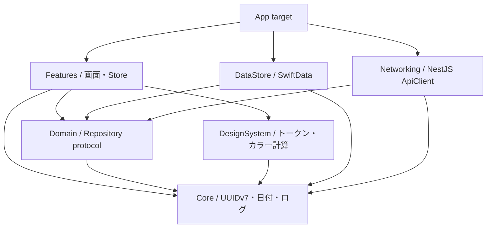
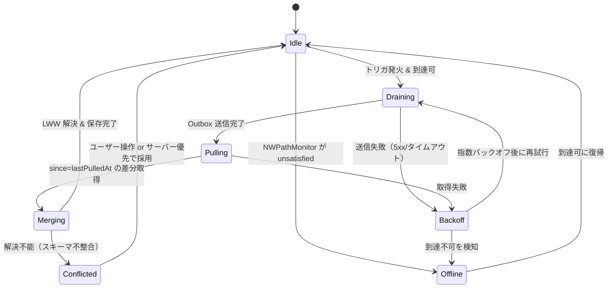

# 05. iOSクライアント設計

## このドキュメントの位置づけ

本書は「参戦名義帳」iOSアプリ（Swift 6 / SwiftUI / iOS 17.0+）の実装設計を定めます。**何を作るか**は
[01-product-overview.md](./01-product-overview.md)、**どこにデータを置くか**は [03-database.md](./03-database.md)、
**どう通信するか**は [04-api.md](./04-api.md) に委ね、本書は**クライアント内部の構造・型・アルゴリズム**のみを扱います。
全体の前提は [00-design-basis.md](./00-design-basis.md) を正とし、これに矛盾する記述は本書の誤りとします。

| 項目 | 動かせない決定 |
|------|------|
| 真実の源 | Phase 0 は **SwiftData がSSoT**。UIは SwiftData だけを読む |
| 依存方向 | View → Store(`@Observable`) → Repository(protocol) → LocalStore(SwiftData) / ApiClient(NestJS) |
| BE | NestJS on Cloud Run。通信は `GET/POST /v1/*`（[04-api.md](./04-api.md)）。Supabase SDK は使わない |
| 同期 | `updated_at` ベースの Last-Write-Wins、`deleted_at` によるソフトデリート |
| 主キー | UUID v7（**クライアント生成**）。オフラインでもIDが確定するため楽観的更新が成立する |
| 通知 | ローカル通知（`UNUserNotificationCenter`）が第一選択。APNs は Phase 2 |
| 課金・広告 | StoreKit 2 + RevenueCat / AdMob。Free は名義3件まで、**申込件数は無制限** |

---

## 1. モジュール構成

Swift Package 分割の効用は3つで、それ以上を期待してはいけません。(1) **ビルド時間** — `Features` を触ったときに
`DataStore` を再コンパイルさせない（SwiftDataのマクロ展開コストが毎回乗るのを防ぐ）。(2) **テスト容易性** —
`Domain` / `DataStore` を SwiftUI 非依存に保ち、テスト起動を速くする。(3) **依存の逆流防止** — 「`Domain` が
NestJS の HTTP 実装詳細を知っている」といった事故をレビューではなく**コンパイルエラー**で止める。

一方、Feature ごとに1パッケージまで刻むのは個人〜2名の規模では過剰です。Feature 間の共有型の置き場が無くなり、
`FeatureKit`（何でも置き場）が生えて分割が無意味化します。**6モジュール固定**とし、`Features` は1パッケージ内の
ディレクトリ分割に留めます。Feature数が15を超えるかフルビルドが3分を超えた時点で再検討します。



**`Features` は `DataStore` / `Networking` を参照しません。** Repository の protocol は `Domain` に、実装は
`DataStore` / `Networking` にあり、具象の注入は App の Composition Root で行います。**`Domain` は SwiftData を
import しません**（`@Model` を Domain 型にすると Repository のモックが SwiftData 抜きで作れない）。ただし境界で
全部を値型に詰め替えると記述量が爆発するため、詰め替えるのは「集計結果」と「Store が保持する派生状態」に限り、
単純な一覧表示は `@Model` を直接 View に渡します（9.4）。`Core` は他のどこにも依存しません。

> **HTTP 層のパッケージ名は `Networking`**（`Network` ではない）。Apple の `Network.framework` と
> モジュール名が衝突し、Xcode 統合 SPM では依存していないターゲットでもビルド順しだいで解決先が
> 入れ替わるため（2026-08-09 に改名 / `feedback_review_patterns.md` IOS-12）。

```
meigicho/
├── App/  MeigichoApp.swift（@main・ModelContainer構築・Composition Root）
│         AppEnvironment.swift / DeepLinkRouter.swift / Resources
├── Packages/
│   ├── Core/          UUIDv7.swift, CalendarDay.swift, AppLogger.swift, Debouncer.swift
│   ├── DesignSystem/  Tokens/{ColorToken,Radius,Spacing,Typography}.swift
│   │                  Theme/{ThemeColor,ThemeStore}.swift
│   │                  Components/{StampView,RenewalBadge,TicketRow,FormCard}.swift
│   ├── Domain/        Models/（値型DTO・enum） Repositories/（protocol） UseCases/
│   ├── DataStore/     Schema/{SchemaV1,MigrationPlan}.swift  Models/（@Model群）
│   │                  Local/SwiftData*Repository.swift  ModelContainer+Factory.swift
│   ├── Networking/    NestApiClient.swift  AuthTokenStore.swift  Remote/*Store.swift
│   │                  Sync/{SyncEngine,OutboxStore,Reachability}.swift
│   └── Features/      Home/(S1) Identities/(S2 S3 S7 S8) Applications/(S4 S5 S9)
│                      Share/(S6) Paywall/ Navigation/AppRoute.swift
└── Tests/  各パッケージに *Tests ターゲット
```

---

## 2. SwiftData モデル定義

### 2.1 命名規約 — なぜ `EventEntity` か

DBテーブル名をそのまま型名にすると、標準フレームワークの一般名と衝突・混同する型が生まれます。`Event` は
`UIKit.UIEvent` / `EventKit.EKEvent` と並ぶと可読性を落とし、`import EventKit` した瞬間に修飾なしで書けません。
同じ理由で `Color`（推しカラー）や `Task`（同期タスク）をモデル名に使うことは禁止します（`SwiftUI.Color` /
`Swift.Task` と衝突）。規約は「**衝突・混同の恐れがある型にだけサフィックスを付ける**」。全型に一律で付けると
`IdentityEntity.identityEntityID` のような冗長さが増えるだけです。`identities`/`memberships`/`tours`/
`application_companions`/`entitlements` は `Identity`/`Membership`/`Tour`/`Companion`/`Entitlement` のまま、
`events` は **`EventEntity`**、`applications` は **`ApplicationEntry`**（`UIApplication` との混同、「アプリ本体」との誤読回避）とします。

### 2.2 同期フィールドと enum の相互変換

```swift
import Foundation
import SwiftData

public enum SyncState: Int, Codable, Sendable {
    case synced = 0, pendingCreate = 1, pendingUpdate = 2, pendingDelete = 3, conflicted = 4
}
public protocol SyncableModel: AnyObject {
    var id: UUID { get }
    var updatedAt: Date { get set }; var remoteUpdatedAt: Date? { get set }
    var syncStateRaw: Int { get set }; var deletedAt: Date? { get set }
}
extension SyncableModel {
    public var syncState: SyncState {
        get { SyncState(rawValue: syncStateRaw) ?? .synced }
        set { syncStateRaw = newValue.rawValue }
    }
    /// ローカル編集の記録。updatedAt を必ず進めることが LWW の前提。
    public func markDirty(now: Date = .now) {
        updatedAt = now
        if syncState == .synced { syncState = .pendingUpdate }
    }
    public func softDelete(now: Date = .now) { deletedAt = now; updatedAt = now; syncState = .pendingDelete }
}
public enum Relation: String, CaseIterable, Codable, Sendable {
    case `self`, family, friend, other
    /// モックの日本語ラベル（本人/家族/友人/その他）
    public var label: String {
        switch self { case .self: "本人"; case .family: "家族"; case .friend: "友人"; case .other: "その他" }
    }
}
public enum ApplicationStatus: String, CaseIterable, Codable, Sendable {
    case draft, applied, won, lost, cancelled
    public var label: String {
        switch self {
        case .draft: "下書き"; case .applied: "申込中"; case .won: "当選"
        case .lost: "落選"; case .cancelled: "取消"
        }
    }
    /// S5 のステータス3ボタン（モック `status-changer`）に出す3値
    public static var primaryChoices: [ApplicationStatus] { [.applied, .won, .lost] }
}
```

`syncState` / `status` / `relation` は**生値をストアドプロパティにし、enum は計算プロパティ**にします。SwiftData の
`#Predicate` は enum のまま比較できないケースがあり、生値なら `$0.syncStateRaw != 0` が確実にSQLへ落ちます。また
`Relation(rawValue:) ?? .other` のフォールバックにより、**サーバーが先に新しい値を増やしてもクラッシュしません**。

### 2.3 モデル本体

```swift
@Model
public final class Identity: SyncableModel {
    @Attribute(.unique) public var id: UUID
    public var ownerID: UUID?
    public var displayName: String
    public var relationRaw: String
    public var colorHex: String            // 推しカラー #RRGGBB
    public var joinedOn: Date?             // 入会日（00:00 JST に正規化して保存）
    public var note: String, historyVisible: Bool, sortOrder: Int
    @Relationship(deleteRule: .cascade, inverse: \Membership.identity)
    public var memberships: [Membership] = []
    public var updatedAt: Date, remoteUpdatedAt: Date?, syncStateRaw: Int, deletedAt: Date?
    public init(id: UUID = UUIDv7.generate(), displayName: String, relation: Relation = .other,
                colorHex: String = "#0017C1", joinedOn: Date? = nil, note: String = "",
                historyVisible: Bool = true, sortOrder: Int = 0, now: Date = .now) {
        self.id = id; self.displayName = displayName; self.relationRaw = relation.rawValue
        self.colorHex = colorHex; self.joinedOn = joinedOn; self.note = note
        self.historyVisible = historyVisible; self.sortOrder = sortOrder
        self.updatedAt = now; self.syncStateRaw = SyncState.pendingCreate.rawValue
    }
    public var relation: Relation {
        get { Relation(rawValue: relationRaw) ?? .other }
        set { relationRaw = newValue.rawValue }
    }
}

// 以下、共通の同期4フィールド（updatedAt / remoteUpdatedAt / syncStateRaw / deletedAt）と init は同型のため省略。
@Model
public final class Membership: SyncableModel {
    @Attribute(.unique) public var id: UUID
    public var identity: Identity?
    public var fanClubID: UUID?, fanClubNameRaw: String
    public var memberNoCipher: Data?       // 平文は持たない。Keychain の鍵で暗号化（03 の member_no_cipher）
    public var memberNoLast4: String?, rank: String?
    public var renewalOn: Date?, feeYen: Int?, autoRenew: Bool = false, note: String = ""
}
@Model
public final class Tour: SyncableModel {
    @Attribute(.unique) public var id: UUID
    public var artistID: UUID?, artistNameRaw: String, name: String
    @Relationship(deleteRule: .cascade, inverse: \EventEntity.tour) public var events: [EventEntity] = []
}
@Model
public final class EventEntity: SyncableModel {
    @Attribute(.unique) public var id: UUID
    public var tour: Tour?
    public var name: String, venueID: UUID?, venueNameRaw: String
    public var eventDate: Date?, startsAt: Date?   // 公演日（日付のみ）/ 開演時刻（任意）
    @Relationship(deleteRule: .cascade, inverse: \ApplicationEntry.event)
    public var applications: [ApplicationEntry] = []
}
@Model
public final class ApplicationEntry: SyncableModel {
    @Attribute(.unique) public var id: UUID
    public var event: EventEntity?
    /// 名義を消しても申込の記録自体は残す（J3の蓄積価値）ため .nullify
    @Relationship(deleteRule: .nullify) public var repIdentity: Identity?
    @Relationship(deleteRule: .nullify) public var repMembership: Membership?
    public var roundName: String?          // 先行 / 一般 / 2次
    public var appliedOn: Date?, resultOn: Date?, statusRaw: String
    public var seatRaw: String             // R3-2: 自由入力を正とする
    public var seatBlock: String?, seatRow: Int?, seatNo: Int?
    public var ticketCount: Int = 1, priceYen: Int?, note: String = ""
    @Relationship(deleteRule: .cascade, inverse: \Companion.application) public var companions: [Companion] = []
    public var status: ApplicationStatus {
        get { ApplicationStatus(rawValue: statusRaw) ?? .applied }
        set { statusRaw = newValue.rawValue }
    }
}
@Model
public final class Companion: SyncableModel {
    @Attribute(.unique) public var id: UUID
    public var application: ApplicationEntry?
    /// R2-2: 名義未登録の同行者を氏名テキストだけで持てるため nil 許容
    @Relationship(deleteRule: .nullify) public var identity: Identity?
    public var displayName: String, position: Int
}
@Model
public final class Entitlement {
    @Attribute(.unique) public var id: UUID
    public var planRaw: String             // "free" | "plus"
    public var expiresAt: Date?, bonusIdentitySlots: Int   // bonus はリワード広告で +1
    public var bonusExpiresAt: Date?, checkedAt: Date      // checkedAt は RevenueCat と最後に突き合わせた時刻
}
```

**`#Index` マクロは iOS 18 以降**のため Phase 0 では使わず、述語で使う列を単純型（`String`/`Int`/`Date`）に保つことで
実用性能を確保します。`Identity` ⇄ `Companion` は**明示的な inverse を張りません**。張るとほぼ使わない
`companionAppearances` 配列が生まれ、名義削除時の更新コストだけ増えるためで、逆引きは `#Predicate` で行います。

### 2.4 UUID v7 の生成

v4 でなく v7 を使うのは、**時刻順に単調増加するため B-tree の断片化が起きず、ローカルでも「作成順」を追加カラムなしで
得られる**からです。Foundation に生成器が無いので自前実装します。

```swift
public enum UUIDv7 {
    private static let lock = NSLock()
    nonisolated(unsafe) private static var lastMillis: UInt64 = 0
    nonisolated(unsafe) private static var counter: UInt16 = 0
    public static func generate(date: Date = Date()) -> UUID {
        let ms = UInt64((date.timeIntervalSince1970 * 1000).rounded(.down))
        lock.lock()
        if ms == lastMillis { counter &+= 1 } else { lastMillis = ms; counter = UInt16.random(in: 0...0x0FFF) }
        let seq = counter & 0x0FFF
        lock.unlock()
        var b = [UInt8](repeating: 0, count: 16)
        // 0-5: unix_ts_ms（48bit big endian）
        b[0] = UInt8((ms >> 40) & 0xFF); b[1] = UInt8((ms >> 32) & 0xFF); b[2] = UInt8((ms >> 24) & 0xFF)
        b[3] = UInt8((ms >> 16) & 0xFF); b[4] = UInt8((ms >> 8) & 0xFF);  b[5] = UInt8(ms & 0xFF)
        // 6-7: version(0b0111) + rand_a に同一ms内カウンタを載せ、単調性を保つ
        b[6] = 0x70 | UInt8((seq >> 8) & 0x0F); b[7] = UInt8(seq & 0xFF)
        // 8-15: variant(0b10) + rand_b(62bit)
        var rng = SystemRandomNumberGenerator()
        for i in 8..<16 { b[i] = UInt8.random(in: 0...255, using: &rng) }
        b[8] = (b[8] & 0x3F) | 0x80
        return UUID(uuid: (b[0],b[1],b[2],b[3],b[4],b[5],b[6],b[7],b[8],b[9],b[10],b[11],b[12],b[13],b[14],b[15]))
    }
    /// 生成時刻の復元（デバッグ・移行検証用）
    public static func timestamp(of uuid: UUID) -> Date {
        let u = uuid.uuid
        let ms = (UInt64(u.0) << 40) | (UInt64(u.1) << 32) | (UInt64(u.2) << 24)
               | (UInt64(u.3) << 16) | (UInt64(u.4) << 8) | UInt64(u.5)
        return Date(timeIntervalSince1970: Double(ms) / 1000)
    }
}
```

### 2.5 マイグレーション方針

```swift
public enum SchemaV1: VersionedSchema {
    public static var versionIdentifier = Schema.Version(1, 0, 0)
    public static var models: [any PersistentModel.Type] {
        [Identity.self, Membership.self, Tour.self, EventEntity.self,
         ApplicationEntry.self, Companion.self, Entitlement.self]
    }
}
public enum SchemaV2: VersionedSchema {          // 例: seatRaw の構造化
    public static var versionIdentifier = Schema.Version(2, 0, 0)
    public static var models: [any PersistentModel.Type] { SchemaV1.models }
}
public enum MeigichoMigrationPlan: SchemaMigrationPlan {
    public static var schemas: [any VersionedSchema.Type] { [SchemaV1.self, SchemaV2.self] }
    public static var stages: [MigrationStage] { [v1toV2] }
    static let v1toV2 = MigrationStage.custom(
        fromVersion: SchemaV1.self, toVersion: SchemaV2.self, willMigrate: nil,
        didMigrate: { context in
            let apps = try context.fetch(FetchDescriptor<ApplicationEntry>())
            for app in apps where app.seatBlock == nil {
                if let p = SeatParser.parse(app.seatRaw) {    // 失敗しても seatRaw は残る
                    app.seatBlock = p.block; app.seatRow = p.row; app.seatNo = p.no
                }
            }
            try context.save()
        })
}
```

| 変更 | 判定 | 理由 |
|------|------|------|
| Optional の追加 / 既定値付き非Optionalの追加 / 削除 | 軽量 | 既存行は nil か既定値で埋まる |
| リネーム（`@Attribute(originalName:)` 併用） | 軽量 | 対応付けを与えれば列が再作成されない |
| **既存値からの導出**（`seatRaw` → 構造化列） | **カスタム** | 変換ロジックが必要 |
| **enum 生値の変更**（`"申込中"` → `"applied"`） | **カスタム** | 全行の文字列書き換えが必要 |
| **リレーションの多重度変更**（to-one → to-many） | **カスタム** | 中間データの再配置が必要 |
| nil を含む列の非Optional化 | **カスタム** | 事前に値を埋める必要がある |

原則として **enum の生値は初回リリースで英小文字スネークに確定させ以後変更しない**ことで、カスタム移行の最大要因を潰します。
日本語ラベルは `label` 計算プロパティ側にのみ持ちます。

---

## 3. 画面実装対応表

| ID | モック関数 | SwiftUI View | 遷移 | Store | 主に読むモデル |
|----|-----------|--------------|------|-------|---------------|
| S1 | `screenHome()` | `HomeView` | タブ1（`NavigationStack(path:)` ルート） | `HomeStore` | `Membership` / `ApplicationEntry` |
| S2 | `screenIdentities()` | `IdentityListView` | タブ2 ルート | `IdentityListStore` | `Identity` |
| S3 | `screenIdentityDetail()` | `IdentityDetailView` | `path.append(.identity(id))` | `IdentityDetailStore` | `Identity`/`Membership`/`ApplicationEntry` |
| S4 | `screenApplications()`/`screenApplicationsTable()` | `ApplicationListView` | タブ3 ルート | `ApplicationListStore` | `ApplicationEntry` / `Tour` |
| S5 | `screenApplicationDetail()` | `ApplicationDetailView` | `path.append(.application(id))` | `ApplicationDetailStore` | `ApplicationEntry` / `Companion` |
| S6 | `screenSharePreview()` | `SharePreviewView` | S2 から `path.append(.sharePreview)` | `SharePreviewStore` | `Identity` / `ApplicationEntry` |
| S7 | `screenAddIdentity()` | `IdentityFormView` | `.sheet(item:)` | `IdentityFormStore` | 新規 `Identity` |
| S8 | `screenAddMembership()` | `MembershipFormView` | `.sheet(item:)` | `MembershipFormStore` | 新規 `Membership` |
| S9 | `screenAddApplication()` | `ApplicationFormView` | `.sheet(item:)` | `ApplicationFormStore` | 新規 `ApplicationEntry` ほか |

**S9拡張（申込編集・`docs/plans/application-edit/`）**: `ApplicationFormView`は`mode: .create` / `.edit(ApplicationEntry)`を受け取る共通コンポーネントとして実装する（追加要件R2-9・roadmap 0-11b）。編集エントリはS5（申込詳細）のツールバーから`AppSheet.editApplication(id:)`で開く。書き込み経路は既存のローカルSSoT + `POST /v1/sync/push`のみ（REST `PATCH /v1/applications/:id`は使わない）。詳細は計画の`plan.md`参照。

```swift
public enum AppRoute: Hashable { case identity(UUID), application(UUID), sharePreview }
public enum AppSheet: Identifiable, Hashable {
    case addIdentity, addMembership(identityID: UUID)
    case addApplication(prefillIdentityID: UUID?), paywall(trigger: PaywallTrigger)
    public var id: Self { self }
}
```

ルーティングはタブごとに独立した `NavigationPath` を持ちます。モックの `tabBar.style.display = s.modal ? 'none' : 'flex'`
に相当する処理は、SwiftUI の `sheet` が既定でタブバーを覆うため**不要**です。

**S1 ホーム。** 3指標（`identities.length` / `expiringCount` / `pendingCount`）は `v_upcoming_renewals` 相当の集計を
ローカルで組みます。`FetchDescriptor` に `fetchLimit` を必ず付け、全件ロードしないことが要点です。

```swift
@MainActor @Observable
public final class HomeStore {
    public private(set) var identityCount = 0, expiringWithin30Days = 0, pendingResultCount = 0
    public private(set) var upcomingRenewals: [RenewalRow] = []        // 最大4件
    public private(set) var awaitingResults: [ApplicationSummary] = [] // 最大4件
    private let repo: HomeRepository
    public func load(today: Date = .now) async {
        async let counts = repo.summaryCounts(today: today)            // 3クエリを並行
        async let renewals = repo.upcomingRenewals(limit: 4, today: today)
        async let pending = repo.awaitingResults(limit: 4, today: today)
        (identityCount, expiringWithin30Days, pendingResultCount) = await counts
        upcomingRenewals = await renewals; awaitingResults = await pending
    }
}
```

指標の数値はモックで 24px Bold・等幅（`--font-mono`）なので `.monospacedDigit()` を当てて更新時の幅揺れを防ぎます。
モックが `<br>` で2行にしていた「30日以内に更新期限」は Dynamic Type で3行になり得るため
`.fixedSize(horizontal: false, vertical: true)` を付けます。

**S2 名義一覧 — FC別グルーピングとソート。** 名義一覧は `Membership.fanClubNameRaw` をキーに常時グルーピング表示する（`IdentityStore.groupedByFanClub` / `docs/plans/identity-grouping/`）。1名義が複数FCに所属する場合は各グループに `(Identity, Membership)` 行として重複表示する。セグメンテッドコントロールの3種ソートは**グループ内の並び順**として適用する（グループ自体の順序は各グループの最小 `renewalOn` 昇順、FC未登録は常に最後）。

3つのソートのうち `SortDescriptor` で表現できるのは「入会が古い順」だけです。
「更新が近い順」は `min(memberships.renewalOn)` という to-many の集約、「当選が多い順」は別テーブルを跨いだ集計
（しかも R2-7 により**代表者と同行者の両方**を数える）で、いずれも述語に落とせません。対処はデータ規模で切り分けます。
名義は Free 3件、Plus でも現実的に数十件で1,000件には決してならないため、(1) `deletedAt == nil` の `Identity` を全件フェッチ、
(2) `ApplicationEntry` を**1回だけ**フェッチして `[UUID: Stats]` に畳む（N+1を作らない）、(3) Swift 側で `sorted(by:)`、
(4) 結果を Store がキャッシュしソート切替では再計算しない、とします。

```swift
func sortedIdentities(_ order: IdentitySortOrder) -> [IdentityRow] {
    switch order {
    case .renewalSoon:  rows.sorted { ($0.nearestRenewalDays ?? .max) < ($1.nearestRenewalDays ?? .max) }
    case .mostWins:     rows.sorted { $0.winCount > $1.winCount }
    case .joinedOldest: rows.sorted { ($0.joinedOn ?? .distantFuture) < ($1.joinedOn ?? .distantFuture) }
    }
}
```

モックが未登録名義に `9999` を入れて末尾送りにしていた箇所は `Int?` + `?? .max` で表現します。**却下案**:
`Identity.winCountCache` を持って `SortDescriptor` で並べる案は、同期で外部から `ApplicationEntry` が入ってきたときの
更新漏れが避けられず、数十件規模では利得（数ミリ秒）よりバグのコストが上回ります。

**S3 名義詳細。** 推しカラー変更は `applyTheme()` に相当し `ThemeStore` を更新します。`.environment(themeStore)` で
配られているため**選んだ瞬間に全画面のプライマリ色・背景が追随**します。備考のインライン編集は、モックの
`startEditNote()`（表示→`textarea` に差し替え、`onblur` で保存）を `@FocusState` で表現します（SwiftUI に `onBlur` は無い）。

```swift
ColorPicker("推しカラー", selection: $picked, supportsOpacity: false)
    .onChange(of: picked) { _, new in
        store.updateColor(new)                                    // colorHex を保存 + markDirty
        withAnimation(.easeInOut(duration: 0.2)) { theme.apply(hex: new.hexString) }
    }

@FocusState private var noteFocused: Bool
if isEditingNote {
    TextEditor(text: $draftNote).focused($noteFocused).frame(minHeight: 76)
        .onChange(of: noteFocused) { _, focused in
            if !focused { store.saveNote(draftNote); isEditingNote = false }   // onblur 相当
        }
} else {
    Button { isEditingNote = true; noteFocused = true } label: { NoteBox(text: note) }
}
```

プロフィールカードのグラデーション（モック `linear-gradient(180deg, rgba(color,0.14), surface 75%)`）は
`LinearGradient(colors: [themeColor.opacity(0.14), .dsSurface], startPoint: .top, endPoint: .init(x: 0.5, y: 0.75))` で再現します。

**S4 申込一覧。** モードは `enum ApplicationViewMode { case list, tourTable }` を Store に置き `switch` で切り替えます。
ツアー表は横スクロールが必須（モック `min-width:480px`）なので `ScrollView(.horizontal)` + `Grid`。`Table` は iOS で
列ヘッダ・横スクロールの制御が効かずモックを再現できないため採用しません。検索は 250ms デバウンス。`.task(id:)` は
キャンセルが自動で走るため `Timer` の自前管理より安全です。

```swift
.task(id: store.searchTextInput) {
    try? await Task.sleep(for: .milliseconds(250))
    guard !Task.isCancelled else { return }
    await store.applySearch(store.searchTextInput)
}
```

モックの `renderAppsListOnly()` は「入力のたび全体を `innerHTML` で置換すると**検索欄のフォーカスが飛ぶ**」ための回避策でした。
SwiftUI ではこれは構造的に不要です。`body` の再評価は差分適用であって DOM の再生成ではなく、ビュー識別（階層上の位置と `id`）が
保たれる限り `TextField` は同じレスポンダを維持します。ただし**同じ問題を再発させる書き方は存在します** — 検索結果に応じて
`if` で型が入れ替わる位置に `TextField` を置く、`.id(searchText)` を付ける、などです。「検索欄は常に同じ階層・分岐の外側に置く」
を規約で担保します。

**S5 申込詳細。** チケット風ヒーローは、本体と半券（幅92pt固定・左に 1.5pt の境界線、モック `ticket-hero__stub`）の
`HStack(spacing: 0)` で、`.background(theme.primary)` + `RoundedRectangle(cornerRadius: DS.Radius.lg)` を被せます。
ステータス3ボタン（`status-changer`）は選択中だけ `win/lose/pending` のセマンティック色に切り替わり、モックの
`padding:11px 4px` では 44pt に届かないため `.frame(minHeight: 44)` + `.contentShape(Rectangle())` を必ず付けます。
R3-3 の通り、当選→落選に戻しても `seatRaw` は消しません。座席のインライン編集は S3 と同じ `@FocusState` パターンに
`.onSubmit`（モックの `onkeydown Enter`）を併用します。

**S6 共有プレビュー。** Phase 0 ではリンクを発行しないため、ボタンは「この内容で共有リンクを作成（Plus）」として
ペイウォールを開きます。Phase 1 で `share_links` 発行APIに接続し、`UIPasteboard.general.string = url` と 1.5秒後に
文言を戻すトースト（モック `copyShareLink()` の `setTimeout(...,1500)`）を実装します。非公開名義は行ごと消さず
グレーで「非公開」と出します（モック `is-hidden`）。**今どの名義を隠しているかを確認できること**がこの画面の価値だからです。

> **2026-08-07 更新**: 共有はアカウント招待制に移行済み（`docs/plans/share-account-invites/`）。
> 発行時に招待先 ACC-ID（1〜20件）の入力が**必須**になり、「URLを知っていれば誰でも見られる」旧仕様は廃止された。
> 受け取り側は**未ログインでは開けない**（ログイン必須。招待されたアカウントのみ受信箱 `SharedInbox` に表示され、
> ディープリンク `meigicho://share/<token>` を開いた場合も未ログイン時はサインインを挟んでから board へ遷移する）。
> `PublicApiClient` / `OpenSharedBoardView`（URL貼り付け画面）は削除済み。閲覧・編集は `ApiClient`（Bearer）経由の
> `SharedBoard` に一本化。詳細は [04-api.md](./04-api.md) §3.7。

**S7〜S9 モーダルフォーム。** `Form` は使わず、モックの `form-card`（角丸12・1px枠・行区切り）を再現する
`FormCard` / `FormRow` を `DesignSystem` に作ります（`Form` の既定装飾は DADS のトークンと合わない）。バリデーションは
Store の `validationErrors: [FieldID: String]` が保存ボタンの `disabled` と行下のエラー文を駆動します。必須は S7=氏名、
S8=FC名・更新日、S9=公演名・代表者・公演日（モックの各 `save*()` の early return と同一）。エラーは**保存を押すまで出しません**。
保存後の遷移は S7 だけ特殊で、モックは `state.stack.pop()` → `navigate('identity-detail')` でした。SwiftUI では sheet を
閉じるアニメーションと push が衝突するため `dismiss()` の後に一拍置きます（`Task { try? await Task.sleep(for: .milliseconds(250));
path.append(.identity(newID)) }`）。ツアー名サジェストはモックが `<datalist>` でしたが SwiftUI に等価物が無いため、入力中に
既存 `Tour.name` を前方一致で引いて候補行（各44pt）を出す方式に置き換え、保存時は **find-or-create**（同名 `Tour` があれば再利用、
無ければ `UUIDv7` で新規）とします。空欄なら公演名をツアー名にする（モック `tour = ... || event`）挙動は維持します。

---

## 4. デザインシステムの実装

### 4.1 トークン

目的は「**マジックな色・数値を View に書かせない**」ことです。すべて `DesignSystem` 経由でのみ触れます。

```swift
import SwiftUI
public enum DS {
    /// Primitive: Blue（DADS 公式サイト掲載の実値）
    public enum Blue {
        public static let b50 = Color(hex: 0xE8F1FE),  b100 = Color(hex: 0xD9E6FF), b200 = Color(hex: 0xC5D7FB)
        public static let b300 = Color(hex: 0x9DB7F9), b400 = Color(hex: 0x7096F8), b500 = Color(hex: 0x4979F5)
        public static let b600 = Color(hex: 0x3460FB), b700 = Color(hex: 0x264AF4), b800 = Color(hex: 0x0031D8)
        public static let b900 = Color(hex: 0x0017C1), b1000 = Color(hex: 0x00118F), b1100 = Color(hex: 0x000071)
    }
    /// Primitive: Neutral（コントラスト基準に沿った近似値）
    public enum Gray {
        public static let g50 = Color(hex: 0xF7F7F9),  g100 = Color(hex: 0xEEEEF2), g200 = Color(hex: 0xE1E1E7)
        public static let g300 = Color(hex: 0xC9C9D2), g400 = Color(hex: 0x9C9CA8), g500 = Color(hex: 0x7B7B89)
        public static let g600 = Color(hex: 0x5C5C6B), g700 = Color(hex: 0x45454F), g800 = Color(hex: 0x2B2B33)
        public static let g900 = Color(hex: 0x18181C)
    }
    /// Semantic（win/lose/pending/warn のマッピング元）
    public static let success = Color(hex: 0x177A46), successBG = Color(hex: 0xE3F3EA)
    public static let error   = Color(hex: 0xC21F39), errorBG   = Color(hex: 0xFBE7EA)
    public static let warning = Color(hex: 0xA15C00), warningBG = Color(hex: 0xFBEBD9)
    /// 角の形状（--r-none/sm/md/lg/xl）
    public enum Radius {
        public static let none: CGFloat = 0, sm: CGFloat = 8, md: CGFloat = 12, lg: CGFloat = 16, xl: CGFloat = 24
    }
    /// 余白（8pxベース: 4/8/12/16/24/32/48/64）
    public enum Space {
        public static let xxs: CGFloat = 4, xs: CGFloat = 8, sm: CGFloat = 12, md: CGFloat = 16
        public static let lg: CGFloat = 24, xl: CGFloat = 32, xxl: CGFloat = 48, xxxl: CGFloat = 64
    }
}
/// タイポグラフィ: 14pt 未満を型レベルで作れなくする
public enum DSFont {
    public static let bigTitle = Font.custom("NotoSansJP-Bold", size: 28, relativeTo: .largeTitle)     // .big-title
    public static let bodyBold = Font.custom("NotoSansJP-Bold", size: 16, relativeTo: .body)           // .row__title
    public static let body     = Font.custom("NotoSansJP-Regular", size: 16, relativeTo: .body)
    public static let caption  = Font.custom("NotoSansJP-Regular", size: 14, relativeTo: .subheadline) // 最小サイズ
    public static let captionB = Font.custom("NotoSansJP-Bold", size: 14, relativeTo: .subheadline)
    public static let mono     = Font.custom("NotoSansMono-Regular", size: 14, relativeTo: .subheadline)
}
```

SwiftUI 標準の `.caption` は 12pt で「14px未満不使用」に反するため、`Font` の直接使用は SwiftLint の `custom_rules` で
禁止し `DSFont` 経由のみを許可します。**これがDADS準拠を維持する唯一の現実的な手段**です。

### 4.2 推しカラーの明度補正（`ensureDarkEnough` の移植）

モックの `ensureDarkEnough()` は、**ユーザーが自由に選んだ色でも白背景上で読めるコントラストを保つ**ための中核です。
HSL に変換して L（明度）だけを上限でクリップし、H・S は保つ。色相・彩度が保たれるので「選んだ色である」という主観は
壊れず、明度だけが落ちて可読性が担保されます。R5-3 として必ず移植します。

```swift
public struct RGB: Equatable, Sendable {
    public var r: Double, g: Double, b: Double        // 0...255
    public init(hex: String) {
        let s = hex.hasPrefix("#") ? String(hex.dropFirst()) : hex
        let v = UInt32(s, radix: 16) ?? 0
        r = Double((v >> 16) & 0xFF); g = Double((v >> 8) & 0xFF); b = Double(v & 0xFF)
    }
    public init(r: Double, g: Double, b: Double) { self.r = r; self.g = g; self.b = b }
    public var hexString: String {
        func c(_ v: Double) -> Int { max(0, min(255, Int(v.rounded()))) }
        return String(format: "#%02X%02X%02X", c(r), c(g), c(b))
    }
}
public struct HSL: Equatable, Sendable { public var h: Double, s: Double, l: Double }  // 0...1

/// モック rgbToHsl()
public func rgbToHSL(_ c: RGB) -> HSL {
    let r = c.r/255, g = c.g/255, b = c.b/255
    let mx = max(r, g, b), mn = min(r, g, b), l = (mx + mn) / 2
    guard mx != mn else { return HSL(h: 0, s: 0, l: l) }
    let d = mx - mn
    let s = l > 0.5 ? d / (2 - mx - mn) : d / (mx + mn)
    var h: Double
    if mx == r { h = (g - b)/d + (g < b ? 6 : 0) } else if mx == g { h = (b - r)/d + 2 } else { h = (r - g)/d + 4 }
    return HSL(h: h/6, s: s, l: l)
}
/// モック hslToRgb()
public func hslToRGB(_ c: HSL) -> RGB {
    guard c.s != 0 else { return RGB(r: c.l*255, g: c.l*255, b: c.l*255) }
    func hue2rgb(_ p: Double, _ q: Double, _ t0: Double) -> Double {
        var t = t0
        if t < 0 { t += 1 }; if t > 1 { t -= 1 }
        if t < 1.0/6 { return p + (q - p) * 6 * t }
        if t < 1.0/2 { return q }
        if t < 2.0/3 { return p + (q - p) * (2.0/3 - t) * 6 }
        return p
    }
    let q = c.l < 0.5 ? c.l * (1 + c.s) : c.l + c.s - c.l * c.s, p = 2 * c.l - q
    return RGB(r: hue2rgb(p, q, c.h + 1.0/3)*255, g: hue2rgb(p, q, c.h)*255, b: hue2rgb(p, q, c.h - 1.0/3)*255)
}
/// モック mixHex(a, b, t) — a から b へ t だけ線形補間
public func mixHex(_ a: String, _ b: String, _ t: Double) -> String {
    let x = RGB(hex: a), y = RGB(hex: b)
    return RGB(r: x.r + (y.r - x.r)*t, g: x.g + (y.g - x.g)*t, b: x.b + (y.b - x.b)*t).hexString
}
/// モック ensureDarkEnough(hex, maxLightness = 0.34)
public func ensureDarkEnough(_ hex: String, maxLightness: Double = 0.34) -> String {
    var hsl = rgbToHSL(RGB(hex: hex))
    hsl.l = min(hsl.l, maxLightness)
    return hslToRGB(hsl).hexString
}
/// WCAG 相対輝度によるコントラスト比の実測（モックに無い改良）
public func relativeLuminance(_ c: RGB) -> Double {
    func lin(_ v: Double) -> Double {
        let s = v / 255
        return s <= 0.03928 ? s / 12.92 : pow((s + 0.055) / 1.055, 2.4)
    }
    return 0.2126*lin(c.r) + 0.7152*lin(c.g) + 0.0722*lin(c.b)
}
public func contrastRatio(_ a: RGB, _ b: RGB) -> Double {
    let la = relativeLuminance(a), lb = relativeLuminance(b)
    return (max(la, lb) + 0.05) / (min(la, lb) + 0.05)
}
/// 白背景に対して 4.5:1 を満たすまで明度を落とす（色相・彩度は保持）
public func accessibleOnWhite(_ hex: String, minRatio: Double = 4.5, startL: Double = 0.34) -> String {
    var hsl = rgbToHSL(RGB(hex: hex))
    hsl.l = min(hsl.l, startL)
    let white = RGB(hex: "#FFFFFF")
    while hsl.l > 0.02, contrastRatio(hslToRGB(hsl), white) < minRatio { hsl.l -= 0.02 }
    return hslToRGB(hsl).hexString
}
```

`maxLightness` の 0.34 / 0.24 はモックの実装値をそのまま採用します。ただし **HSL の L は知覚的明度ではない**ため、
L=0.34 でも彩度の高い黄色などでは 4.5:1 を割ります。そこで `accessibleOnWhite` で実測し、足りなければ L を 0.02 ずつ
落とすフォールバックを足しました。

### 4.3 `applyTheme()` の移植

モックは CSS 変数を5つ書き換えていました。これを `@Observable` な `ThemeStore` にします。`--bg-outer` は端末フレーム外の
背景で iOS には存在しないため移植しません。

```swift
@Observable @MainActor
public final class ThemeStore {
    public private(set) var seedHex = "#0017C1"          // 既定は blue-900
    public private(set) var primary = DS.Blue.b900, primaryHover = DS.Blue.b1000, primaryTint = DS.Blue.b50
    public private(set) var bgApp = DS.Gray.g50, surfaceAlt = DS.Gray.g100
    public func apply(hex: String) {
        seedHex      = hex
        primary      = Color(hex: accessibleOnWhite(hex, startL: 0.34))
        primaryHover = Color(hex: accessibleOnWhite(hex, startL: 0.24))
        primaryTint  = Color(hex: mixHex("#FFFFFF", hex, 0.14))
        bgApp        = Color(hex: mixHex("#FFFFFF", hex, 0.05))
        surfaceAlt   = Color(hex: mixHex("#FFFFFF", hex, 0.08))
        UserDefaults.standard.set(hex, forKey: "theme.seedHex")
    }
}
```

App ルートで `.environment(themeStore)` し、各 View は `@Environment(ThemeStore.self)` で読みます。ユーザー由来の色は
実行時に決まるため **`Assets.xcassets` に置きません**。固定トークンだけ Assets 化してダークモード対応の余地を残します
（Phase 0 はライトのみ。DADS のダークトークンは公開値が乏しく、独自解釈でコントラストを崩すリスクの方が大きい）。

### 4.4 アクセシビリティ

| 項目 | 実装 |
|------|------|
| Dynamic Type | 全フォントを `relativeTo:` 付きで定義。ツアー表など横方向に厳しい画面は `.dynamicTypeSize(...accessibility3)` で上限を切る |
| 最小サイズ | 14pt 未満のトークンを定義しない。`Font` 直接使用を lint で禁止 |
| コントラスト | ユーザー色は `accessibleOnWhite` で 4.5:1 を保証。固定トークンはテストで比率を検証（8章） |
| タップ領域 | 全 `Button` に `.frame(minWidth: 44, minHeight: 44)` + `.contentShape(Rectangle())`。モックの `nav-icon-btn`（36px）は 44pt に拡大 |
| フォーカスリング | モックの `outline:2px solid` 相当は Full Keyboard Access が自動描画。独自実装しない |

VoiceOver は「**画面上の断片を読み上げず、意味のある1文にする**」方針です。残日数バッジは色（赤/橙/グレー）で緊急度を
伝えていますが、文言にも「更新期限切れ」「あとN日」を含めることで色覚に依存しません（モックの `renewalBadge()` は既にそう）。
アバターの頭文字や半券の区切り線などの装飾は `.accessibilityHidden(true)` にします。

```swift
// モック identityRow の読み上げ
.accessibilityElement(children: .ignore)
.accessibilityLabel("\(identity.displayName)、\(identity.relation.label)、\(fcNames)")
.accessibilityValue(renewalDays.map { "更新まであと\($0)日" } ?? "更新日未設定")
.accessibilityHint("ダブルタップで名義詳細を開きます")
StampView(status: .won).accessibilityLabel("当選")   // 色だけで意味を伝えない
```

---

## 5. オフライン/同期のクライアント実装



**送信キューの永続化。** 「未送信の変更」は **`syncState` と `OutboxEntry` の両方**で持ちます。`syncState` が真実で、
`pendingCreate/Update/Delete` の行を `#Predicate` で拾えば強制終了されても未送信分は失われず、Outbox を独立管理する場合に
必ず起きる「Outbox とモデルの不整合」が原理的に発生しません。`OutboxEntry` は依存順（`Tour` → `EventEntity` →
`ApplicationEntry` → `Companion`）と `attemptCount` / `nextRetryAt` / `lastError` を保持する**ペイロードを持たない
ポインタキュー**です（`modelName` と `targetID` のみ）。ペイロードを持たせると、送信前にさらに編集された場合に古い値を送ります。

**actor による直列化と `@MainActor` 境界。** Swift 6 の厳格並行性下では `ModelContext` は `Sendable` ではありません。
UI が使うのは `@MainActor` の `mainContext`、同期が使うのは SyncEngine actor 内で新規生成した `ModelContext` とします。
`ModelContainer` は `Sendable` なので actor へ渡せ、同じコンテナを共有するため保存後に `mainContext` へ反映されます。
**actor 間で `@Model` インスタンスを渡してはいけません**。必ず `UUID` か値型 DTO で受け渡します。

```swift
public actor SyncEngine {
    private let container: ModelContainer
    private let remote: any RemoteStore, reachability: Reachability
    private var currentTask: Task<Void, Never>?
    /// 全トリガの唯一の入口。多重起動は畳む（coalescing）
    public func requestSync(reason: SyncTrigger) {
        guard currentTask == nil else { return }
        currentTask = Task { [weak self] in await self?.runCycle(); await self?.clearTask() }
    }
    private func runCycle() async {
        guard await reachability.isOnline else { await publish(.offline); return }
        let context = ModelContext(container)          // actor 隔離下の専用コンテキスト
        do {
            await publish(.syncing)
            try await drainOutbox(context)             // push
            try await pullChanges(context)             // pull（since = lastPulledAt）
            try context.save()
            await publish(.upToDate(at: .now))
        } catch {
            await publish(.failed(error.localizedDescription)); await scheduleBackoff()
        }
    }
    @MainActor private func publish(_ s: SyncStatus) { SyncStatusBox.shared.status = s }
}
/// 競合解決は純関数にしてテストから直接叩けるようにする（8章）
public enum LWWResolver {
    public enum Decision: Equatable { case takeRemote, keepLocal, deleteLocal }
    public static func resolve(localUpdatedAt: Date, localState: SyncState,
                               remoteUpdatedAt: Date, remoteDeletedAt: Date?) -> Decision {
        // 削除も「1つの更新」として updated_at で比較する（削除の巻き戻しを防ぐ）
        if remoteUpdatedAt > localUpdatedAt { return remoteDeletedAt != nil ? .deleteLocal : .takeRemote }
        return .keepLocal                              // 同着はローカル優先（体感の安定）
    }
}
```

| トリガ | 実装 | 意図 |
|--------|------|------|
| 起動 | ルートの `.task` | 最新化する。ただし**描画をブロックしない**（ローカルを先に描く） |
| フォアグラウンド復帰 | `.onChange(of: scenePhase)` の `.active` | 他端末の変更を拾う最頻タイミング |
| 編集後3秒デバウンス | Repository の書き込みフックで `Debouncer(3s)` | 座席の打鍵など連続入力で毎回叩かない |
| バックグラウンド | `BGAppRefreshTask`（`earliestBeginDate: +15min`） | 起動前に同期を済ませる。実行機会はOS任せで保証されない |

`BGAppRefreshTask` は30秒程度で終了させる必要があるため、`expirationHandler` で `currentTask?.cancel()` し
`setTaskCompleted(success:)` を必ず呼びます。ネットワーク監視は `NWPathMonitor` を actor で包み、`pathUpdateHandler` で
`isOnline`（`path.status == .satisfied`）と `isConstrained`（低データモード）を更新します。**低データモードでは自動同期を止め
手動のみ**にします（会場でのテザリング利用を想定）。

**UI表示とリトライ。** 「さりげなく出す」= **成功は出さない、失敗と未送信だけ出す**。同期中はナビゲーションバー右端に小さな
回転インジケータ。未送信があればホームの指標カード下に1行「未同期の変更が N 件あります」（タップで手動同期）。失敗は同じ位置に
`DS.error` 系で「同期できていません（最終同期 7/31 21:04）」。**モーダルやアラートは絶対に出しません** — ローカルファーストである以上、
同期失敗はユーザーの作業を妨げないからです。リトライは指数バックオフ（2→4→8…上限300秒）+ ジッタ ±20%。`attemptCount >= 8` で
自動再試行を止め以後は明示トリガのみ。**4xx（認証切れ以外）はリトライしません**（叩いても直らない）。

---

## 6. ローカル通知設計

| 対象 | タイミング | 要件 |
|------|-----------|------|
| FC更新期限（`Membership.renewalOn`） | 30日前 / 14日前 / 前日 の 09:00 JST | R1-5 |
| 当落発表日（`ApplicationEntry.resultOn`） | 当日 08:00 JST | R3-5 |

朝8時なのは当落を朝一で確認する行動が多いため。更新期限が9時なのは支払い手続きが日中でないと進まないためです。

**64件上限への対処。** `UNUserNotificationCenter` は**アプリあたり未発火の通知を64件までしか保持しません**。名義5×FC2×3回=30件に
申込30件を足せば容易に超え、**超過分は黙って捨てられます**。「通知が来なかった」は J1 の価値そのものが壊れる最悪のバグです。
対処は「**発火が近い順に64件だけ登録し、起動・フォアグラウンド復帰・データ変更のたびに全消し＋再構築**」。数か月起動されなくても
直近64件分は必ずカバーされます。差分更新は「どれが消えたか」の追跡コストが高く、64件制約下では総入替の方が単純で安全です。

```swift
public struct NotificationRequestSpec: Equatable, Sendable {
    public let id: String        // "renewal:<membershipID>:30" / "result:<applicationID>"
    public let fireDate: Date, title: String, body: String
    public let deepLink: URL     // meigicho://identity/<uuid> | meigicho://application/<uuid>
}
public enum NotificationPlanner {
    public static let maxPending = 64
    /// 純関数。副作用を持たないのでテストから直接叩ける。
    public static func plan(memberships: [MembershipSnapshot], applications: [ApplicationSnapshot],
                            now: Date, calendar: Calendar) -> [NotificationRequestSpec] {
        var specs: [NotificationRequestSpec] = []
        for m in memberships {
            guard let renewal = m.renewalOn else { continue }
            for daysBefore in [30, 14, 1] {
                guard let day = calendar.date(byAdding: .day, value: -daysBefore, to: renewal),
                      let fire = calendar.date(bySettingHour: 9, minute: 0, second: 0, of: day),
                      fire > now else { continue }
                specs.append(.init(id: "renewal:\(m.id.uuidString):\(daysBefore)", fireDate: fire,
                    title: "FC更新期限まであと\(daysBefore)日",
                    body: "\(m.identityName)／\(m.fanClubName)（更新日 \(DateFormat.jpShort(renewal))）",
                    deepLink: URL(string: "meigicho://identity/\(m.identityID.uuidString)")!))
            }
        }
        for a in applications where a.status == .applied {
            guard let result = a.resultOn,
                  let fire = calendar.date(bySettingHour: 8, minute: 0, second: 0, of: result),
                  fire > now else { continue }
            specs.append(.init(id: "result:\(a.id.uuidString)", fireDate: fire,
                title: "本日、当落発表です", body: "\(a.eventName)（代表: \(a.repName)）",
                deepLink: URL(string: "meigicho://application/\(a.id.uuidString)")!))
        }
        return Array(specs.sorted { $0.fireDate < $1.fireDate }.prefix(maxPending))
    }
}
public actor NotificationScheduler {
    private let center = UNUserNotificationCenter.current()
    public func reschedule(_ specs: [NotificationRequestSpec]) async {
        center.removeAllPendingNotificationRequests()
        for spec in specs {
            let content = UNMutableNotificationContent()
            content.title = spec.title; content.body = spec.body; content.sound = .default
            content.userInfo = ["deepLink": spec.deepLink.absoluteString]
            // TZ を明示して端末のタイムゾーン変更に追従させる
            var comps = Calendar.jst.dateComponents([.year, .month, .day, .hour, .minute], from: spec.fireDate)
            comps.timeZone = TimeZone(identifier: "Asia/Tokyo")
            let trigger = UNCalendarNotificationTrigger(dateMatching: comps, repeats: false)
            try? await center.add(UNNotificationRequest(identifier: spec.id, content: content, trigger: trigger))
        }
    }
}
```

**タイムゾーン。** 更新日・公演日・発表日はいずれも「**日付のみ**」のデータです。`Date` へは **Asia/Tokyo の 00:00 に正規化**して
保存し、表示・通知でも `Calendar.jst` を使います。海外遠征中に端末TZが変わって「8月19日更新」が18日に見える事故を防ぐためです。
`UNTimeIntervalNotificationTrigger` は夏時間・TZ変更に追従しないため使いません。

**ディープリンク。** `userInfo["deepLink"]` を `UNUserNotificationCenterDelegate.didReceive` で読み、`DeepLinkRouter` が
`meigicho://identity/<uuid>` なら名義タブ + `NavigationPath([.identity(id)])`、`meigicho://application/<uuid>` なら
申込タブ + `.application(id)` に復元します。対象が削除済み（`deletedAt != nil`）ならタブのルートに留め「この項目は削除されています」を
1行出します。空の詳細画面を出す方が体験として悪いためです。

**許諾を求めるタイミング。** **初回起動では絶対に求めません。** 価値を体験する前の許諾要求は拒否率が高く、一度拒否されると
設定アプリからの復帰が必要になり J1 の柱が失われます。求めるのは「**最初の会員情報（S8）を保存した直後**」。この瞬間ユーザーは
更新日を入力し終えており、「その日を忘れないようにする」文脈が最も濃くなります。事前に自前のプリパーミッションを挟み
（「2026年11月3日の更新をお知らせしますか？ 30日前・14日前・前日にお知らせします」／[お知らせを受け取る][あとで]）、「あとで」なら
OSダイアログを出さず次の機会に再度聞けます。「受け取る」で初めて `requestAuthorization(options: [.alert, .sound, .badge])` を
呼びます。拒否済みならホームに1行「通知がオフです」を出し `UIApplication.openSettingsURLString` へ誘導します。

---

## 7. 課金・広告のクライアント実装

StoreKit 2 を直接叩かず **RevenueCat SDK 経由**とし（レシート検証・解約猶予を自前で持たないため）、`CustomerInfo` → 自前の
`EntitlementSnapshot` に変換して**アプリ内は自前の型だけを見ます**。将来 RevenueCat を外す場合の影響を購読層1ファイルに閉じ込めるためです。

```swift
public struct EntitlementSnapshot: Sendable, Equatable {
    public let plan: Plan                    // .free / .plus
    public let expiresAt: Date?, bonusIdentitySlots: Int, bonusExpiresAt: Date?
    public var identityLimit: Int? {
        guard plan == .free else { return nil }              // Plus は無制限
        let bonusValid = (bonusExpiresAt ?? .distantPast) > .now
        return 3 + (bonusValid ? bonusIdentitySlots : 0)
    }
    public func canAddIdentity(current: Int) -> Bool {
        guard let limit = identityLimit else { return true }
        return current < limit
    }
}
```

**オフライン時の判定。** 課金判定は必ずローカルキャッシュ（`Entitlement` モデル）を正とします。`expiresAt` を過ぎていても
**最終確認（`checkedAt`）から14日以内なら Plus のまま**扱い、14日を超え、かつオンラインで確認できて初めて Free に落とします。
**オフラインを理由に Plus を剥奪しません** — 飛行機・地下・海外で機能が消えるのは正規の課金者への裏切りで、月350円のアプリで
不正対策コストを掛ける合理性もありません。

| ペイウォール表示条件 | 実装位置 | 方向 |
|------|---------|------|
| **4件目の名義追加をタップした瞬間** | S1/S2 の追加ハンドラで、フォームを開く前に判定 | 入力後に弾くのは最悪 |
| 共有リンク作成（2本目以降） | S6 の作成ボタン | 「無料プランは1本まで」 |
| 統計（Phase 1） | 統計タブ | ぼかしプレビュー付き |
| リワード広告視聴 | 完了時に「+1枠を30日間」 | 課金への踏み台。押し売りしない |

```swift
Button("名義を追加") {
    sheet = entitlements.canAddIdentity(current: store.identityCount)
        ? .addIdentity : .paywall(trigger: .identityLimit(current: store.identityCount))
}
public struct BannerAdView: UIViewRepresentable {
    let unitID: String
    public func makeUIView(context: Context) -> GADBannerView {
        let v = GADBannerView(adSize: GADCurrentOrientationAnchoredAdaptiveBannerAdSizeWithWidth(
            UIScreen.main.bounds.width))
        v.adUnitID = unitID
        v.rootViewController = UIApplication.shared.firstKeyWindow?.rootViewController
        v.load(GADRequest())
        return v
    }
    public func updateUIView(_ uiView: GADBannerView, context: Context) {}
}
/// 広告を出さない画面を「型」で固定し、後から仕様として弾けるようにする
public enum AdPlacement {
    case homeBelowSummary, applicationListFooter, identityListFooter             // 出す
    case applicationDetailHero, statusChangeMoment, anyInputForm, sharePreview   // 出さない
    public var allowsAds: Bool {
        switch self {
        case .homeBelowSummary, .applicationListFooter, .identityListFooter: true
        default: false
        }
    }
}
public struct AdSlot: View {                    // Plus なら描画しない（空の高さも取らない）
    @Environment(EntitlementStore.self) private var entitlements
    let placement: AdPlacement
    public var body: some View {
        if entitlements.snapshot.plan == .free, placement.allowsAds {
            BannerAdView(unitID: placement.unitID).frame(height: 50)
        }
    }
}
```

**ステータスを「当選」に切り替えた瞬間**は、このアプリで最も感情が動く1秒です。ここに広告を差し込むと信頼が一度で失われます。
実装上は、ステータス変更後**60秒間はアプリ内の全広告リクエストを止める**クールダウンを入れます。申込一覧のバナーもリスト末尾のみで、
行間には挿入しません。リワード広告（`GADRewardedAd`）の完了で `bonusIdentitySlots += 1`、`bonusExpiresAt = now + 30日` を
ローカル即時反映し Outbox 経由でサーバーへ。**同時上限は1枠**（+2 不可。無限に積ませない）。付与はクライアントの楽観更新を正とせず、
**SSV（Server-Side Verification）検証後にサーバーが確定させた値のみを正**とします（`docs/07` §7.5、`docs/plans/admob-integration/`）。
ATT は要求しません。**非パーソナライズ広告（NPA）固定で開始**します（`docs/08-compliance-risk.md` §2.8 が正）。UMP による同意取得は導入しません。

---

## 8. テスト戦略

| 層 | 配分 | 対象 | 環境 |
|----|------|------|------|
| ユニット | 70% | LWW解決、通知プランナ、カラー計算、日付計算、バリデーション、Entitlement判定 | Swift Testing（シミュレータ不要） |
| 統合 | 20% | Repository × インメモリ SwiftData、Store × モックRepository | Swift Testing |
| UI/スナップショット | 10% | 主要画面の崩れ、Dynamic Type 最大時 | swift-snapshot-testing |

XCUITest は**「起動→名義作成→申込作成」の1本のみ**にします。遅く壊れやすく、1〜2名体制では維持コストが利得を上回るためです。
Repository を protocol にしてあるため Store のテストは SwiftData を起動せずに書け、永続化まで含めた検証は**インメモリ
`ModelContainer`**（`ModelConfiguration(isStoredInMemoryOnly: true)`）で行います。

```swift
@Test("名義を削除しても申込の記録は残る")
@MainActor func softDeleteKeepsApplications() throws {
    let ctx = try makeInMemoryContainer().mainContext
    let identity = Identity(displayName: "佐藤"), app = ApplicationEntry(status: .applied)
    app.repIdentity = identity
    ctx.insert(identity); ctx.insert(app); try ctx.save()
    identity.softDelete(); try ctx.save()
    let apps = try ctx.fetch(FetchDescriptor<ApplicationEntry>())
    #expect(apps.count == 1); #expect(apps[0].repIdentity?.deletedAt != nil)
}
@Test(arguments: [
    (local: 100.0, remote: 200.0, deleted: false, expected: LWWResolver.Decision.takeRemote),
    (local: 200.0, remote: 100.0, deleted: false, expected: .keepLocal),
    (local: 100.0, remote: 100.0, deleted: false, expected: .keepLocal),   // 同着はローカル優先
    (local: 100.0, remote: 200.0, deleted: true,  expected: .deleteLocal),
    (local: 300.0, remote: 200.0, deleted: true,  expected: .keepLocal),   // 削除より新しい編集が勝つ
])
func lww(local: Double, remote: Double, deleted: Bool, expected: LWWResolver.Decision) {
    #expect(LWWResolver.resolve(
        localUpdatedAt: Date(timeIntervalSince1970: local), localState: .pendingUpdate,
        remoteUpdatedAt: Date(timeIntervalSince1970: remote),
        remoteDeletedAt: deleted ? Date(timeIntervalSince1970: remote) : nil) == expected)
}
@Test("推しカラーは常に白背景で4.5:1を満たす")
func themeContrast() {
    for hex in ["#FFFF00", "#00FF00", "#FF00FF", "#0017C1", "#FFFFFF"] {
        #expect(contrastRatio(RGB(hex: accessibleOnWhite(hex)), RGB(hex: "#FFFFFF")) >= 4.5)
    }
}
```

通知スケジューラは `plan` が純関数なので `UNUserNotificationCenter` を起動せず検証できます。検証項目は (1) 65件以上の入力で必ず
64件に切り詰められ、かつ発火が早い順であること、(2) 過去日が含まれないこと、(3) 30日前がちょうど今日の09:00より前なら登録されないこと
（境界）、(4) `status != .applied` に発表通知が作られないこと、(5) 端末TZを `America/Los_Angeles` にしても生成される
`DateComponents` が JST 基準であること。スナップショットは崩れやすい箇所に絞ります（S1の2行ラベル指標、S4のツアー表、
S5のチケットヒーロー、S3のプロフィールカード）。それぞれ**標準 / `.accessibility3`** の2条件で撮ります。

---

## 9. パフォーマンス

目標は「**起動1.5秒以内**」「**申込1,000件でスクロールが滞らない**」です。

**起動。** `ModelContainer` の構築は同期処理でマイグレーションが走ると数百msかかります。効くのは**起動時に全件フェッチしないこと** —
S1 が必要なのは指標3つと最大8行だけです。`SyncEngine` の起動同期は `.task` で**描画後**に開始し初回描画をブロックしません。
RevenueCat / AdMob の初期化は `Task.detached(priority: .utility)` に逃がします（`GADMobileAds.start` は数百ms級で、メインスレッドで
待つと起動時間に直撃する）。

| 画面 | `List` / `LazyVStack` | 理由 |
|------|------|------|
| S1 ホーム | `ScrollView + LazyVStack` | 異種セクションが少数。`List` の既定装飾を打ち消すコードの方が多くなる |
| S2 名義一覧 | `LazyVStack` | 最大でも数十件。モックの `card-list`（角丸で囲んだ連結行）は `List` では再現しにくい |
| **S4 申込一覧（リスト）** | **`List`** | 1,000件でセル再利用が効く。`LazyVStack` は表示済みビューを解放せずメモリが増え続ける |
| S4 ツアー表 | `LazyVStack` + `ScrollView(.horizontal)` | ツアー数は数十。横スクロールを含むため `List` は不適 |
| S3 申込履歴 | `LazyVStack` | 1名義あたり現実的に数十件 |

`List` を使う S4 では `.listRowSeparator(.hidden)` / `.listRowInsets(.init())` / `.scrollContentBackground(.hidden)` で装飾を落とし、
モックの `ticket-row` を `listRowBackground` に載せます。

**集計のキャッシュ。** モックの `winCount(identityId)` は `applicationsForIdentity()` を毎回走らせており、名義一覧を描くたびに
O(名義数 × 申込数) が走っていました。1,000件では確実に破綻します。方針は「**描画中に集計しない**」で、Store が読み込み時に1回だけ
畳み込み値型で保持します。再計算のトリガは `load()` と同期完了通知だけ。ソート切替やフィルタ変更では再計算しません。

```swift
func buildStats(_ apps: [ApplicationEntry]) -> [UUID: IdentityStats] {
    var map: [UUID: IdentityStats] = [:]
    for app in apps where app.deletedAt == nil {
        var ids: Set<UUID> = []
        if let rep = app.repIdentity?.id { ids.insert(rep) }
        for c in app.companions { if let id = c.identity?.id { ids.insert(id) } }
        for id in ids {                          // R2-7: 代表・同行の両方を履歴に数える
            map[id, default: .zero].applied += 1
            if app.status == .won { map[id, default: .zero].won += 1 }
        }
    }
    return map
}
```

**`@Query` の使い所と避け所。** 使ってよいのは、述語がリテラルで固定でき変更を即UIへ反映したい小さなリスト（S3の会員情報カード）だけです。
避けるのは、(1) **述語が実行時に変わる場合**（S4の検索・フィルタ）— `@Query` の述語は View 初期化時に固定され、動的変更は `init` での
再構築＝View再生成となりフォーカス喪失を招く、(2) **集計が絡む場合** — 行を返すだけなので集計は結局 View 内で回り上記の破綻を再生産する、
(3) **Store がある画面全般** — View に永続化層への依存を持ち込み1章の依存方向を破る。結論として本アプリでは **`@Query` を原則使わず、
Store が Repository 経由で読む**方式に統一し、データ変更の伝播は `ModelContext` の `didSave` 通知を Store が購読して `load()` を
再実行することで賄います。

**その他。** `FetchDescriptor` には `fetchLimit` / `propertiesToFetch` を必ず指定します（S1 の更新期限リストは4件しか要らない）。
一覧用フェッチでは `relationshipKeyPathsForPrefetching: [\.companions, \.repIdentity]` を指定して N+1 を防ぎます。`DateFormatter` は
生成が重いため `static let` で共有します（モックの `fmtDate()` に相当）。なお R5-5 により**画像を一切持たない**ため、デコード・キャッシュ・
メモリ圧の問題が構造的に発生しません。

| 計測 | ツール | 閾値 |
|------|--------|------|
| 起動時間 | App Launch テンプレート | 1.5秒（cold） |
| スクロールのヒッチ率 | Animation Hitches | 5%未満、2連続フレーム落ちはゼロ |
| SwiftData のクエリ時間 | `SQLDEBUG=1` + Time Profiler | 単一クエリ 16ms 未満（1フレーム分） |
| メモリ | Allocations | 申込1,000件表示時に 120MB 未満 |
| 同期1サイクルのCPU | Time Profiler（バックグラウンド） | 2秒未満 |

計測は **1,000件のシードデータを投入するデバッグメニュー**を用意して毎リリース前に実施します。実データが少ない開発初期こそ、
この人工データでの計測が唯一の防波堤になります。
