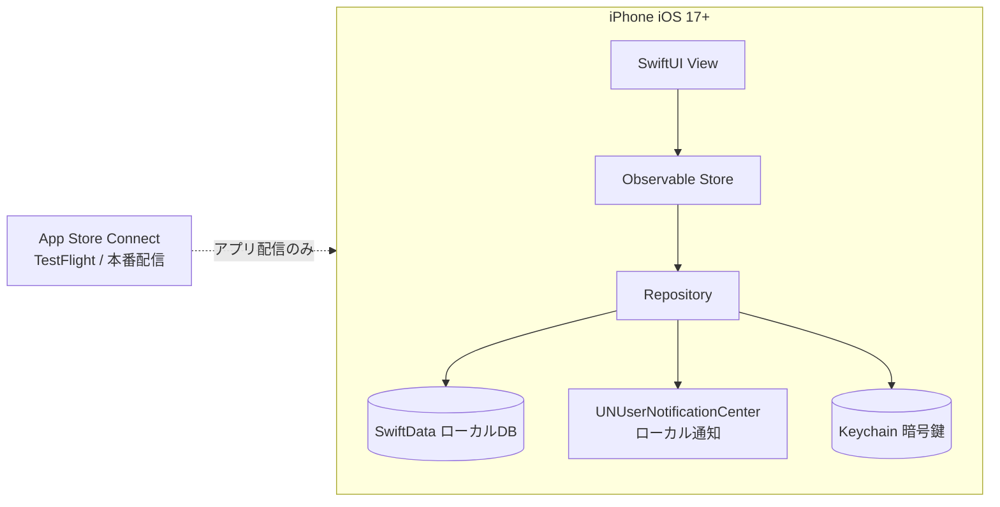
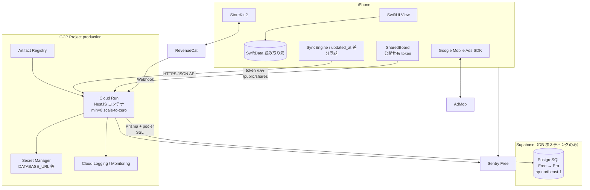
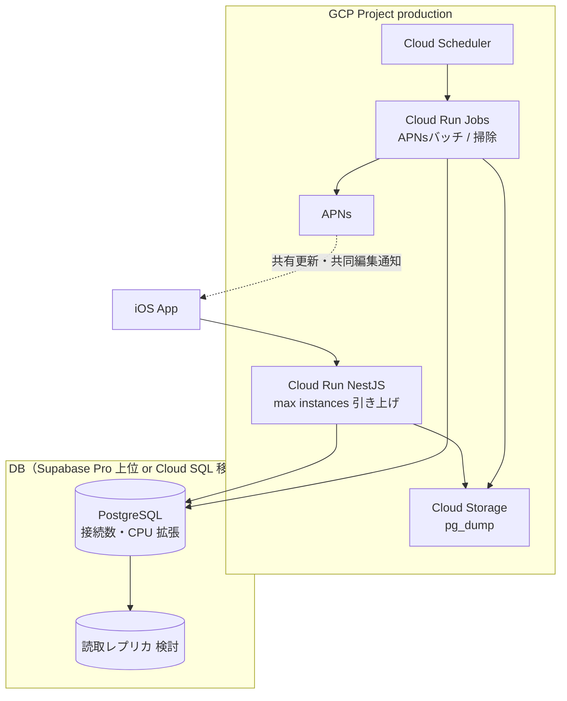

# 06. インフラ構成・コスト・運用（GCP / NestJS）

## このドキュメントの位置づけ

「参戦名義帳」を**個人〜2名の体制で、できるだけ低コストに運用し続ける**ための
構成・コスト試算・監視・バックアップ・CI/CD・セキュリティ運用を定義します。

**方針（2026-07-31 確定）**: API は **NestJS + GCP Cloud Run**。DB の正は **Supabase PostgreSQL（ホスティングのみ）**。
Auth / PostgREST / Realtime / Storage / Edge Functions は不使用。**NestJS + Prisma が唯一の DB クライアント**（Connection pooler 経由を推奨）。
開発初期の代替は **Neon Free**。将来オプションとして **Cloud SQL**（GCP 一体・規模拡大時）を Phase 2 以降で検討するが、Phase 1 既定ではない。
[`./00-design-basis.md`](./00-design-basis.md) のスコープ・低コスト方針・収益化骨子は継承する。
BE=Supabase 記述と矛盾する場合は**インフラ面では本書を優先**する（他章の追随は別タスク）。

| 関連ドキュメント | 本書との関係 |
|---|---|
| [`./00-design-basis.md`](./00-design-basis.md) | スコープ・フェーズ・収益化骨子・リスクの正 |
| [`./02-architecture.md`](./02-architecture.md) | 同期設計。帯域・リクエスト試算の根拠 |
| [`./03-database.md`](./03-database.md) | DDL・インデックス。容量試算（認可は NestJS 側へ移行想定） |
| [`./04-api.md`](./04-api.md) | NestJS API 契約。タイムアウト・レート制限と対応 |
| [`./07-monetization.md`](./07-monetization.md) | 売上・コスト試算。本書コストと対比して損益判断 |
| [`./08-compliance-risk.md`](./08-compliance-risk.md) | 個人情報の安全管理。鍵管理と対応 |
| [`./09-roadmap.md`](./09-roadmap.md) | フェーズ計画。本書のコスト閾値を参照 |

### 4原則

1. **Phase 0 のインフラ費は0円**。サーバーなしで PMF 検証。
2. **常時課金を最小化**。Cloud Run は scale-to-zero、画像なし、Realtime なし、ローカル通知。
3. **Free 中は DB ¥0。Pro（≈$25≈¥3,875）または将来 Cloud SQL が支配項になりうる**。リクエスト課金より先に DB プランを見る。
4. **ロックインを浅く**。標準 PostgreSQL + `pg_dump` で退避可能（Supabase / Neon / Cloud SQL いずれも）。

### 確定構成

| 要素 | 採用 | 備考 |
|---|---|---|
| API | NestJS on Cloud Run | min instances=0 / scale-to-zero |
| DB | Supabase PostgreSQL（ホスティングのみ） | Prisma + Connection pooler（Transaction mode）経由。リージョン Tokyo `ap-northeast-1` |
| レジストリ | Artifact Registry | |
| 秘密情報 | Secret Manager | JWT、`DATABASE_URL`、RevenueCat webhook secret |
| 認証 | NestJS 自前（Sign in with Apple 検証） | Identity Platform は使わない |
| 共有ボード | iOS SharedBoard（同一アプリ） | NestJS `GET/PATCH /public/shares/:token`。**独立 Web / Cloudflare Pages は使わない**（2026-08-05） |
| 通知 | ローカル通知（Phase 1） | Cloud Scheduler / APNs バッチは Phase 2 |
| 監視 | Cloud Logging / Monitoring（無料枠）+ Sentry | |
| CI/CD | GitHub Actions → Artifact Registry → Cloud Run | |

Supabase 機能の使い分け: **PostgreSQL ホスティングのみ採用**。PostgREST→NestJS API、Auth→自前 JWT、
Edge Functions→NestJS コントローラ、pg_cron→Phase 2 の Scheduler+Job、Storage/Realtime→不使用。
委託先として Supabase Inc. を DB ホスティングに利用（[`./08-compliance-risk.md`](./08-compliance-risk.md) 参照）。

---

## 1. フェーズ別の構成図

### 1.1 Phase 0: ローカル完結（インフラ費0円）



サーバーなし。通知は端末内。バックアップは iCloud。
**固定費は Apple Developer Program 年額のみ**（インフラ費0）。

### 1.2 Phase 1: NestJS + Cloud Run + Supabase Postgres + 課金



- Auth: NestJS が Apple identity token を検証し自前 JWT を発行
- Realtime / WebSocket なし。同期は起動時・明示リフレッシュのみ
- 通知はローカル。Cloud Scheduler は Phase 1 不要
- 共有閲覧・編集は **アプリ内 SharedBoard**。独立 Web ビューは作らない

### 1.3 Phase 2: 共同編集・APNs・スケール強化



投入順（安いものから）: Cloud Run 調整 → Supabase Pro 上位 / pool 強化 →
Supabase 上位プラン or **Cloud SQL 移行**（GCP 一体・接続要件・コスト比較で必要なら）→
読取レプリカ / Scheduler+APNs。

---

## 2. サービス選定と低コストの工夫

### 2.1 共有: アプリ内 SharedBoard（独立 Web は作らない）

**2026-08-05 決定**: Next.js / Cloudflare Pages の共有 Web ビューは**作らない**。
受け取り側は iOS の `SharedBoardView` が `GET/PATCH /public/shares/:token` を直接叩く。
Universal Links（HTTPS → アプリ起動）は任意の後続タスク（静的ランディングは不要）。

### 2.2 構造的にコストを抑える選択

| 工夫 | 効果 |
|---|---|
| Cloud Run `min-instances=0` | アイドル時 CPU/メモリ課金をゼロに寄せる（コールドスタート 1〜3s 許容） |
| 画像アップロードなし | Storage・帯域・スキャン不要 |
| ローカル通知 | APNs / Scheduler が Phase 1 で不要 |
| Realtime なし | 常時接続課金・接続数管理を回避 |
| 独立共有 Web なし | Pages / CDN / 共有用ドメインの運用を回避 |
| Identity Platform 非採用 | Auth 月額と複雑さを回避 |
| Supabase Free 据え置き | Phase 1 立ち上げは DB 常時課金 ¥0。Pro は本番安定時に移行 |

### 2.3 Supabase Free → Pro をいつ引き上げるか

| 指標 | Free 据え置き | Pro 移行検討 |
|---|---|---|
| 同時接続（pool 合計） | 定常 < Supabase Free 上限 | 定常 > 上限、または接続待ちエラー |
| CPU / I/O | 平均 < 40%、短スパイクのみ | 平均 > 60% が連続、または p95 > 300ms |
| ストレージ | 8GB 以内 | 8GB 超・成長見込み |
| バックアップ | Free の日次自動（7日保持）で足りる | PITR・長期保持・SLA 要件 |
| MAU 目安 | 〜数千〜1万前半（同期頻度次第） | 有料ユーザー増・本番 SLA 確保時 |
| 次段 | — | **Supabase Pro**（≈$25≈¥3,875/月） |

原則: Cloud Run を先に増やさず、**Supabase ダッシュボードの接続数・CPU を見てから** Pro へ移行する。
接続式: `max_instances × pool_max ≦ DB max_connections × 0.7`。
例: 実効接続 ≈25 なら `max_instances=10` × `pool_max=1〜2`。**Prisma は pooler（Transaction mode）URL を使う。**

### 2.4 段階的移行: Free → Pro →（任意）Cloud SQL

```
[段階 A] Cloud Run + Supabase Free（推奨）または Neon Free
    ↓ 有料ユーザー / 本番 SLA / 接続・容量上限
[段階 B] Cloud Run + Supabase Pro（本番安定の既定）
    ↓ GCP 一体・接続要件・コスト比較で Supabase 上位でも足りない場合
[段階 C 任意] Cloud SQL（GCP 一体・規模拡大時）
```

| 段階 | DB | 月額DB目安 | 用途 |
|---|---|---:|---|
| A | Supabase Free / Neon Free | ¥0 | 立ち上げ・クラウド検証・β少数 |
| B | Supabase Pro | **≈ ¥3,875**（$25） | 本番安定。自動バックアップ・PITR 含む |
| C | Cloud SQL `db-f1-micro`〜 | 約 ¥1,700〜2,400〜 | GCP 統合 IAM・VPC・大規模時の選択肢 |

移行 A→B: Supabase ダッシュボードで Pro にアップグレード → Secret Manager の `DATABASE_URL` を pooler URL に更新 → 接続確認。
移行 B→C: `pg_dump` → Cloud SQL リストア → Secret の DSN を Cloud SQL 接続名へ →
接続を Unix ソケット/Auth 方式へ（**Cloud SQL 採用時のみ**）→ Supabase を read-only 並行確認後に削除。
**Neon は開発初期の代替。長期依存しない。**

---

## 3. 具体的な月額コスト表

### 3.1 前提

- 為替: **$1 = ¥155**（変動しうる。四半期ごとに見直し）
- 税抜概算。無料枠・プロモは使い切った後の定常値
- **料金は改定されうる**。発注前に Cloud Run / Supabase 公式価格を再確認
- Apple Developer Program: **年額 $99 ≒ ¥15,345 / 年 ≒ 月割 ¥1,279**
- リクエストモデル（同期中心・画像なし）:
  - アクティブ1人あたり **20 req/日**
  - 平均処理 **CPU 約 80ms / メモリ 512MiB 換算**
  - 共有ボード閲覧: MAU の 10% が月 5 回、公開 API 数回と仮定（アプリ内 SharedBoard）

試算内訳: MAU1万 → 10,000×20×30 ≒ **600万 req/月**。MAU10万 → ≒ **6,000万 req/月**。
共有ボード API 追加は相対的に小さい（1万で約1.5万、10万で約15万）。

### 3.2 シナリオ別月額（本番1プロジェクト）

**Phase 1 立ち上げは Supabase Free 前提**（DB ¥0）。本番 SLA 確保時は Supabase Pro へ移行（下記 §3.3 参照）。

| 費目 | Phase 0 | Phase 1 立ち上げ<br/>MAU〜200<br/>（Supabase Free） | MAU 1万 | MAU 10万 |
|---|---:|---:|---:|---:|
| Cloud Run リクエスト | ¥0 | 〜12万 req ≈ ¥0〜50 | 約600万 req ≈ ¥800〜1,400 | 約6,000万 req ≈ ¥8,000〜14,000 |
| Cloud Run CPU/メモリ時間 | ¥0 | ほぼ無料枠 ≈ ¥0〜200 | ≈ ¥1,200〜2,500 | ≈ ¥12,000〜25,000 |
| Supabase PostgreSQL | ¥0 | **¥0**（Free） | **¥0〜3,875**（Free 可なら ¥0 / Pro 移行時 ≈¥3,875） | **≈ ¥3,875〜**（Pro 必須級） |
| Cloud SQL（段階 C 採用時） | ¥0 | — | 約 ¥1,700〜2,400（移行時） | 上位必須 **≈ ¥6,000〜12,000** |
| Artifact Registry | ¥0 | ≈ ¥0〜50 | ≈ ¥50〜150 | ≈ ¥150〜400 |
| Secret Manager | ¥0 | ≈ ¥0〜50 | ≈ ¥50〜100 | ≈ ¥100〜200 |
| Cloud Logging / Monitoring | ¥0 | 無料枠 ≈ ¥0 | ≈ ¥0〜500 | ≈ ¥500〜2,000 |
| Sentry | ¥0 | ¥0（Free） | ¥0〜検討 | ¥0〜3,000 |
| Cloud Storage（週次 dump） | ¥0 | ≈ ¥50〜100 | ≈ ¥100〜300 | ≈ ¥300〜800 |
| **GCP 小計** | **¥0** | **≈ ¥100〜450** | **≈ ¥2,200〜6,900** | **≈ ¥21,000〜51,000** |
| **Supabase（DB）** | **¥0** | **¥0** | **¥0〜3,875** | **≈ ¥3,875〜** |
| Apple 年会費（月割） | ¥1,279 | ¥1,279 | ¥1,279 | ¥1,279 |
| **合計目安** | **≈ ¥1,279** | **≈ ¥1,400〜1,750** | **≈ ¥3,500〜11,000** | **≈ ¥26,000〜56,000** |

**Supabase Pro 移行シナリオ（Phase 1 本番安定）**: GCP 小計 ≈ ¥100〜450 + Supabase Pro ≈ **¥3,875** → **合計 ≈ ¥5,250〜5,600**（Apple 月割込み）。
Cloud SQL 段階 C 採用時は DB 行を Cloud SQL に置き換え、Supabase 行は ¥0 になる。

### 3.3 なぜ DB が支配項になりうるか

**Supabase Free 中は DB ¥0** のため、Phase 1 立ち上げでは Cloud Run（scale-to-zero + 無料枠）と合わせて **GCP 小計 ≈ ¥100〜450** に抑えられる。
ユーザーがほぼいない月でも **請求の大半は Apple 月割（≈ ¥1,279）** となる。

**Pro 移行後**（≈ ¥3,875/月）または **Cloud SQL 採用後**（≈ ¥1,700〜2,400/月）は DB が支配項になりうる。
Pro 移行時点で **インフラ請求の 70〜90% が DB** になる想定。

MAU 1万でも同期頻度を抑え concurrency を適切にすれば、Cloud Run より **DB 接続数・CPU** が先に限界に達しやすい。
MAU 10万ではリクエスト課金も無視できないが、ボトルネック第一候補は DB（Supabase Pro 上位 or Cloud SQL 移行、第9章）。

Cloud Run 費用の本丸は件数より **CPU/メモリ時間**（処理を短く終えること）。
**Free 中は DB 常時課金を見落としにくい**が、Pro / Cloud SQL 移行後は請求の一行目に DB が来る。

### 3.4 段階 A（Supabase Free / Neon Free）時の立ち上げ

| 費目 | 月額目安 |
|---|---:|
| Cloud Run + Artifact Registry + Secret Manager + Logging | ≈ ¥0〜400 |
| Supabase Free / Neon Free / Pages / Sentry Free | ¥0 |
| **GCP 小計** | **≈ ¥0〜400** |
| Apple 月割込み合計 | **≈ ¥1,300〜1,700** |

---

## 4. Cloud Run 推奨設定

### 4.1 推奨値

| 項目 | 推奨 | 理由 |
|---|---|---|
| CPU | 1 vCPU | NestJS + TLS + JSON 同期に十分 |
| Memory | 512Mi | Node の余裕。256Mi は尖りやすい |
| Concurrency | 80 | DB pool をインスタンスあたり 5〜10 に抑えつつスループット確保 |
| Timeout | 30s | 同期は数秒以内前提。長時間は Phase 2 Jobs |
| min instances | 0 | 低コスト最優先 |
| max instances | 10（立ち上げ）/ 50（MAU1万目安） | `max × pool ≦ DB 接続上限の 70%` |
| CPU throttling | true | アイドル費用抑制 |
| startup-cpu-boost | true | コールドスタート短縮 |

### 4.2 gcloud デプロイ例（参考・現在は Terraform + GitHub Actions が正）

以下は設定値の意味を理解するための手動コマンド例。**実際のCloud Runリソースは
[`infra/terraform/`](../infra/terraform/) が正**（§7参照）。手動でこのコマンドを叩くと
Terraformのstateとズレるので、通常運用では使わないこと。

```bash
gcloud run deploy meigicho-api \
  --image="${REGION}-docker.pkg.dev/${PROJECT_ID}/meigicho/api:${COMMIT_SHA}" \
  --region="${REGION}" \
  --platform=managed \
  --allow-unauthenticated \
  --min-instances=0 \
  --max-instances=10 \
  --cpu=1 \
  --memory=512Mi \
  --concurrency=80 \
  --timeout=30 \
  --cpu-boost \
  --service-account="meigicho-api@${PROJECT_ID}.iam.gserviceaccount.com" \
  --set-secrets="JWT_SECRET=jwt-secret:latest,DATABASE_URL=database-url:latest,REVENUECAT_WEBHOOK_SECRET=rc-webhook:latest" \
  --set-env-vars="NODE_ENV=production"
```

`DATABASE_URL` は Secret Manager に **Supabase pooler URL**（SSL 必須、`?pgbouncer=true` 等）を格納する。
Cloud SQL 段階 C 採用時のみ `--add-cloudsql-instances` と Unix ソケット接続を追加する。

`--allow-unauthenticated` は Cloud Run IAM を外し**アプリ層 JWT で保護**する構成。
管理系は NestJS 側で拒否。Cloud Armor 等は Phase 2 検討。

---

## 5. バックアップ

| 層 | 手段 | RPO 目安 | 備考 |
|---|---|---|---|
| 自動 | Supabase 自動バックアップ（Free: 日次7日 / Pro: PITR 含む） | 24h（Pro PITR 時は分〜時間） | 本番必須。Pro 移行で PITR 有効化 |
| 論理 | 週次 `pg_dump` → Cloud Storage | 7日 | ロックイン回避・別退避。Supabase / Cloud SQL 共通 |
| アプリ | SwiftData がローカル SSoT | — | サーバー障害時も端末内は残る |

週次 dump の実装:

- **Phase 1**: GitHub Actions cron + `pg_dump`（Secret Manager の `DATABASE_URL` 経由、WIF 推奨）
- **Phase 2**: Cloud Scheduler + Cloud Run Job → GCS へアップロード
- **Cloud SQL 段階 C 採用時**: `gcloud sql export` または Auth Proxy 経由 `pg_dump` を追加選択肢に

バケット例: `gs://meigicho-prod-backups/pg_dump/YYYY/MM/meigicho-YYYYMMDD.sql.gz`
公開禁止。ライフサイクルで 30日標準→90日 Coldline 等。四半期1回リストア訓練。

Supabase Pro 移行時はダッシュボードで PITR を有効化。Cloud SQL 採用時は以下を参考:

```bash
# Cloud SQL 段階 C のみ
gcloud sql instances patch meigicho-pg \
  --backup-start-time=17:00 \
  --retained-backups-count=7 \
  --maintenance-window-day=SUN \
  --maintenance-window-hour=18
```

（時刻は UTC。JST 深夜帯になるよう調整）

---

## 6. 環境構成

| 環境 | コンピュート | DB | 備考 |
|---|---|---|---|
| **local** | Docker Compose（Nest + Postgres 16） | ローカル | クラウド課金ゼロ |
| **staging** | Cloud Run（`meigicho-stg`） | Supabase Free / Neon Free | 本番データ禁止 |
| **production** | Cloud Run（`meigicho-prod`） | Supabase Free → Pro | 課金・個人情報あり。Cloud SQL は段階 C |

**stg / prod は GCP プロジェクトを分ける**（フォルダ分けだけは事故りやすい）。

```yaml
# docker-compose.yml（local 要旨）
services:
  db:
    image: postgres:16-alpine
    environment:
      POSTGRES_USER: meigicho
      POSTGRES_PASSWORD: meigicho
      POSTGRES_DB: meigicho
    ports: ["5432:5432"]
    volumes: [pgdata:/var/lib/postgresql/data]
  api:
    build: ./apps/api
    environment:
      NODE_ENV: development
      DATABASE_URL: postgres://meigicho:meigicho@db:5432/meigicho
      JWT_SECRET: local-dev-only-not-for-prod
    ports: ["8080:8080"]
    depends_on: [db]
volumes:
  pgdata:
```

| 名前 | local | staging / production |
|---|---|---|
| `JWT_SECRET` | `.env` | Secret Manager |
| `DATABASE_URL` | Compose | Secret Manager（Supabase pooler URL / Cloud SQL 時は接続名） |
| `REVENUECAT_WEBHOOK_SECRET` | ダミー可 | Secret Manager |
| `APPLE_CLIENT_ID` 等 | `.env` | Secret Manager（機密度に応じる） |
| `CORS_ORIGINS` | 任意（ローカル） | **必須ではない**（共有は iOS ネイティブ）。残すなら開発用のみ |
| `SENTRY_DSN` | 任意 | 環境別 DSN |

---

## 7. CI/CD（GitHub Actions）・IaC（Terraform）

**実装済み**（2026-08-07）。以下は実ファイルの索引。設計の詳細・初回セットアップ手順は
それぞれのファイル自身のコメント/READMEを正とする（本節はここでは概要のみ）。

| ファイル | 役割 |
|---|---|
| [`infra/terraform/`](../infra/terraform/) | Cloud Run・Artifact Registry・Secret Manager・IAM・WIFプールをコード化。**README.md に初回セットアップ手順**（state用GCSバケット作成 → 初回だけ手動apply → Secret Manager値投入 → GitHub Variables設定） |
| [`.github/workflows/deploy-api.yml`](../.github/workflows/deploy-api.yml) | `main`への`apps/api/**`変更マージで自動実行。test → build → push → `gcloud run deploy --image=...`（Cloud Run自体の設定はTerraformが正、ここではイメージ差し替えのみ） |
| [`.github/workflows/terraform-plan.yml`](../.github/workflows/terraform-plan.yml) | `infra/terraform/**`変更のPRで`terraform plan`のみ自動実行（レビュー用、applyしない） |
| [`.github/workflows/terraform-apply.yml`](../.github/workflows/terraform-apply.yml) | インフラ変更の本適用。事故防止のため`workflow_dispatch`（手動実行）のみ |

認証は **Workload Identity Federation（キーレス）**。JSON鍵はどこにも置かない。

**DBマイグレーションはCI/CDに含めない**（`apps/api/prisma/migrations/` が未整備で `db push` のみの運用のため）。
本番コンテナは `NODE_ENV=production` のとき起動時の自動 `prisma db push` をスキップする
（`apps/api/docker-entrypoint.sh`）。スキーマ変更は当面、人が明示的に実行する運用とする。

- production は `main` へのマージのみ。staging環境は現状未構築（`infra/terraform/`はproduction一本、必要になれば`.tfvars`を環境ごとに分けて同じモジュールを再利用する）
- iOS CI（Xcode Cloud / fastlane）はインフラ費外。TestFlight は Phase 0 から

---

## 8. セキュリティ

### 8.1 サービスアカウント最小権限

| SA | 用途 | 役割（例） |
|---|---|---|
| `meigicho-api@` | Cloud Run ランタイム | `secretmanager.secretAccessor`（必要シークレットのみ） |
| `ci-deploy@` | GitHub Actions | `run.admin`, `artifactregistry.writer`, `iam.serviceAccountUser`（実行 SA への actAs のみ） |
| `backup@` | dump | バックアップバケットの `storage.objectAdmin`（Cloud SQL 段階 C 時は SQL export 権限も） |

### 8.2 Secret Manager / DB ネットワーク

- JWT・`DATABASE_URL`・RevenueCat secret はリポジトリ・プレーン env 禁止
- JWT は kid 付き段階ローテーションを可能にする
- **DB パスワードを平文 env に置かない**（DSN は Secret Manager 一元管理）

| 方式 | Phase 1（Supabase） | Cloud SQL 段階 C |
|---|---|---|
| Prisma + Supabase pooler（SSL） | ○ 推奨 | — |
| Cloud Run の Cloud SQL 接続（Unix ソケット） | — | ○ 推奨 |
| プライベート IP + VPC Egress | — | ○ より堅牢（構成コスト増） |
| 公開 IP + パスワードのみ / `0.0.0.0/0` | × 禁止 | × 禁止 |

Supabase 接続: **Transaction pooler URL** + SSL（`sslmode=require`）。Direct connection はマイグレーション時のみ。
Cloud SQL 採用時は可能なら公開 IP 自体を無効化。残す場合も IAM DB Auth + 信頼済みネットワーク最小化。

**委託先**: DB ホスティングに Supabase Inc.（米国）を利用。個人情報の取扱いは
[`./08-compliance-risk.md`](./08-compliance-risk.md) の委託先一覧・DPA 確認に記載する。

### 8.3 アプリ層・請求ガード

| 項目 | 実装 |
|---|---|
| CORS | 必須ではない（共有は iOS）。残す場合は開発用に限定。所有者 API は JWT 必須 |
| レート制限 | NestJS で IP/userId（例: 同期 120 req/分）。webhook は署名必須 |
| Webhook | RevenueCat 署名検証 |
| 共有リンク | 高エントロピー token、期限・revoke、会員番号マスキング既定 |
| TLS | Cloud Run HTTPS のみ |
| 依存関係 | CI で `npm audit`（重大度しきい値） |

予算アラート: **¥3,000 / ¥10,000 / ¥30,000**。Monitoring: 5xx、p95、DB 接続数・CPU（Supabase ダッシュボード / Cloud SQL 段階 C）。
本番の削除保護・バケット公開チェックを有効化。

---

## 9. ボトルネックとスケール判断

```
iOS 同期 QPS 増
  → Cloud Run インスタンス増（比較的安い）
    → DB 接続数・CPU・ロック競合増
      → 最初の壁は Supabase Free 上限 or Pro プラン
```

Cloud Run は横スケールが得意だが、Supabase Free / Pro は接続と CPU に上限がある。
「API 503」より先に「接続タイムアウト / 遅い同期」が出やすい。

| 症状 | まず | 次 |
|---|---|---|
| コールドスタート | startup-cpu-boost、バンドル縮小 | min-instances=1（費用許容時のみ） |
| Cloud Run 429 / 高レイテンシ | max-instances↑、concurrency 調整 | CPU 1→2 |
| DB 接続エラー | pool 縮小、max-instances 上限↓ | Supabase Pro / 上位プラン |
| 遅い集計 | インデックス・N+1 解消 | Pro 上位、読取レプリカ、**Cloud SQL 移行検討** |
| 共有ボード負荷 | レート制限・無効リンク早期 404 | Cloud Run スケール |
| 共同編集・APNs | Phase 2: Scheduler + Jobs | — |

| 規模 | Cloud Run | DB |
|---|---|---|
| 立ち上げ〜MAU 200 | min=0, max=10, 512Mi | Supabase Free（Neon Free 段階 A 可） |
| MAU 1万 | max=20〜50、pool 再計算 | Supabase Pro。負荷試験後、必要なら上位 or Cloud SQL |
| MAU 10万 | max↑、必要なら CPU 2 | **Supabase 上位 or Cloud SQL 専用 vCPU 必須級** |

やらないこと: Identity Platform 必須化、Realtime、画像アップロード、
Phase 1 の Scheduler/常駐ワーカー、マルチリージョン Active-Active。

---

## 10. 監視・初期構築

| レイヤ | ツール | 指標 |
|---|---|---|
| プラットフォーム | Cloud Logging / Monitoring | リクエスト、レイテンシ、インスタンス |
| DB | Supabase ダッシュボード（/ Cloud SQL 段階 C 時は Monitoring） | 接続数、CPU、ディスク、レプリケーション |
| アプリ | Sentry | NestJS 例外、iOS クラッシュ |
| ビジネス | App Store Connect / RevenueCat | インストール、課金、解約 |

アラート初期セット: (1) Cloud Run 5xx > 5%（5分）(2) DB CPU > 80%（15分）
(3) DB 接続 > 上限の 70% (4) 日次費用 > 予算の 50%。

推奨リージョン: **GCP `asia-northeast1`（東京）**、**Supabase `ap-northeast-1`（東京）**。
Run / Artifact Registry / Secret Manager を GCP 同一リージョンに揃える。

初期構築チェックリスト:

1. `meigicho-stg` / `meigicho-prod` 作成、請求リンク、予算アラート
2. Artifact Registry 作成
3. Supabase プロジェクト作成（Postgres 16、`ap-northeast-1`）、pooler URL 取得
4. Secret Manager（JWT / `DATABASE_URL` / RevenueCat）
5. ランタイム SA・CI SA、IAM バインド
6. Cloud Run 初回デプロイ、Supabase 接続確認（SSL + pooler）
7. （任意）Universal Links / カスタムスキームの動作確認。CORS は必須ではない
8. GitHub Actions（WIF）配線
9. 週次 `pg_dump` バックアップ有効化
10. Sentry + 5xx / DB CPU アラート

---

## 11. コスト結論（意思決定用）

| フェーズ | 月額の感覚 | 支配項 |
|---|---|---|
| Phase 0 | **インフラ ¥0**（Apple 月割 ≈ ¥1,279） | なし |
| Phase 1 立ち上げ（Free） | **GCP ≈ ¥100〜450**（合計 ≈ ¥1,400〜1,750） | **Apple 月割**（DB ¥0） |
| Phase 1 本番安定（Pro） | **GCP ≈ ¥100〜450 + Supabase Pro ≈ ¥3,875**（合計 ≈ ¥5,250〜5,600） | **Supabase Pro** |
| MAU 1万 | **GCP ≈ ¥2,200〜6,900 + DB ¥0〜3,875** | DB + 増え始めた Cloud Run |
| MAU 10万 | **GCP ≈ ¥21,000〜51,000 + DB ≈ ¥3,875〜** | DB 上位化 + Cloud Run |
| 開発 defer | Supabase Free / Neon Free + Cloud Run **GCP ≈ ¥0〜400** | 本番前の逃げ道 |

Plus 月額 ¥350 換算で、Phase 1 立ち上げ（Free、GCP ≈ ¥250）は有料ユーザー約 **1人分**で回収ライン、
Pro 移行後（合計 ≈ ¥5,500）は約 **16人分**（手数料・税は `07` で精緻化）。
**Free 中は DB 常時課金がない**が、Pro 移行後は **DB が請求の中心**になる点に注意。
