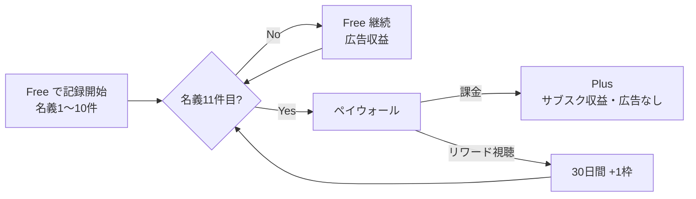
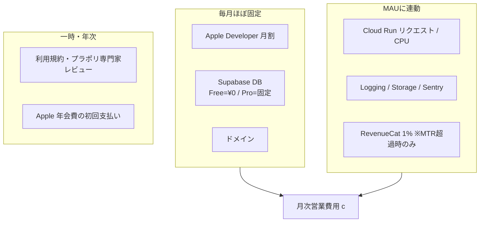

# 07. 収益化設計（Monetization）

## このドキュメントの位置づけ

[`./00-design-basis.md`](./00-design-basis.md) の「6. 収益化方針」で決めた骨格（**Free は10名義まで / 申込件数は無制限 / Plus は月¥350・年¥2,800 / 無料版は広告**）を、実装に落とせるレベルまで具体化したものです。決めることは、プラン間の機能差分（＝feature flag 一覧）、ペイウォールの位置と表示コピー、広告の配置と禁止領域、**予想コストと売上・損益試算**、StoreKit 2 / RevenueCat の実装要件（特に **Plus 解約後の名義の扱い**）。

| 関連ドキュメント | 参照理由 |
|---|---|
| [`./01-product-overview.md`](./01-product-overview.md) | 画面一覧（ペイウォール／広告の設置場所の前提） |
| [`./03-database.md`](./03-database.md) / [`./04-api.md`](./04-api.md) | `entitlements` テーブル、RevenueCat Webhook（NestJS `POST /v1/webhooks/revenuecat`） |
| [`./05-ios-client.md`](./05-ios-client.md) | ペイウォールUI・広告SDKの組み込み位置 |
| [`./06-infrastructure.md`](./06-infrastructure.md) | **インフラ費の正**（本書8章の控除項目はここから引用） |
| [`./08-compliance-risk.md`](./08-compliance-risk.md) | 広告SDKのプライバシー申告、サブスクの審査要件、訴求表現の制約 |
| [`./09-roadmap.md`](./09-roadmap.md) | 収益化機能の実装フェーズ・工数（機会費用の根拠） |

金額はすべて円・税込（日本のApp Storeは税込表示）を基準とし、手取り計算では消費税とApple手数料を明示的に差し引きます。

---

## 1. 収益モデルの全体像

**フリーミアム（サブスク）＋ 無料版への広告**のハイブリッド。収益源は2本だが役割が明確に分かれます。



| 収益源 | 対象 | 役割 |
|---|---|---|
| サブスク（Plus） | 名義が上限を超えるヘビー層（数%） | 売上の主軸。ARPU が高い |
| 広告 | 名義1〜10件の大多数 | ヘビー化を待つ期間の運転資金 |

### なぜこの組み合わせがこのアプリに合うのか

**(a) 支払い能力は高いが、支払い意思の発火が遅い。** 想定ユーザーはライブに年数万〜数十万円を使う層で、月¥350 は金額としてまったく障壁になりません。障壁は「まだこのアプリを信用していない」こと。FC会員番号や家族の氏名を預ける相手を、インストール直後に決められる人はいません。**課金判断は数か月使って記録が溜まってからしか起きない**。その待機期間を無収益で耐えるのが広告の役割です。

**(b) 強い季節性がある。** 利用は申込期（ツアー発表〜締切）と当落発表期に集中します。モックのサンプルでも `appliedDate` が6〜8月、`resultDate` が7〜9月に固まっています。オフシーズンは開かない月すらある。サブスク単独だと「使わない月がある」が解約理由になり、広告単独だと閑散期に収益がゼロ近くまで落ちてインフラ費を賄えない。**両方持つことで、季節変動する広告収益の谷を、平準化された年額サブスクが埋めます**（8.8 で定量化）。

**(c) 無料版でも価値の証明が完結する。** 最大価値である J1（FC更新期限を落とさない）は、名義10件・通知ありの Free で完全に成立します。つまり無料ユーザーは「損な体験」をしていない。これはフリーミアムの成功条件そのもので、「無料版は削って不便にしてある」型よりレビュー評価と口コミが安定します。

**(d) 広告を出せる面が構造的にある。** 一覧系画面（ホーム・名義一覧・申込一覧）が滞在時間の大半を占め、リスト末尾やカード間に自然な広告面があります。逆に広告を出せない入力フォームと当落確認画面は滞在時間が短く、機会損失も小さい。

### 採用しなかったモデル

| モデル | 却下理由 |
|---|---|
| 完全買い切り | 同期・共有リンク・APNs という継続的な変動費がある。長期ユーザーほど赤字になる |
| 広告のみ | MAU 数千〜数万のニッチアプリでは工数を回収できない（MAU 1万でも広告は月¥35,000程度） |
| サブスクのみ | 課金率3%なら残り97%が完全に無収益。同期・通知の変動費を賄えない |
| 従量課金（名義1件¥100/月） | 「名義を増やすたびに罰金」と感じる。ヘビー化を阻害する最悪の設計 |

---

## 2. プラン設計

| | **Free** | **Plus** |
|---|---|---|
| 価格 | ¥0 | **月 ¥350** / **年 ¥2,800** |
| 名義（プロフィール）登録数 | **10件まで** | 無制限 |
| 申込記録 | **無制限** | 無制限 |
| 広告 | あり | なし |

### 機能差分表（モックの実装から洗い出し）

`○` 利用可 / `△` 制限付き / `×` 不可

| # | 機能 | モック上の該当 | Free | Plus | 補足 |
|---|---|---|---|---|---|
| 1 | 名義の登録・編集・削除 | `screenAddIdentity` / `screenIdentityDetail` | △ 10件 | ○ 無制限 | **唯一の主要な上限** |
| 2 | 関係性・備考メモ | `f-relation` / `saveNote` | ○ | ○ | |
| 3 | FC会員情報の登録 | `screenAddMembership` | ○ 名義あたり無制限 | ○ | 名義数で絞れているので会員情報は絞らない |
| 4 | 会員番号の保存・表示 | `membership-no` | ○ | ○ | セキュリティ機能は課金対象にしない（`08`） |
| 5 | 申込の登録・編集 | `screenAddApplication` | ○ **無制限** | ○ | 3.2 の理由で絶対に制限しない |
| 6 | 同行者の登録（名義／氏名テキスト） | `a-companion-*` | ○ | ○ | 同行者は名義枠を消費しない |
| 7 | 申込一覧・検索・ステータスフィルタ | `screenApplications` | ○ | ○ | |
| 8 | ツアー表（マトリクス表示） | `screenApplicationsTable` | ○ | ○ | J2/J3 の中核。塞ぐと日常価値が消える |
| 9 | 当落ステータス切替・座席記録 | `status-changer` / `seat-input` | ○ | ○ | |
| 10 | 更新期限・当落発表日のローカル通知 | J1 | ○ | ○ | **絶対に有料化しない**（3.4） |
| 11 | 通知タイミングのカスタマイズ | Phase 1 | △ 30日前・7日前固定 | ○ 任意日数・複数回 | |
| 12 | 共有プレビュー | `screenSharePreview` | ○ | ○ | 発行前の確認は無料 |
| 13 | 共有リンクの発行 | `copyShareLink` | △ 有効なリンク**1本** | ○ 無制限 | |
| 14 | 共有時のマスキング詳細設定 | `historyVisible` | △ 名義単位ON/OFFのみ | ○ 項目単位（氏名/会員番号/座席/メモ） | |
| 15 | 共有リンクの有効期限・閲覧数確認 | Phase 1 | × | ○ | |
| 16 | 推しカラーテーマ | `setIdentityColor` / `applyTheme` | △ プリセット8色 | ○ カラーピッカー自由 | 情緒価値が高く機能価値を削らない安全な差分 |
| 17 | 統計（名義別当選率・FC別） | `v_identity_stats` | △ 直近3か月のサマリ | ○ 全期間・名義別・FC別・年別 | |
| 18 | エクスポート（CSV / PDF） | Phase 1 | × | ○ | |
| 19 | クラウドバックアップ（1端末） | Phase 1 | ○ | ○ | データ喪失は「不便」でなく「裏切り」。無料でも守る |
| 20 | 複数端末同期 | Phase 1 | × | ○ | |
| 21 | 共同編集ボード | Phase 2 | × | ○ | |
| 22 | 広告の非表示 / リワードで名義枠+1（30日） | — | × / ○ | ○ / —（不要） | |
| 23 | ファミリー共有 | — | — | ○ | 9.6 |

**この表を将来変更するときの判断基準**

1. **安全性・データ保全に関わる機能は絶対に有料化しない**（#4, #10, #19）。「無料だと会費を失効する」「無料だとデータが消える」構造は、収益以上の信用を失う。
2. **蓄積を止める制限は置かない**（#5, #8）。
3. 制限は「上限（quota）」に寄せ、「機能の削除」は極力使わない。上限は伸びれば自然に当たるので、取り上げられた感覚が生じにくい。

---

## 3. なぜ「名義数」が課金トリガーとして正しいのか

### 3.1 名義数トリガーの利点

| # | 利点 | 説明 |
|---|---|---|
| 1 | **ユーザーが価値を認めた「後」の行動である** | 名義を11件目に増やす人は、すでに1〜10件を登録し、通知を受け取り、申込を記録し、「このアプリは機能する」と確認した人。**支払い意思が最大化した瞬間にだけ**ペイウォールが出る。逆に起動時ハードウォールや期間制限トライアルは価値の証明前に判断を強制するので CVR が構造的に低い |
| 2 | **使用量と提供コストが比例する** | 名義が増えれば membership 行・通知スケジュール・同期対象が増える。「たくさん使う人が払う」という説明が成立する |
| 3 | **ヘビーユーザーの定義と一致する** | 名義11件以上＝「自分と家族だけでは足りず友人の名義まで広く管理している」層。滞在時間・記録件数・継続率すべてが高くLTVも最高。**収益の最大化と体験の最良化が一致する**数少ない設計 |
| 4 | **上限が見えるので不意打ちにならない** | 名義一覧に「10 / 10」と常時表示できるため、「使い始めたら急に金を取られた」型のレビュー低評価を防げる |

### 3.2 なぜ申込件数を制限してはいけないのか

**申込記録の蓄積が、このアプリにおける唯一の乗り換えコストです。** 3年分の申込・当落・座席が入ったアプリからは移れません（手入力の再現が不可能）。逆に記録が10件しかないアプリはいつでも捨てられます。

ここに上限を置いた場合の連鎖:

| 起きること | 結果 |
|---|---|
| 「上限に近いから記録を控えよう」と考える | **記録習慣が壊れる** |
| 記録が途切れる | ツアー表・統計が不完全になり、アプリの価値そのものが下がる |
| 蓄積が止まる | 乗り換えコストが育たず、解約率が上がる |
| 記録件数が伸びない | **北極星指標が死ぬ** |

北極星指標を「アクティブユーザーあたりの月間記録件数（名義登録＋申込登録＋ステータス更新）」に置く以上、この指標に課金圧をかけるのは自己矛盾です。つまり申込件数の制限は、短期の課金圧のためにプロダクトの中核資産と主要指標を破壊する取引です。

さらに実務上、**申込件数はユーザーが制御できません**。ツアーが発表されれば1週間で10件記録することもある。制御できない量で課金判定されるのは理不尽です。名義数は自分の意思で増やすものなので、この非対称性がありません。

### 3.3 代替案の検討と却下理由

| 代替案 | 却下理由 |
|---|---|
| **申込件数制限**（Free は50件まで） | 3.2 の通り。蓄積＝資産を人質に取る設計。**採用不可** |
| **期間制限トライアル**（14日で全機能ロック） | 価値は「更新期限が来たときに通知が届く」ことで証明される。更新期限は年1回なので**14日では価値が証明されない**。CVRが最も低くなる |
| **機能単位の買い切り**（統計¥480 など） | ①継続コストを回収できない ②SKUが増えて価格ページが複雑化 ③「どれを買えばいいか分からない」で購入意思が消える ④機能追加ごとにSKUを増やす負債 |
| **共有リンク数のみ** | 共有を使う人は限定的で母数が小さい。ただし**補助トリガーとして採用**（6.2 B） |
| **統計を主トリガー** | あれば嬉しいが無くても困らず支払い意思が弱い。**補助トリガーとして採用**（6.2 C） |
| **広告除去のみの課金** | 「不快さの解消」に課金させると、意図的に不快にする動機が生まれ、プロダクト品質が腐る |

**結論: 名義数を主トリガー、共有リンク数と統計を補助トリガーとする。**

### 3.4 やってはいけない収益化（明文化して禁止する）

以下は「効く」が採用しません。実装しようとした人が出たときに参照するための禁止リストです。

1. **更新期限通知を Plus 限定にする** — 会費失効という実損害を人質に取る。倫理的に不可、レビューでも致命傷。
2. **上限超過時に名義データを削除する** — 9.5 参照。閲覧は必ず残す。
3. **広告を意図的に不快にする**（インタースティシャル連打など） — 7.4 参照。
4. **無料ユーザーの通知を遅延させる** — 検知されたときの信用損失が回復不能。

---

## 4. 無料枠の閾値「10名義」の妥当性検証

### 4.1 設計意図

モックの `identities` は4件（本人・妹・友人2名）で、うち2件は「借りている名義」です。実際のユースケースを写したサンプルが4件であることは、**典型ユーザーが3〜4件に到達する**ことを示しています。閾値を10に緩和したことで、この典型ユーザー層は無料範囲に完全に収まります（2026-08-21 ユーザー判断で3→10へ緩和。以下の記述は新しい閾値に合わせて更新済み）。

```
名義1件: 自分だけ                 → 無料。まだ価値を実感していない
名義2件: 自分＋家族1人            → 無料。ここで通知の価値を実感する
名義3〜10件: 家族・親しい友人まで   → 無料。典型的な利用はほぼこの範囲に収まる
──────────── ここに壁 ────────────
名義11件目: さらに名義を増やす      → 課金判定。ヘビー層の域に入る瞬間
```

**閾値10の本質は「日常的な利用の大半は無料で完結し、それを超えて広く名義を管理し始めた層だけが有料」という線引き**です。優れている理由:

1. **10件目までのユーザーは課金しないが、広告を見て、口コミを運び、レビューを書く。** 無料層を狭めるとこの層が消え、アプリが伸びない。閾値を3→10に広げたことで、この無料層自体も広がった。
2. **11件目に到達した瞬間、管理対象がヘビー層の域に入っている。** そこまで名義を増やす層は記録量・継続率・LTVが高く、月¥350の価値が最も高く見える。
3. **モックのサンプル（4件）は、新しい閾値10より十分に低い。** 典型ユーザーは壁に触れず無料で完結する。これは「無料版でも損をしない」体験を強めるが、一方でペイウォール到達率は閾値3のときより下がる（4.2 参照）。

### 4.2 A/Bテストで検証すべき候補値と判断指標

**2026-08-21 ユーザー判断で既定値を3→10へ緩和した。** 以下の候補値・判断指標は旧既定値3を基準に設計されたもので、**新しい既定値10を基準に再検討が必要**（未着手）。参考として残す:

| 候補 | 想定される効果 | 想定されるリスク |
|---|---|---|
| **2** | ペイウォール到達率が大幅上昇。到達が早い | 価値証明の前に壁が来る。**CVRが下がりつつアンインストールが増える**。「無料では実質使えない」レビュー |
| **3** | 家族利用までは無料で完結。到達時点で価値証明が済んでいる | — |
| **5** | 無料層の満足度が最大。口コミが最良 | 到達率が大きく下がり、課金する必要がある人がほぼいなくなる可能性 |
| **10（現在の既定）** | 無料層の満足度が最大級。ペイウォール到達率はさらに下がる想定 | 到達率が下がりすぎると課金CVRの母数が減り、収益への影響を要観測 |

**判断指標（この優先順で見る）**

1. ペイウォール到達後30日以内の課金CVR（主指標）
2. インストール30日後の継続率（閾値2で下がりやすい。ここが落ちるならCVRが上がっても採用しない）
3. インストール→初回課金までの日数の中央値（キャッシュフロー観点）
4. 1インストールあたり期待収益 = 課金収益 + 広告収益（閾値5の広告収益増を正しく評価するため）
5. レビュー平均評価と「有料」「課金」を含むレビュー比率（定性の早期警戒）

**実施条件**: 有意差には各群1,000インストール以上必要。MAU 1,000規模では検定力が足りないので、**Phase 1 は 10（2026-08-21 緩和後の既定値）で固定し、MAU 5,000超で A/B を開始**。それ以前はペイウォール到達率の生値だけを見て、極端に低いなら閾値を下げる方向で単独変更（前後比較）します。

---

## 5. 価格設定

### 5.1 相場観

日本のニッチな趣味・記録系アプリの月額サブスクは概ね ¥150〜¥600 に収まります。¥350 はこのレンジの中央で、①ライブ1回に数万円使う層にとって検討に値しない絶対額 ②日本ストアの標準価格ティア上にある ③年額¥2,800との比率が「33%割引」として説明しやすい、の3点を満たします。

### 5.2 手取り（proceeds）の計算

**前提**: 日本のApp Storeでは Apple が販売者となり消費税10%を価格に内包して徴収・納付する。Apple手数料は**消費税を除いた金額**にかかる。Small Business Program（年間収益100万米ドル以下）適用時は **15%**、非適用は30%。本プロダクトは初年度から適用対象。

```
税抜金額   = 税込価格 ÷ 1.10
手取り     = 税抜金額 × (1 − 手数料率)
```

```
月額 ¥350: 税抜 = 350 ÷ 1.10   = 318.18 円
           手取り = 318.18 × 0.85   = 270.45 円 ≒ ¥270 / 月（年換算 ¥3,240）
年額 ¥2,800: 税抜 = 2,800 ÷ 1.10 = 2,545.45 円
           手取り = 2,545.45 × 0.85 = 2,163.64 円 ≒ ¥2,164 / 年（月換算 ¥180）

手数料30%の場合
月額 ¥350:  318.18 × 0.70   = ¥223   （15%比 −17%）
年額 ¥2,800: 2,545.45 × 0.70 = ¥1,782 （15%比 −18%）
```

売上100万ドル（≒1.5億円）到達は MAU 数十万規模なので当面15%前提。ただし損益計算には30%ケースも併記し、判断が反転しないことを確認します（8.8）。

### 5.3 価格候補の比較

| 価格 | 税抜 | 手取り(15%) | 評価 |
|---|---|---|---|
| ¥250 / 月 | 227.27 | **¥193** | ¥350比で手取り29%減。¥350と¥250でCVRが29%以上変わるとは考えにくく、**取りこぼしが大きい**。安すぎて「他人の個人情報を預けて管理する信頼性」を自ら安く見せる |
| **¥350 / 月（採用）** | 318.18 | **¥270** | 「気にならない額」の上限付近。MAU 1万で黒字化するのに十分 |
| ¥500 / 月 | 454.55 | **¥386** | 手取り +43%。ただし「月500円」はサブスク一覧を見直すときに切られる閾値。年額¥4,000も4桁で抵抗が出る |

### 5.4 年額の設計

```
月額×12 = 350 × 12 = ¥4,200      年額 = ¥2,800
割引率 = 1 − 2,800 ÷ 4,200 = 33.3%
```

**33%割引の目的は「安くする」ことではなく「解約判断の回数を12回から1回に減らす」ことです。** オフシーズンに起動されない月があるため、月額だと「今月使ってないな」という解約トリガーが毎月発火します。年額なら解約判断は1年後で、しかもそのタイミングは「また申込シーズンが来た」時期になる可能性が高い。

**誘導方針**: ペイウォールでは年額を既定選択にし「月あたり¥233」（2,800 ÷ 12）と併記。ただし**月額を隠すことはしない**（審査要件および誠実性）。目標ミックスは年額40% / 月額60%（初期）→ 1年後に年額55%。

```
1契約あたり月間平均手取り（年額40% / 月額60%）
= 0.6 × 270 + 0.4 × 180 = 162 + 72 = ¥234 / 契約・月   ← 8章で使う
```

---

## 6. ペイウォール設計

### 6.1 ハード / ソフトの使い分け

| 種別 | 定義 | 使う場所 |
|---|---|---|
| ハードウォール | 課金しないと操作が完了しない | 名義11件目の追加、共有リンク2本目の発行 |
| ソフトウォール | 一部を見せ、閉じれば元の画面に戻れる | 統計タブ、マスキング詳細、エクスポート |
| 常設エントリ | ペイウォールではなく導線 | 設定画面の「参戦名義帳 Plus」行 |

原則: **ユーザーが明示的に起こした操作を塞ぐときだけハード**。偶発的な遷移（タブを覗いた等）はソフト。

### 6.2 表示タイミングと実際のコピー

#### (A) 11件目の名義追加をタップした瞬間 — ハードウォール

トリガー: 名義が10件のときに名義一覧の `＋` またはホームのアクションシート「名義を追加」をタップ。**フォームを開いてから止めるのではなく、開く前に出します**（入力後に止めるのは最も嫌われる）。

```
11件目の名義を登録するには

無料版では名義を10件まで登録できます。
家族や友人の名義もまとめて管理すると、
「誰の会員資格がいつ切れるか」を一覧で追えるようになります。

Plusでできること
・名義を無制限に登録
・広告なし
・複数の端末で同じ記録を見る
・名義ごとの当選率などの統計
・CSV / PDF で書き出し

[ 年額プラン ¥2,800 / 年（月あたり¥233） ]   ← 主ボタン
[ 月額プラン ¥350 / 月 ]                     ← 副ボタン
 動画を見て30日間だけ1枠増やす                ← 第3導線
 あとで                                       ← 閉じる

自動更新されます。いつでも解約できます。
利用規約 ／ プライバシーポリシー ／ 購入を復元
```

#### (B) 共有リンクを2本目以降作成しようとしたとき — ハードウォール

トリガー: `screenSharePreview` の「共有リンクをコピー」を、有効なリンクが既に1本あるときにタップ。

```
共有リンクは無料版で1本まで

いま「STELLARIS ARENA TOUR 2026」の共有リンクが有効です。
Plus にすると、ツアーごと・相手ごとにリンクを分けて発行でき、
それぞれ公開する範囲と有効期限を別々に設定できます。

[ Plus を見る ]
[ いまのリンクを無効にして作り直す ]
 あとで
```

副ボタンが重要です。「1本だけ」の制限は**作り直せるなら不便ではない**。逃げ道のないハードウォールはレビュー低評価を招きます。

#### (C) 統計タブを開いたとき — ソフトウォール

直近3か月のサマリは実データで表示し、その下の「全期間・名義別」ブロックをぼかし＋サンプル値で見せます。

```
名義ごとの当選率（Plus）

どの名義がよく当たっているかを、全期間の記録から集計します。
申込 24件・当選 7件 のような集計を、名義別・ファンクラブ別・年別に表示します。

[ Plus で統計を見る ]
```

**ぼかしに使う数字は必ずダミーであることを明示**します。実データをぼかして「見えそうで見えない」表示にするのは、自分のデータを取り上げられた感覚を生むため避けます。

#### (D) 設定画面 — 常設エントリ（ペイウォールではない）

```
未契約時                              契約中（審査要件を満たすためにも必要）
─────────────────────    ────────────────────────────────
参戦名義帳 Plus                       参戦名義帳 Plus（年額プラン）
名義を無制限に・広告なし・端末間で同期  › 2027年8月14日に自動更新されます
                                      サブスクリプションを管理する          ›
                                      購入を復元                            ›
```

#### (E) 出さない場所

| 場所 | 理由 |
|---|---|
| 起動時 | 価値証明の前に判断を強制する。CVRが最も低い |
| 申込詳細（`application-detail`） | 当落を確認・更新する画面。感情の最中に金の話をしない |
| フォーム入力中 | 入力途中の中断は最も強い不満を生む |
| 通知タップ直後 | 「更新期限が近い」と知らせておいてペイウォールを出すのは悪質に見える |
| 共有リンクの閲覧側（Web） | 相手はユーザーではない。営業対象にしない |

### 6.3 表示頻度の制御

同一トリガーは1日1回まで。「あとで」を3回連続で押されたトリガーは14日間表示しない（`paywall_suppressed_until`）。ソフトウォールのぼかしブロックは常設（モーダルではないので許容）。

### 6.4 無料トライアル（7日間）を付けるか

**結論: Phase 1 ではつけない。ただし撤回条件を先に決めておく。**

**つけない理由**

1. **名義数トリガーは既に「価値体験の後」に発火している。** トライアルの目的は価値の体験だが、この設計ではペイウォール到達時点でユーザーは数か月使っています。トライアルは意思決定を7日後ろにずらすだけになりやすい。
2. **代替がすでにある。** リワード広告の「30日間+1枠」が実質的な機能トライアルとして働きます。7日ではなく30日、かつ広告収益を伴う。
3. **運用コストが増える。** 転換追跡、7日目の解約集中への対応、Introductory Offer の表示要件（`08`）が発生する。
4. **年額主軸と相性が悪い。** 7日トライアル付き年額は「1年分をうっかり課金された」というクレームと返金申請の主要因になります。

**撤回条件**: ペイウォール表示→30日以内の課金CVRが **2%を下回った**場合、または解約理由アンケートで「試せなかった」が上位3位に入った場合。その際の実装は「**年額プランのみ7日間トライアル**、月額はなし」とし、終了2日前にローカル通知で予告します（返金申請の予防）。

---

## 7. 広告設計（AdMob）

### 7.1 使用するフォーマット

| フォーマット | 使う / 使わない |
|---|---|
| インライン・アダプティブバナー（スクロール内） | **使う** |
| ネイティブ広告（小・リスト内） | **使う** |
| リワード動画 | **使う** |
| アダプティブ・アンカーバナー（画面下部固定） | 使わない（タブバー上に常時居座り、DADSの落ち着いたUIを壊す） |
| インタースティシャル（全画面） | 使わない（7.4） |
| リワード・インタースティシャル / アプリ起動時広告 | 使わない |

### 7.2 配置（モックの画面構成に即して）

| 画面 | 位置 | フォーマット | 上限 |
|---|---|---|---|
| ホーム（`screenHome`） | 「当落発表待ちの申込」リストの**後**、画面最下部 | ネイティブ（小） | 1枚 |
| 名義一覧（`screenIdentities`） | `card-list` の**後**、画面最下部 | インラインバナー | 1枚 |
| 申込一覧・リスト | 5件目の後、以降10件ごと | ネイティブ（`ticket-row` と同じカード形状） | 1画面あたり2枚 |
| 申込一覧・ツアー表 | `tour-group` と `tour-group` の**間**（表の内側には絶対に入れない） | インラインバナー | 全体で1枚 |
| 名義詳細（`screenIdentityDetail`） | 「申込履歴」リストの**後**、画面最下部 | インラインバナー | 1枚 |

**ホームで `stat-row` の直下に置かない理由**: `stat-row`（名義数・更新期限・発表待ち）は「今日の状態」を伝える最重要ブロックです。直下に広告を挟むと、起動直後の最初のスクロールが広告に当たり、アプリの第一印象が広告になります。

**申込一覧で5件目の後に置く理由**: モックの初期データは8件で1画面に約3.5件。5件目の後＝**2画面目の中盤**になり、1画面目には広告が出ません。

### 7.3 広告を絶対に出さない場所

| 場所 | モック上の該当 | 理由 |
|---|---|---|
| **当落ステータスを切り替える瞬間** | `status-changer` / `setStatus()` | 「当選」を押す瞬間はこのアプリで最も感情が動く瞬間。ここに広告が挟まると、体験の記憶が「広告が出たアプリ」に置き換わる |
| **申込詳細のヒーロー部** | `ticket-hero` / `stamp-lg` | 当選・落選が表示される領域。落選を確認した直後の広告は残酷であり、レビュー低評価の直接原因 |
| **申込詳細の画面全体** | `screenApplicationDetail` | 上記を含む画面なので最下部含め広告ゼロ。滞在時間が短く機会損失も小さい |
| **入力フォーム全画面** | `screenAddIdentity` / `screenAddMembership` / `screenAddApplication` | 入力の中断は不満が最大。誤タップで離脱すると入力内容が消え致命的 |
| **共有プレビュー** | `screenSharePreview` | 「この画面が相手に見える」という信頼の説明画面。共有先にも広告が出ると誤解される |
| **共有ボード（アプリ内）** | iOS SharedBoard | 閲覧者は名義主・同行者。広告は置かない（礼を欠く） |
| **通知タップからの初回画面** | — | 通知が広告の呼び水に見える |
| **会員番号が表示される領域の隣** | `membership-card` / `membership-no` | 機微情報の隣に第三者の広告SDKがある構図そのものを避ける（`08` の説明責任上も重要） |

**この禁止領域は feature flag ではなくコード構造で担保します。** 広告は `AdSlot` コンポーネントとして実装し、上記画面には `AdSlot` を置かない。フラグで消せる設計にすると、将来の収益改善圧で必ず戻されます。

### 7.4 インタースティシャルを一切使わない理由

このアプリは画面遷移が非常に多く（一覧→詳細→名義詳細→一覧）、遷移トリガーの全画面広告は体感で「常に出ている」水準になります。誤タップ率が高く AdMob の無効トラフィック判定リスクもある。eCPM はバナー比5〜10倍高いが、**最も価値の高い遷移（申込詳細を開く）が最も汚染される**ため、7.3 の原則と正面衝突します。

### 7.5 リワード広告「動画視聴で30日間だけ名義枠+1」

報酬は名義上限 +1（10 → 11）、有効期間は視聴完了から **30日**、同時に持てるボーナス枠は **1枠まで**（+2 不可）、再視聴による延長は残り7日以内になってから可、**月間視聴上限は2回**。Plus 契約中は導線を表示しません。

```sql
-- entitlements（詳細は 03-database.md）
bonus_identity_slots   smallint  not null default 0,
bonus_slots_expires_at timestamptz,
rewarded_views_month   smallint  not null default 0,   -- 月初にリセット
rewarded_views_reset_at date

-- 名義上限 = Plus契約中 ? 無制限
--          : 10 + (bonus_slots_expires_at > now() ? bonus_identity_slots : 0)
```

**課金への踏み台になる仕組み**

1. 11件目の名義を**実際に作って30日間使える**＝Plus の主機能を無料で体験する。
2. 30日後に上限に戻るとき、11件目は消えず**閲覧のみ**になる（9.5 と同じ挙動）。すでに使っていた名義が読み取り専用になる体験は、初めて壁に当たるより支払い意思が強い。
3. 期限3日前に通知: 「『小林 蓮 (友人)』の追加枠が3日後に終わります。Plus にすると、そのまま使い続けられます。」
4. 月2回上限があるため**リワードだけで永久に回避できない**。3か月目には「毎月動画を見るか、月¥350を払うか」の比較になり、後者が選ばれやすい。

**悪用防止**: 月2回上限をサーバー側 `entitlements` で判定（クライアント値は信用しない）。付与は AdMob の **SSV（Server-Side Verification）** を使い、Edge Function で署名検証してから更新する（`04-api.md`）。1日3回以上の視聴試行はログに記録し異常検知の対象にする。

### 7.6 DADS 準拠UIに広告を載せるときのデザイン規約

デジタル庁デザインシステムは「アクセントカラーの多用を避ける」「情報階層を明確にする」方針で、広告は原則としてこれと衝突します。次のルールで衝突を最小化します。

| ルール | 具体 |
|---|---|
| **広告であることを必ず明示** | カード左上に `広告` ラベル。`.tag` と同じスタイル（14px / `--surface-alt` 背景 / `--border` 枠 / `--ink-soft` 文字）。「Sponsored」「PR」ではなく日本語の `広告` に統一 |
| **既存カードの形状トークンを流用** | `border-radius: var(--r-md)` / `border: 1px solid var(--border)` / `background: var(--surface)` / `padding:14px`（`ticket-row` と同じ） |
| **推しカラーテーマを広告に適用しない** | `applyTheme()` が書き換える `--primary` を広告に使わない。広告は常にニュートラル（`--gray-*`）。ユーザーが選んだ推しカラーを広告に使うのは心情的に最悪 |
| **CTAを主ボタンと同じ見た目にしない** | 広告のCTAは枠線ボタン（`--ink-soft`）。`btn-primary-block`（塗り）と見分けがつくこと |
| **フォントサイズ下限を守る** | DADS は14px未満を使わない。見出し16px / 本文14px。AdMob のネイティブテンプレートは使わず**カスタムレイアウト**で実装 |
| **レイアウトを崩さない** | 画像が取得できない場合はテキストのみで表示して空枠を残さない。プレースホルダの高さは事前固定（読み込み完了でリストが飛ぶとタップミスが起きる）。自動再生動画・点滅フォーマットは管理画面で除外 |
| **広告カテゴリのブロック** | ギャンブル、出会い系、投資・仮想通貨、美容医療、および**チケット売買・転売関連**をブロック。最後の1つは `08` のリスク管理上必須 |

**表示頻度**: 1セッション最大3インプレッション / 起動から30秒間は要求しない / 同一画面で連続2枚を出さない / オフライン時は枠自体を出さない。

### 7.7 eCPM の想定値

**想定範囲（日本・iOS・女性中心の趣味／記録系アプリ・非パーソナライズ広告前提）**

| フォーマット | 保守 | 基準 | 楽観 |
|---|---|---|---|
| インライン・アダプティブバナー | ¥80 | ¥150 | ¥300 |
| ネイティブ（小・リスト内） | ¥200 | ¥400 | ¥800 |
| リワード動画 | ¥600 | ¥1,200 | ¥2,500 |
| **ブレンド（バナー:ネイティブ = 4:6）** | **¥150** | **¥250** | **¥400** |

**根拠の示し方（実測前の扱い方）**

1. **これは推定値であり、リリース前に確度を上げる手段はない**と明記する。AdMob の公開レポートは地域・カテゴリ別の粒度しかなく、個別アプリの eCPM は在庫の質（ユーザー属性・広告面の位置・視認性）で3倍以上変動します。
2. 根拠として使えるのは次の2点。①日本は iOS の広告単価が世界的に高い市場に属する。②一方で本アプリは **`08` の判断により非パーソナライズ広告（NPA）で開始**するため、行動ターゲティングが効かず eCPM が一般に **30〜50% 低下**する。上表はこの低下を織り込んだ**控えめな値**です。ATT を導入し許諾率25〜35%を仮定するとブレンドは10〜20%改善する見込みで、これは Phase 2 の A/B 項目とします。
3. **リリース後7日で実測に置き換える。** 本書の試算は暫定であり、インフラのスケールアップ判断などは実測 eCPM で再計算します。
4. 収益予測は必ず**保守ケースで判断**する（基準で黒字だが保守で赤字なら採用しない）。

---

## 8. 予想コストと売上・損益試算

売上だけ見ると楽観に傾くため、**先にコストを確定し、その控除後で黒字かを見る**。インフラの内訳・根拠は [`./06-infrastructure.md`](./06-infrastructure.md) を正とし、本書は損益判断用にシナリオへ写し替える。

前提（コスト共通）:

- 為替 **$1 = ¥155**（`06` と同じ。四半期見直し）
- 金額は税抜概算。GCP / SaaS の改定で変動しうる
- **人件費（自分の時間）は営業損益の控除に入れない**。機会費用として 8.5 で別掲する

### 8.1 コストの全体像



| 区分 | 含むもの | 扱いかた |
|---|---|---|
| **月次ランニング** | GCP + Apple 月割 + ドメイン +（条件付き）RevenueCat | 損益の控除 `c` |
| **一時費用** | 法務レビュー、初回ドメイン取得 | 初年度キャッシュアウトとして別掲。月次損益には按分しない（判断を濁すため） |
| **機会費用** | Phase 0〜1 の工数（`09`） | 現金支出ではない。撤退判断・ROIの参考 |

### 8.2 月次ランニングコスト（シナリオ別）

`06` 3.2 / 12章を、本書の売上シナリオ（MAU 1k / 10k / 50k）に写したもの。**損益計算ではレンジの中央値を `c` に使う**（保守判断が必要なときは上限を見る）。

| 費目 | MAU 1,000<br/>（Phase 1 相当） | MAU 10,000 | MAU 50,000 |
|---|---:|---:|---:|
| Cloud Run（req + CPU/メモリ） | ≈ ¥0〜250 | ≈ ¥2,000〜3,900 | ≈ ¥8,000〜16,000 |
| Supabase PostgreSQL（ホスティングのみ） | **¥0**（Free） | **≈ ¥3,875**（Pro） | **≈ ¥3,875**（Pro。超過時 Team 等） |
| Artifact / Secret / Logging / Storage | ≈ ¥50〜200 | ≈ ¥200〜1,050 | ≈ ¥1,000〜3,500 |
| AdMob / Sentry Free | ¥0 | ¥0〜500 | ¥0〜3,000 |
| **GCP 小計** | **≈ ¥0〜450** | **≈ ¥2,200〜4,950** | **≈ ¥9,000〜22,500** |
| Apple Developer（年 $99 ÷ 12） | ¥1,279 | ¥1,279 | ¥1,279 |
| ドメイン（年 ¥1,500〜2,000 ÷ 12） | ≈ ¥150 | ≈ ¥150 | ≈ ¥150 |
| RevenueCat | ¥0 | ¥0 | **≈ ¥4,500**（下記） |
| **月次合計 `c`（中央値）** | **¥1,500** | **¥9,100** | **¥25,500** |
| 参考: レンジ | ¥1,400〜1,900 | ¥7,500〜10,800 | ¥19,000〜32,000 |
| 参考: Pro 移行後（1k のみ） | **≈ ¥5,500** | — | — |

**MAU 1,000（Phase 1・Supabase Free）**: DB は ¥0。支配項は **Apple 月割（¥1,279）** とドメイン。Cloud Run は scale-to-zero + 無料枠で誤差。**合計 ≈ ¥1,300〜1,700**。

**MAU 1,000（Pro 移行後）**: Supabase Pro（$25 ≈ ¥3,875）が支配。中央値 **≈ ¥5,500**（GCP + Apple + ドメイン ≈ ¥1,650 + Pro ¥3,875）。

**MAU 10,000 以降**: Supabase Pro を前提に DB **≈ ¥3,875** を織り込む。Cloud Run のリクエスト課金が次の支配項。

**MAU 50,000 の Supabase**: Pro 枠内に収まれば据え置き。DB サイズ・接続数が Pro 上限に近づけば Team 等へ（`06` 参照）。Cloud SQL への移行は将来オプション。

**RevenueCat（MAU 50,000 のみ計上）**:

```
MTR（税込ストア売上の概算）= 契約数 × 1契約あたり税込月額換算
  = 1,500 × (0.6 × 350 + 0.4 × 2,800 ÷ 12)
  = 1,500 × 303.33 ≒ ¥455,000  ≈ $2,935（¥155換算）

無料枠: Monthly Tracked Revenue $2,500 まで ¥0
超過後: MTR の 1% → $2,935 × 0.01 ≒ $29 ≒ ¥4,500 / 月
```

MAU 10,000 時点の MTR は約 ¥91,000（≈ $590）で無料枠内。**RevenueCat 費用は「売上が先に立つ」コスト**であり、立ち上げ期の固定費ではない。

AdMob は掲載費用ゼロ（収益は eCPM 側で既にネット）。Apple 手数料は売上の手取り計算（5.2）で控除済みなので、ここには二重計上しない。

### 8.3 フェーズ別の見え方（意思決定用）

| 段階 | 月次コスト目安 | 何を耐えるか |
|---|---:|---|
| Phase 0（サーバーなし） | **≈ ¥1,279**（Apple のみ） | PMF 検証。失敗しても現金損失は年会費程度 |
| Phase 1 立ち上げ / MAU〜1,000 | **≈ ¥1,300〜1,700**（Supabase Free） | Apple + Cloud Run が支配。DB は ¥0 |
| Pro 移行後 / MAU〜1,000 | **≈ ¥5,300〜5,800** | Supabase Pro（≈ ¥3,875）が支配 |
| MAU 10,000 | **≈ ¥7,500〜10,800** | Supabase Pro + Cloud Run。副業黒字の主戦場 |
| MAU 50,000 | **≈ ¥19,000〜32,000** | Cloud Run 増 + RC 1%（Supabase は Pro 据え置き想定） |
| 凍結モード（開発停止・掲載維持） | **≈ ¥1,279**（Apple）＋年2人日 | `09` の撤退実務。Cloud Run scale-to-zero + Supabase プロジェクト停止で GCP/DB を切る |

**既定の初期構成は Supabase Free**（`06` 3.4）。DB 費 ¥0 のまま Phase 1 を回せる。Neon Free は同等の Free 代替として触れる程度。本番安定後は **Supabase Pro（≈ ¥3,875/月）** へ移行。Cloud SQL は将来オプション（既定の支配項からは外す）。

### 8.4 初年度の一時費用（キャッシュアウト）

月次損益には入れないが、**最初の12か月で別途出ていく現金**。

| 項目 | 目安 | タイミング | 備考 |
|---|---:|---|---|
| Apple Developer Program | **≈ ¥15,345**（$99） | Phase 0 開始時 | 月割 ¥1,279 と二重に数えないこと。ここは年払いの実額 |
| ドメイン取得・更新 | ¥1,500〜3,000 | Universal Links 用に必要になった場合のみ | `.com` / `.app` 等（共有専用 Web は作らない） |
| 利用規約・プライバシーポリシーの専門家レビュー | **¥50,000〜150,000** | Phase 1 ストア申請前 | `08` R18。最低1回は予算計上する |
| GCP 初月の検証・余剰 | ¥0〜3,000 | Phase 1 立上げ | 無料枠・クレジット消化後のブレ |
| **初年度一時の合計目安** | **≈ ¥70,000〜170,000** | — | 中央値イメージ **≈ ¥100,000** |

法務を安く済ませすぎると、審査リジェクトや個人情報トラブルの方が高い。**¥10万前後を「保険」として初年度に織り込む**のが妥当。

### 8.5 開発工数の機会費用（参考・現金外）

[`./09-roadmap.md`](./09-roadmap.md) の積み上げ工数。時給換算は個人の都合で変わるため、**人日だけを正**とし、円換算は一例。

| 段階 | 人日（`09`） | 時給 ¥3,000 換算の一例 | 意味 |
|---|---:|---:|---|
| Phase 0 | **56.5人日** | ≈ ¥1,356,000 | PMF 検証までの主要投資。失敗時も現金はほぼ出ない |
| Phase 1（収益化込み） | `09` の Phase 1 合計を参照 | — | 同期・共有・課金・広告が乗る |
| 凍結モード維持 | 2人日 / 年 | ≈ ¥48,000 | OS対応のみ |

営業損益の黒字は「時間を回収した」ことにはならない。**時間の回収は LTV × 契約数の累計が工数換算を超えたとき**に初めて議論できる。

### 8.6 売上試算の共通前提

| 記号 | 項目 | 値 | 根拠 |
|---|---|---|---|
| M | MAU | 1,000 / 10,000 / 50,000 | シナリオ変数 |
| d | DAU/MAU 比 | **12%** | 季節性の強い記録アプリ。毎日開く理由が繁忙期にしかない。ゲーム(20-30%)やSNS(50%+)より大幅に低く見積もる |
| s | 1アクティブ日あたり広告インプレッション | **4** | 1日1.5セッション × 1セッション2.7枚（ホーム1＋一覧2）。7.6 の上限3を平均で下回る |
| e | ブレンド eCPM | **¥250**（基準） | 7.7 |
| p | 課金率（MAU比） | **3%** | 一般水準1〜5%。名義11件到達率10%程度の3割が課金する想定（**2026-08-21 閾値10へ緩和後の再検証が必要。到達率は下がる見込み**） |
| a | 1契約あたり月間手取り | **¥234** | 5.4 |
| c | **月次営業費用** | **1k:¥1,500 / 10k:¥9,100 / 50k:¥25,500** | **8.2（`06` 準拠の中央値。1k は Supabase Free）** |

```
月間広告インプレッション = M × d × 30 × s × (1 − p)     ← Plus には広告を出さないため (1−p)
広告収益                 = 月間インプレッション ÷ 1000 × e
サブスク収益             = M × p × a
月間売上                 = 広告収益 + サブスク収益
営業損益                 = 月間売上 − c
```

### 8.7 計算過程（3シナリオ）

```
【MAU 1,000】
DAU = 1,000 × 0.12 = 120 ／ 月間imp = 120 × 30 × 4 × 0.97 = 13,968
広告 = 13,968 ÷ 1000 × 250 = ¥3,492
契約 = 1,000 × 0.03 = 30 ／ サブスク = 30 × 234 = ¥7,020
売上 = ¥10,512 ／ 費用 −¥1,500 ／ 営業損益 = ¥9,012

【MAU 10,000】
DAU = 10,000 × 0.12 = 1,200 ／ 月間imp = 1,200 × 30 × 4 × 0.97 = 139,680
広告 = 139,680 ÷ 1000 × 250 = ¥34,920
契約 = 10,000 × 0.03 = 300 ／ サブスク = 300 × 234 = ¥70,200
売上 = ¥105,120 ／ 費用 −¥9,100 ／ 営業損益 = ¥96,020

【MAU 50,000】
DAU = 50,000 × 0.12 = 6,000 ／ 月間imp = 6,000 × 30 × 4 × 0.97 = 698,400
広告 = 698,400 ÷ 1000 × 250 = ¥174,600
契約 = 50,000 × 0.03 = 1,500 ／ サブスク = 1,500 × 234 = ¥351,000
売上 = ¥525,600 ／ 費用 −¥25,500 ／ 営業損益 = ¥500,100
```

| MAU | 広告収益 | サブスク収益 | 月間売上 | 月次費用 `c` | 営業損益 | サブスク比率 |
|---|---|---|---|---|---|---|
| 1,000 | ¥3,492 | ¥7,020 | **¥10,512** | ¥1,500 | **¥9,012** | 67% |
| 10,000 | ¥34,920 | ¥70,200 | **¥105,120** | ¥9,100 | **¥96,020** | 67% |
| 50,000 | ¥174,600 | ¥351,000 | **¥525,600** | ¥25,500 | **¥500,100** | 67% |

**MAU 1,000**: 黒字だが開発工数は到底回収できない。目的は収益ではなく **PMFの検証**。`00` の「Phase 0 はインフラ費0円で出す」は、Phase 1 でも **Supabase Free** で DB 固定費を抑える設計と整合する。Pro 移行後（`c` ≈ ¥5,500）でも損益分岐 MAU は約523。

**MAU 10,000（主要シナリオ）**: 月間売上 **約10.5万円**、営業損益 **約9.6万円**。**サブスク67% / 広告33%**。「広告を切ってもサブスク ¥70,200 − 費用 ¥9,100 ≈ ¥61,100 で黒字」なので、広告体験が悪ければ全廃する選択肢が残る。

**MAU 50,000**: 年商約630万円・営業損益年約600万円規模。ただしサポート・審査・障害対応の実務が顕在化し、実質は「専業1人の下限」。RevenueCat 1% と Cloud Run 増がここで効き始める。

### 8.8 感度分析

すべて MAU 10,000・費用 `c` = ¥9,100 を基準に、1変数だけ動かした結果です。

| 変数 | ケース | 広告収益 | サブスク収益 | 月間売上 | 営業損益 |
|---|---|---|---|---|---|
| **課金率** | 1%（契約100） | 144,000×0.99÷1000×250 = ¥35,640 | 100×234 = ¥23,400 | **¥59,040** | ¥49,940 |
| | 3%（契約300・基準） | ¥34,920 | ¥70,200 | **¥105,120** | ¥96,020 |
| | 5%（契約500） | 144,000×0.95÷1000×250 = ¥34,200 | 500×234 = ¥117,000 | **¥151,200** | ¥142,100 |
| **eCPM** | ¥150（保守） | 139,680÷1000×150 = ¥20,952 | ¥70,200 | **¥91,152** | ¥82,052 |
| | ¥400（楽観） | 139,680÷1000×400 = ¥55,872 | ¥70,200 | **¥126,072** | ¥116,972 |
| **Apple手数料30%** | 1契約 0.6×223 + 0.4×(1,782÷12) = ¥193 | ¥34,920 | 300×193 = ¥57,900 | **¥92,820** | ¥83,720 |
| **費用上限（`06`）** | c = ¥10,800 | ¥34,920 | ¥70,200 | **¥105,120** | ¥94,320 |
| **季節変動 ±40%** | 繁忙月（DAU +40%） | ¥48,888 | ¥70,200 | **¥119,088** | ¥109,988 |
| | 閑散月（DAU −40%） | ¥20,952 | ¥70,200 | **¥91,152** | ¥82,052 |

**課金率1%でも黒字を維持する。下方耐性は高い。** 課金しないユーザーが広告に転換されるため、課金率低下は売上に線形に効かない（1%は3%売上の56%）。eCPM 保守でも十分な黒字。Apple 手数料30%でも判断は反転しない。費用を `06` の上限 ¥10,800 にしても営業損益は約 ¥94,000。

季節変動は、サブスク（特に年額）が緩衝し、DAU ±40% に対して売上全体は **±13%** 程度に収まる（1.(b) の実利）。

### 8.9 損益分岐点

```
1 MAU あたり月間売上 = (0.12 × 30 × 4 × 0.97 ÷ 1000 × 250) + (0.03 × 234)
                     = 3.492 + 7.02 = ¥10.51 / MAU
損益分岐 MAU（c = ¥9,100・Pro 前提）= 9,100 ÷ 10.51 ≒ 866
損益分岐 MAU（Phase 1 立ち上げ c = ¥1,500・Free）= 1,500 ÷ 10.51 ≒ 143
損益分岐 MAU（Pro 移行直後 c = ¥5,500）= 5,500 ÷ 10.51 ≒ 523
```

**MAU 約870 で MAU 1万想定の月次費用（Pro）を回収**（人件費除く）。Phase 1 立ち上げ（Supabase Free）なら **MAU 約140** で固定費を賄える計算。ただしこれは「課金率3%・eCPM ¥250が既に成立している」前提なので、立ち上げ直後は広告も課金も未熟。実務上の Phase 1 移行ゲートは売上ではなく `09` の継続率・記録率を正とする。

### 8.10 初年度キャッシュフローの目安（参考）

「月次黒字」と「初年度に手元に残る現金」は別物。粗く置くと:

```
前提例: Phase 0 を半年（売上≈0、費用=Appleのみ）
      → Phase 1 半年（平均 MAU 2,000 相当で月商 ≈ ¥21,000、費用 ≈ ¥1,800・Supabase Free）

半年 Phase 0:  −¥15,345（年会費・期初） − 法務按分など
半年 Phase 1:  売上累計 ≈ ¥126,000 − 月次費用累計 ≈ ¥10,800
初年度一時:    法務+ドメイン ≈ ¥100,000

粗い初年度ネット ≈ 126,000 − 10,800 − 15,345 − 100,000 ≈ −¥145（ほぼトントン）
```

**初年度は黒字化しにくいが、Supabase Free により Phase 1 固定費が大幅に下がり、一時費用（法務等）さえ抑えればトントンに近づく。** 設計上の勝ち筋は2年目以降（蓄積・年額更新・口コミ）であり、初年度は「損を確定させない」（Phase 0 ゲート・凍結モード）ことが目的になる。

---

## 9. 課金実装の要件（StoreKit 2 + RevenueCat）

### 9.1 プロダクト構成

| 項目 | 値 |
|---|---|
| サブスクリプショングループID | `meigicho_plus`（表示名: 参戦名義帳 Plus） |
| 月額プロダクトID | `com.meigicho.plus.monthly` |
| 年額プロダクトID | `com.meigicho.plus.yearly` |
| サービスレベル | 両方 **Level 1**（同一階層＝相互にクロスグレード可） |
| RevenueCat Entitlement ID | `plus` |
| RevenueCat Offering | `default`（Package: `$rc_monthly`, `$rc_annual`） |

**同一グループ・同一レベルにする理由**: 月額↔年額の変更をクロスグレードとして扱い、即時でなく**次回更新日から切り替え**にします（日割り返金が発生せず、経理と説明がシンプル）。将来 Pro を追加する場合のみ Level 2 を使う。

**命名規約**: `com.meigicho.<plan>.<period>`。**価格をIDに含めない**（値上げのたびに新IDになるのを避ける）。

### 9.2 entitlements テーブルとの同期

```
iOS App --purchase--> StoreKit 2 --verified Transaction--> iOS App
   └─ ローカルで即時 Plus 有効化（楽観的更新。Webhook を待たない）
RevenueCat --Webhook--> Edge Function /webhooks/revenuecat
   └─ Authorization ヘッダの共有シークレットを検証 → upsert entitlements
iOS App --次回同期--> entitlements（ローカル値と食い違ったら有効期限が長い方を採用）
```

| イベント | 処理 |
|---|---|
| `INITIAL_PURCHASE` / `RENEWAL` | `plan='plus'`, `expires_at` 更新, `status='active'` |
| `PRODUCT_CHANGE` | `product_id` を更新（期限は変えない） |
| `CANCELLATION` | `auto_renew=false`。**`plan` は変えない**（期限までは Plus） |
| `UNCANCELLATION` | `auto_renew=true` |
| `BILLING_ISSUE` | `status='grace'`, `grace_until` を設定（9.4） |
| `EXPIRATION` / `SUBSCRIPTION_PAUSED` | `plan='free'` → 9.5 の縮退処理 |
| `REFUND` | 即時 `plan='free'`。`refunded_at` を記録し不正検知の対象に |
| `TRANSFER` | 別 App Store アカウントへの移行。旧 `app_user_id` を失効 |

**冪等性**: Webhook は再送されます。`event_id` を `webhook_events` に UNIQUE で記録し、既存なら 200 を返して何もしない。

**信頼の順序**: 権限判定の一次情報源は **RevenueCat の `CustomerInfo`（= StoreKit のレシート）**。`entitlements` テーブルは他端末やサーバー処理（共有リンク発行数の判定など）が参照するミラーであり、**Webhook が遅延してもアプリ内の体験はブロックしない**設計にします。

### 9.3 解約・返金

| ケース | 挙動 |
|---|---|
| ユーザーが解約 | 期間終了まで Plus。終了時に 9.5 の縮退。解約直後に「2027年8月14日まで Plus をご利用いただけます」とトースト表示 |
| Apple による返金 | `REFUND` で即時 Free、名義の縮退も即時。**データは削除しない** |
| 支払い方法エラー | 9.4 の猶予期間 |
| アカウント変更 | `TRANSFER` で旧アカウント側を失効 |

**返金の乱用対策**: 同一アカウントで3回以上の返金があった場合、以降は年額プランの提示を止める（月額のみ）。

### 9.4 Billing Grace Period（請求猶予期間）

**App Store Connect で Billing Grace Period を有効化する（16日）。** カード期限切れによる失効は解約意思がないのに起きます。猶予なしだと即座に Free に落ちて名義がロックされ、「勝手に機能が消えた」というクレームになります。

| 状態 | 期間 | アプリの挙動 |
|---|---|---|
| `active` | — | 通常の Plus |
| `grace` | 最大16日 | **Plus 機能はすべて維持**。設定画面と名義一覧上部に控えめなバナー |
| `expired` | 猶予後 | 9.5 の縮退 |

```
お支払いを確認できませんでした
2026年8月16日までにお支払い方法を更新すると、Plus をそのまま継続できます。
[ お支払い方法を更新する ]
```

猶予中は `status='grace'` とし、権限判定は `active` と同じに扱います。

### 9.5 【最重要】Free に戻ったときの11件目以降の名義の扱い

**この仕様を決めずに実装を始めると必ず事故ります。** 以下を確定仕様とします。

#### 決定: 削除しない / 閲覧のみ可 / 編集不可 / 通知は継続

```
Plus 期限切れ
   ├─ 猶予期間（16日）: 何も変わらない
   └─ 猶予終了 → ソフトロック期間（14日）
                 ・すべての名義が編集可（実質 Plus 相当）
                 ・14日間、縮退の予告を表示
              → 縮退の適用（アクティブ枠10件を決定、11件目以降は locked）
```

**アクティブ枠の決定ルール**: ソフトロック期間中に「残す10件を選ぶ」画面を表示します。

```
使い続ける名義を10件選んでください

Plus の期間が終了しました。選ばなかった名義も削除されません。
記録の閲覧はいつでもできますが、新しい申込の登録や編集はできなくなります。
Plus に戻すと、すべての名義がそのまま使えます。
```

選択されなかった場合の既定順は **`relation`「本人」→ 直近90日の更新頻度が高い順 → `joinedDate` が古い順**。「本人」を最優先するのは、自分の名義がロックされる状況が最も理不尽に見えるためです。

**`locked` な名義でできること / できないこと**

| 操作 | locked |
|---|---|
| 名義詳細を開く / FC会員情報・更新日・年会費の閲覧 / 会員番号の表示 / 申込履歴の閲覧 | ○ |
| **更新期限の通知・当落発表日の通知** | **○ 継続する** |
| 名義の編集（氏名・関係性・色・備考） / FC会員情報の追加・編集 | × |
| この名義を**代表者**にした新規申込の登録 | × |
| この名義を**同行者**として追加 | ○（同行者は名義枠を消費しない） |
| 既存の申込のステータス変更 | ○ |
| CSVエクスポート | ×（Plus 機能） |
| 名義の削除 | ○（ユーザーの意思による削除は常に可能） |
| アクティブ枠との入れ替え | ○ **月1回まで** |

**「更新期限の通知を継続する」ことが最重要の判断です。** 止めると「無料に戻したせいで会費を失効させた」という実損害をアプリが与えることになり、3.4 の禁止事項に該当します。通知は継続し、本文末尾に一行を添えるだけにします。

```
「田中 美咲 (友人)」の ORBIT native club が9月5日に更新期限を迎えます
（この名義は現在、閲覧のみのモードです）
```

**既存申込のステータス変更を許す理由**: 申込データは名義枠の制限対象ではありません（3.2）。代表者が locked だからといって当落を記録できないのは、記録アプリとしての破綻です。

**入れ替えを月1回に制限する理由**: 無制限だと「使うときだけ入れ替える」で上限が事実上無意味になり、ゼロだと「間違えて選んだら取り返しがつかない」。月1回が均衡点です。

**実装メモ**: `identities.locked_at timestamptz`（`NULL` = アクティブ）。判定はサーバー側（RLS + トリガー）でも行う（クライアントの feature flag だけでは複数端末や改造クライアントで上限を超えられる）。ソフトロック期間の存在をリリースノートと FAQ に明記する。

### 9.6 ファミリー共有

**有効にする（`familyShareable = true`）。** 1契約で最大6人が Plus になるため理論上は収益減ですが、このアプリの中心ユースケースが**家族で名義を分け合うこと**（モックの「妹」がまさにそれ）です。姉妹がそれぞれ課金するより、1人が課金して共有する方が「気に入った家族」を丸ごと囲い込めます。App Store 上の「ファミリー共有対応」表示は信頼のシグナルにもなる。

**注意**: ファミリー共有は**有効化した後に無効化できない**（Apple の制約）。最初の判断が最後の判断になります。また家族ごとに `app_user_id` が異なるため、RevenueCat 側で `ownership_type` を確認して `entitlements` を個別に作ります。

### 9.7 価格改定の手順

①決定（値上げは年1回まで）→ ②App Store Connect で新価格を設定し、既存契約者に「価格の維持」か「値上げを適用」を選ぶ（適用する場合 Apple が自動で事前通知。一定条件下では明示的な同意 Consent が必要）→ ③アプリ内でも90日前から告知（設定画面・バナー・リリースノート）→ ④既存契約者は最低6か月グランドファザリング（旧価格を維持）→ ⑤新規のみ新価格。RevenueCat の Offering 差し替えで A/B 可能にする。

**方針**: 初回リリースから2年間は値上げしない。必要な状況（インフラ費の急増など）はまずコスト側で対処します。

### 9.8 購入の復元（Restore）

App Store 審査の必須要件（`08` のチェックリスト参照）。設定画面に「購入を復元」を常設し、ペイウォールの脚注にも配置。実装は1行だが、**復元後に何が起きたかを必ず表示する**（「復元しました: Plus（年額プラン）が有効です」／「復元できる購入が見つかりませんでした」）。押しても何も起きない復元ボタンは審査でリジェクトされます。

---

## 10. 計測すべき指標

### 10.1 課金ファネルとイベント

```
install → identity_created → identity_limit_reached → paywall_shown
        → paywall_cta_tapped → purchase_started → purchase_completed
                     └→ rewarded_ad_completed → (30日後に identity_limit_reached へ戻る)
```

| イベント | パラメータ | 見るもの |
|---|---|---|
| `identity_created` | `count`, `relation` | 名義数の分布 |
| `identity_limit_reached` | — | ペイウォール到達の母数 |
| `paywall_shown` | `source`（`identity_limit`/`share_link`/`stats`/`settings`）, `plan_default` | 到達率、トリガー別の効き |
| `paywall_dismissed` | `source`, `dwell_ms` | 滞在が短いトリガーはコピーが刺さっていない |
| `paywall_cta_tapped` | `source`, `plan` | 年額比率 |
| `purchase_started` / `purchase_completed` / `purchase_failed` | `plan`, `error_code` | StoreKit 段階の離脱 |
| `rewarded_ad_shown` / `rewarded_ad_completed` | `placement` | 利用率と完走率 |
| `restore_completed` | `found`(bool) | 復元の実効性 |
| `subscription_cancelled` | `reason`, `days_subscribed` | 解約理由 |

### 10.2 主要KPIと初期目標

| KPI | 定義 | 目標 |
|---|---|---|
| ペイウォール到達率 | `identity_limit_reached` / `install` | 10% |
| **ペイウォール CVR** | `purchase_completed` / `paywall_shown`（30日窓） | **3%**（2%割れで 6.4 の撤回条件） |
| インストール→課金率 | `purchase_completed` / `install` | 0.5% |
| 年額比率 | 年額 / 全契約 | 40% → 55% |
| 月次解約率（月額） | 解約数 / 期首契約数 | 8% 以下 |
| 年次更新率（年額） | 更新数 / 更新対象数 | 60% 以上 |
| 30日継続率 | — | 25% |

### 10.3 広告の画面別 RPM

AdMob の広告ユニットを**画面ごとに分けて作成**します（しないと画面別評価ができない）。

`ios_home_native_bottom` / `ios_identities_banner_bottom` / `ios_applications_native_inline` / `ios_tourtable_banner_between` / `ios_identitydetail_banner_bottom` / `ios_rewarded_identity_slot`

評価は **RPM（画面1000表示あたりの収益）** で行い、eCPM では行いません。eCPM は「広告が出た回数」基準なので、広告を出さない選択（7.3）を正しく評価できません。

**撤去の判断基準**: ある画面の RPM が全画面平均の30%未満、かつその画面のスクロール完了率が他画面より10ポイント以上低い場合、**その広告枠を撤去する**。稼がない広告は体験だけを削っています。

### 10.4 LTV

```
月額: 平均継続 = 1 ÷ 0.08 = 12.5か月    LTV = 270 × 12.5   = ¥3,375
年額: 平均継続 = 1 ÷ (1−0.60) = 2.5年   LTV = 2,164 × 2.5  = ¥5,410
ブレンド: 0.6 × 3,375 + 0.4 × 5,410 = 2,025 + 2,164        = ¥4,189
無料ユーザー（広告のみ・平均在籍6か月）
        = 0.12 × 30 × 4 × 6 ÷ 1000 × 250                   = ¥21.6
```

年額契約者の LTV は月額の1.6倍。**年額誘導が LTV に直接効く**ことが確認できます。CAC の上限はブレンド LTV の1/3＝**¥1,400**。ただし本プロダクトは有料広告を打たない前提（オーガニック・口コミ・共有リンク経由）なので、この値は「もし打つなら」の上限として持っておくだけです。

### 10.5 無料でどう計測するか

| 手段 | 費用 | 用途 |
|---|---|---|
| RevenueCat Charts | 無料（月間追跡収益 $2,500 まで） | MRR・解約率。MAU 1万／月商10万円規模なら無料枠内 |
| App Store Connect Analytics | 無料 | インストール、リテンション、地域別（遅延と粒度に制約） |
| AdMob レポート | 無料 | 広告ユニット別 eCPM / インプレッション / RPM |
| 自前イベント（Supabase） | 無料枠内 | `analytics_events(user_id, name, params jsonb, created_at)`。MAU 1万で月間約50万行＝無料枠（500MB）に収まる。90日で `pg_cron` 削除 |
| Sentry | 無料枠 | クラッシュ。課金フロー中のクラッシュは最優先 |

**Firebase Analytics / GA4 を使わない理由**: 追加SDKはプライバシー申告項目とトラッキング判定を複雑にします（`08`）。自前テーブル＋RevenueCat＋AdMob で必要な指標は揃うため、**SDKを増やさないこと自体を設計判断として優先**します。

### 10.6 解約理由アンケート

`CANCELLATION` 受信後の初回起動時に1問だけ聞きます（任意・1つ選択）。選択肢は「使う機会が減った / 価格が高い / 期待していた機能がなかった / 使い方がわかりにくかった / 不具合があった / 答えたくない」。

**引き止めオファーは出しません。** この規模では引き止めで残した契約の管理コストが得られる収益を上回り、理由を集めてプロダクトを直す方が効率的です。

---

## 11. 将来の収益源候補

| # | 候補 | 是非 | 優先度 | 内容と判断理由 | `08` との整合 |
|---|---|---|---|---|---|
| 1 | **遠征費管理（Plus内機能）** | 是 | **高** | 交通費・宿泊費・グッズ代を公演単位で記録し年間集計。既存 `application` に紐づき実装が軽く、Plus の価値を厚くして解約率を下げる | **自分の支出記録に限定**。他者への請求・割り勘の送金・立替精算は実装しない。`08` 1.3 の「価格入力を伴う取引機能の禁止」に抵触しないよう、他者へ共有する金額表示も持たない |
| 2 | **FC年会費のカレンダー連携（.ics / iOSカレンダー登録）** | 是 | **高** | J1 を強化。実装コスト極小。**Free でも提供**して価値証明を早める（有料化禁止の原則） | リスクなし |
| 3 | **通知の高度化（Plus）** | 是 | 中 | 「更新30日前・7日前・当日」「当落発表日の朝」「申込締切の前日」。機能差分表 #11 の延長 | リスクなし |
| 4 | **名義主への招待（共同閲覧アカウント）** | 是 | 中 | 名義を貸してくれた人が自分の分だけ見られる。招待した側の Plus 価値として提供。バイラル導線も兼ねる | 招待相手との間に**金銭のやり取りを一切作らない**。見せるのは当該名義に関する記録のみ |
| 5 | **宿泊・交通のアフィリエイト** | 条件付きで是 | 低 | #1 から自然に繋がる。①広告と紛らわしくない明示 ②「PR」表示 ③会場から検索条件を自動生成しない（勧誘性が強くなる）を守る。収益寄与は小さい | チケット関連の外側なので可。ただし**リンク先が転売サイトを含まないこと**を定期監査 |
| 6 | **法人向け（FC運営・イベンター向け管理ツール）** | 否（現時点） | 低 | B2Bは営業・契約・SLAが必要で個人開発の射程外 | FC運営と提携すると「名義管理を公認された」ように見え、**規約解釈のリスクを自ら引き受ける** |
| 7 | **買い切り「永久 Plus」** | 否 | — | 同期・通知の継続コストを永久に負う。1章の通り却下 | — |
| 8 | **チケット関連アフィリエイト（公式リセール含む）** | **絶対に否** | — | 収益額に関わらず実装しない。**「転売支援アプリ」認定への最短経路**。公式リセールでも、アプリ内に売買導線が存在する事実だけで審査の見方が変わる | `08` 1.1 / 1.3 の中核。`00` の Non-goal にも明記済み |
| 9 | **当選確率の予測・傾向分析** | **絶対に否** | — | 統計は「過去の記録の集計」に厳格に留める。予測スコアはアプリの目的を「当選確率を上げること」に変えてしまう | `08` 1.3 の禁止機能リスト |
| 10 | **他ユーザーとの名義マッチング・掲示板** | **絶対に否** | — | 名義貸しの仲介そのもの | `08` 1.3 |

**優先実装順**: #2 → #1 → #3 → #4。いずれも Plus の価値を厚くして解約率を下げる方向に働き、新しい課金トリガーを作らないため、ペイウォール設計を変更せずに済みます。

---

## 12. 決定事項サマリ

1. フリーミアム（サブスク）＋ 無料版広告のハイブリッド。Free = 名義10件 / 申込無制限 / 広告あり、Plus = 月¥350・年¥2,800 / 名義無制限 / 広告なし。
2. 主トリガーは名義数。補助トリガーは共有リンク数と統計。**申込件数は永久に無制限**。更新期限通知・当落通知・クラウドバックアップは Free でも提供（有料化禁止）。
3. 手取りは月¥270 / 年¥2,164（消費税10% + Apple手数料15%控除後）。7日間無料トライアルは付けない（CVR 2%割れで再検討）。
4. ペイウォールは4トリガー（名義11件目=ハード / 共有2本目=ハード / 統計=ソフト / 設定=常設）。
5. 広告はインラインバナーとネイティブのみ。**インタースティシャルは使わない**。申込詳細・全フォーム・共有プレビュー・SharedBoard には広告を置かない（コード構造で担保）。リワードは「30日間+1枠」（同時1枠・月2回上限・SSV検証）。
6. **月次費用**は MAU 1k ≈ ¥1,500 / 10k ≈ ¥9,100 / 50k ≈ ¥25,500（`06` 準拠・中央値。Phase 1 は Supabase Free、本番は Pro ≈ ¥3,875）。MAU 10,000 で月間売上 **約¥105,000**、営業損益 **約¥96,000**。損益分岐 MAU 約870（Pro・`c`=¥9,100時）／ Phase 1 Free なら約140。初年度は一時費用（法務等）込みでトントン〜やや赤字になりやすい。
7. Billing Grace Period 16日 + 独自のソフトロック期間14日。**Free 復帰時、11件目以降の名義は削除しない（閲覧のみ・編集不可・通知は継続）**。
8. ファミリー共有を有効化する（後から無効化できないことを承知の上で）。追加の分析SDKは入れない。
