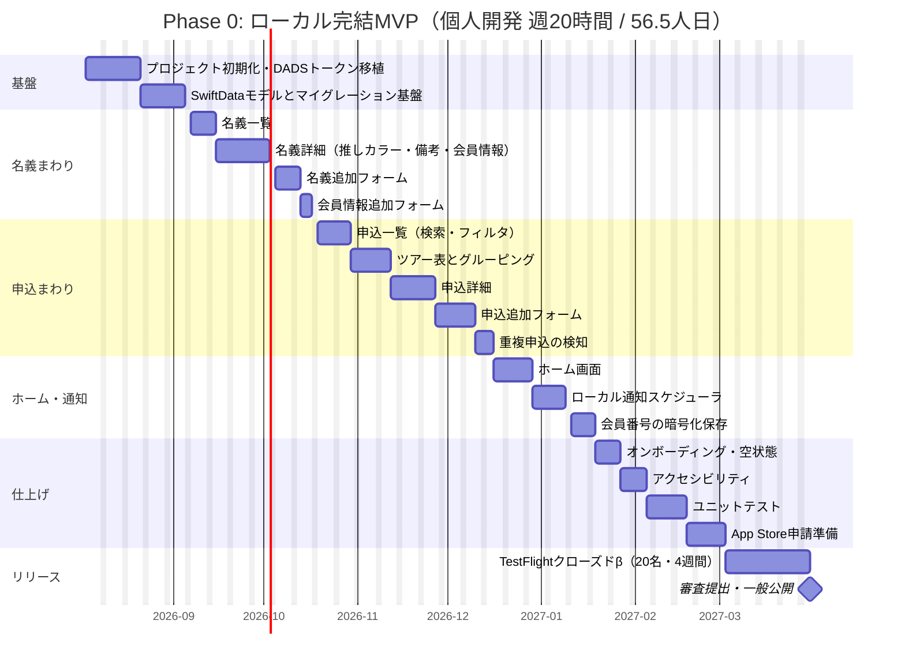
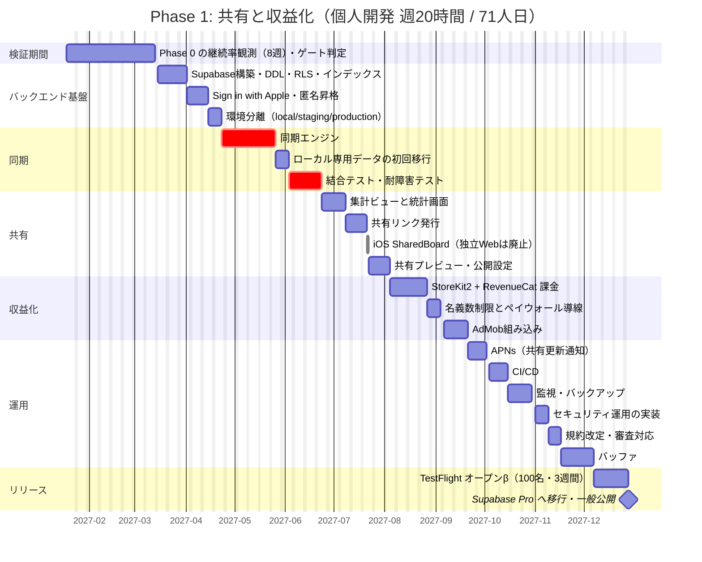
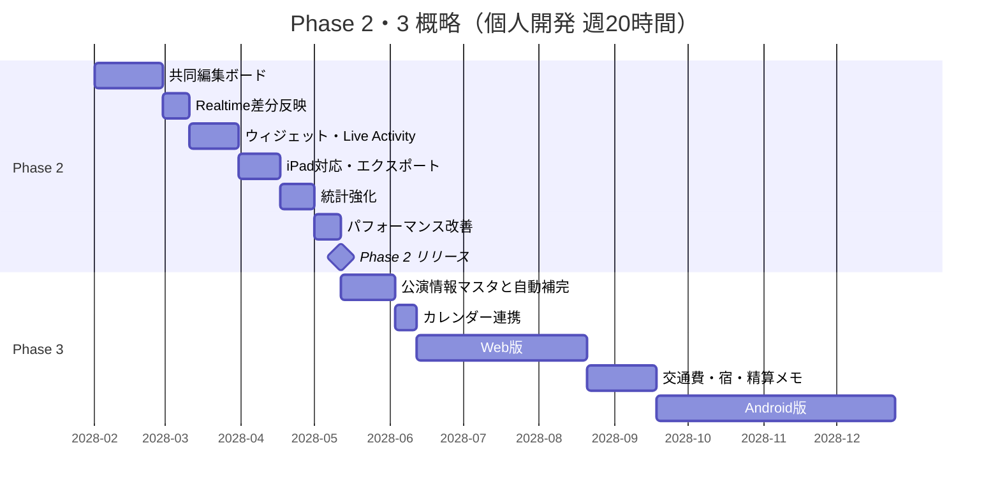
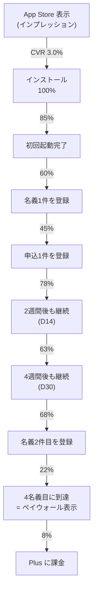

# 09. ロードマップ・工数見積り・KPI

## このドキュメントの位置づけ

本書は「参戦名義帳」を**個人〜2名の体制で、どの順番に・何人日かけて作り、
どの数字を見て次へ進む/撤退するかを判断する**ための計画書です。

工数はすべて **モック `meigi-app-moc-dads.html`（1,639行 / 9画面）の実装量から積み上げた実数**です。
希望的な数字ではなく、モックにあるUI要素を1つずつ数えた結果として提示します。

> **2026-07-31 更新**: BE は **NestJS + GCP Cloud Run**。DB の正は **Supabase PostgreSQL（ホスティングのみ）**。
> 本書中の旧「Supabase BaaS」記述は次のように読み替えること。
> Supabase プロジェクト構築（BaaS） → NestJS API + Prisma Migrate + Supabase Postgres（`DATABASE_URL`） /
> Supabase Auth → `POST /v1/auth/apple` /
> RLS → NestJS Guard（`owner_id`）/
> インフラ費の正は [`./06-infrastructure.md`](./06-infrastructure.md)。

| 関連ドキュメント | 本書との関係 |
|---|---|
| [`./00-design-basis.md`](./00-design-basis.md) | 前提。スコープ・技術スタック・リスクの正 |
| [`./01-product-overview.md`](./01-product-overview.md) | 画面一覧。本書のタスク分解の対象 |
| [`./05-ios-client.md`](./05-ios-client.md) | iOS実装方針。Phase 0 の工数根拠 |
| [`./06-infrastructure.md`](./06-infrastructure.md) | コスト試算。本書の意思決定ゲートの金額根拠 |
| [`./07-monetization.md`](./07-monetization.md) | 売上試算。本書のKPI目標値と整合 |
| [`./08-compliance-risk.md`](./08-compliance-risk.md) | 審査・法務リスク。本書のリスク一覧の詳細 |

### 見積りの前提

| 項目 | 値 |
|---|---|
| 1人日 | **8時間の実作業**（会議・調査・待ち時間を含まない純粋な実装時間） |
| 個人開発（副業） | **週20時間 = 週2.5人日** |
| 専業 | **週40時間 = 週5人日** |
| 体制 | **1名**（設計・実装・テスト・申請をすべて同一人物が行う） |
| バッファ | 各フェーズに**総工数の8〜10%**を明示的に計上（見えないバッファは作らない） |
| 前提スキル | Swift/SwiftUI の実務経験あり、SwiftData と StoreKit 2 は初見 |

---

## 1. フェーズ定義

| Phase | ゴール（一言で） | 含む機能 | Exit Criteria（数値） | インフラ月額 |
|---|---|---|---|---|
| **Phase 0**<br>ローカル完結MVP | **「毎日開く理由」があるかを、0円で検証する** | 名義CRUD、FC会員情報CRUD、申込CRUD、ツアー表、ローカル通知、ホームサマリ、推しカラー、会員番号の暗号化 | ・リリース8週後の **D30継続率 ≥ 20%**<br>・**週次記録率 ≥ 40%**（週に1回以上、申込か当落を記録したMAU比）<br>・**名義2件以上の登録率 ≥ 50%**<br>・ストアレビュー **平均 ≥ 4.0**（10件以上）<br>・クラッシュ率 **< 0.5%** | **¥0**<br>(Apple ≈ ¥1,279のみ) |
| **Phase 1**<br>共有と収益化 | **「他人を連れてくる導線」と「課金」を成立させる** | NestJS API（Cloud Run）、Supabase Postgres、Sign in with Apple、複数端末同期、共有リンク（**アプリ内 SharedBoard**）、統計、Plus サブスク、AdMob | ・**MAU 3,000**<br>・**課金率 ≥ 1.0%**（MAU比）<br>・**MRR ≥ ¥30,000**（Free 立ち上げ ≈¥1,500 の約20倍／Pro 移行後 ≈¥5,500 の約5倍）<br>・**共有リンク経由の新規インストール比率 ≥ 10%**<br>・同期失敗率 **< 1%** | **≈ ¥1,300〜1,700**<br>（Free 立ち上げ） |
| **Phase 2**<br>共同編集と定着 | **「グループで使うツール」にして解約率を下げる** | 共同編集ボード、ウィジェット、Live Activity、エクスポート、統計強化、iPad対応 | ・**MAU 15,000**<br>・**MRR ≥ ¥300,000**<br>・月次解約率 **< 5%**<br>・共同編集ボードの利用率 **≥ 25%**（Plus会員比）<br>・共有リンク経由の新規比率 **≥ 20%** | **≈ ¥7,500〜10,800**<br>（MAU 1万・Pro 帯） |
| **Phase 3**<br>プラットフォーム化 | **iOS以外へ広げ、遠征の総合管理へ** | Web版、Android版、公演情報マスタと自動補完、交通費/宿の管理、精算メモ、カレンダー連携 | ・**MAU 50,000**<br>・**MRR ≥ ¥1,500,000**<br>・非iOS流入比率 **≥ 15%** | **≈ ¥19,000〜32,000**<br>（`07` 8.2 準拠） |

**Phase 0 の設計思想**: このフェーズの目的は「作ること」ではなく「**やめる判断ができる状態を作ること**」です。インフラ費が0円なので失敗しても損失は自分の時間だけで、[`./00-design-basis.md`](./00-design-basis.md) 「7. 最大のリスク」の「ユーザー数が伸びずインフラ費が先行」を構造的に回避する唯一の方法がこれです。

---

## 2. 工数見積り

### 2.1 Phase 0: ローカル完結MVP

モックの9画面（`home` / `identities` / `identity-detail` / `applications`（リスト＋ツアー表）/
`application-detail` / `share-preview` / `add-identity` / `add-membership` / `add-application`）を
SwiftUI で再構築する工数です。

| # | タスク | 内容の実体（モックの該当箇所） | 人日 |
|---:|---|---|---:|
| 0-1 | プロジェクト初期化とデザインシステム移植 | DADS v2.16.0 のトークン（Blue 12段階・Neutral 10段階・Semantic 3種）を Swift の `Color` 拡張に。角丸5種・余白8pxスケール・Noto Sans JP/Mono の Dynamic Type 対応。共通コンポーネント（`Row` / `Badge` / `Stamp` / `Segmented` / `CardList` / `EmptyState` / `SwitchRow` / `FormCard`）を9種 | **5.0** |
| 0-2 | SwiftData モデルとマイグレーション基盤 | `Identity` / `Membership` / `Application` / `ApplicationCompanion` / `Tour` / `Event` の6モデル。`deleted_at` ソフトデリート、`updated_at` 自動更新、`VersionedSchema` + `SchemaMigrationPlan` の枠組み、リポジトリ層の抽象化 | **4.0** |
| 0-3 | ホーム画面 | サマリ3カード（名義数 / 30日以内更新 / 発表待ち）、「更新期限が近い名義」上位4件、「当落発表待ちの申込」上位4件、`+` アクションシート（名義追加/申込追加の2択） | **3.0** |
| 0-4 | 名義一覧 | 3種ソート（更新が近い順 / 当選が多い順 / 入会が古い順）のセグメンテッドコントロール、`identityRow`（アバター＝頭文字＋推しカラー、関係性バッジ、FC名連結、入会日＋当選回数、`renewalBadge`） | **2.0** |
| 0-5 | 名義詳細 | 推しカラーのグラデーションプロフィールカード、64pxアバター、カラーピッカーと**アプリ全体テーマへの反映**（`applyTheme` のHSL明度補正ロジック含む）、備考のインライン編集、共有設定スイッチ、FC会員情報カードのリスト、申込履歴（代表者/同行者の立場を出し分ける `ticketRow`） | **5.0** |
| 0-6 | 名義追加フォーム | 氏名・関係性（4択）・入会日・推しカラー・メモ。保存後に会員情報登録へ連続遷移するフロー | **2.0** |
| 0-7 | 会員情報追加フォーム | FC名・会員番号・更新日・年会費。FC名のサジェスト（既存FCから補完） | **1.5** |
| 0-8 | 申込一覧（リストビュー） | 公演名・アーティスト・会場の横断検索、4種ステータスフィルタ、チケット型の行（ミシン目・スタンプ・座席/発表日）、公演日昇順ソート | **3.0** |
| 0-9 | ツアー表とグルーピングロジック | `groupApplicationsByTour()` 相当（ツアー名でグルーピング、公演日で最早順にソート）、横スクロール可能なテーブル（公演/代表者/同行者/状況）、ツアー単位の集計表示（全N件・当選/申込中/落選） | **3.0** |
| 0-10 | 申込詳細 | チケットヒーロー（アーティスト/公演/会場/日付＋ミシン目スタブ）、3ボタンのステータス切替、情報リスト5行、代表者・同行者から名義詳細への相互リンク、座席のインライン編集、メモ表示 | **4.0** |
| 0-11 | 申込追加フォーム | 公演名・ツアー名（既存ツアーのサジェスト付き）・アーティスト・会場・公演日・代表者選択・同行者2系統（登録済み名義から選択 ＋ 未登録者の氏名直接入力）・申込日・当落発表日・ステータス（当選時のみ座席欄を出す条件表示）・メモ。計12フィールドのバリデーション | **3.0** |
| 0-12 | ローカル通知スケジューラ | 更新期限（30日前/14日前/当日）と当落発表日（当日朝）の通知。権限リクエストのタイミング設計、**ペンディング上限64件への対応**（直近64件のみ登録し起動時に再スケジュール）、通知タップからの該当画面ディープリンク | **3.0** |
| 0-13 | 会員番号の暗号化保存 | CryptoKit（AES-GCM）＋ Keychain（iCloud Keychain同期）での鍵管理。既定表示は下4桁のみ、タップで全表示、「保存しない」選択肢 | **2.0** |
| 0-14 | 重複申込の検知と表示 | 同一 `event_id` に対する複数申込を検知（モック id:101 / 109 のケース）。ツアー表と申込詳細に注意表示。制約は張らず「見せる」実装 | **1.5** |
| 0-15 | オンボーディングと空状態 | 初回起動の3画面説明、空状態3種（名義なし/申込なし/該当なし）、サンプルデータ投入と削除 | **2.0** |
| 0-16 | アクセシビリティ | Dynamic Type（14px未満不使用の原則を維持したまま最大サイズ対応）、VoiceOver ラベル、コントラスト検証、44pt タップ領域、フォーカスリング相当の対応 | **2.5** |
| 0-17 | ユニットテスト | 日付計算（`daysUntil` / `renewalBadge` の境界値: -1日/0日/14日/15日/30日/31日）、ツアーグルーピング、通知スケジュール、暗号化の往復、ソート3種。**カバレッジ目標60%** | **3.0** |
| 0-18 | App Store 申請準備 | スクリーンショット6.7"/6.5"×5枚、アプリ説明文・キーワード、プライバシーマニフェスト（`PrivacyInfo.xcprivacy`）、App Privacy 申告、**審査対策文面**（「転売・名義貸し支援ではない」ことを明示するレビュアー向けノート）、サポートページとプライバシーポリシーの公開 | **3.0** |
| 0-19 | TestFlight β運用と不具合修正バッファ | 20名のクローズドβ、フィードバック収集、修正 | **4.0** |
| | **Phase 0 合計** | | **56.5** |

**期間換算**

| 稼働 | 期間 | 暦月 |
|---|---:|---|
| 個人開発（週20時間 = 2.5人日/週） | **22.6週** | **約5.3か月** |
| 専業（週40時間 = 5人日/週） | **11.3週** | **約2.7か月** |

### 2.2 Phase 1: 共有と収益化

| # | タスク | 内容の実体 | 人日 |
|---:|---|---|---:|
| 1-1 | NestJS 骨格 + Prisma schema + Cloud Run デプロイ | モジュール分割、Prisma Migrate（03のDDL写像）、`/health`、Secret Manager、Supabase Postgres（`DATABASE_URL` + pooler）、GitHub Actions デプロイ | **6.0** |
| 1-2 | Sign in with Apple と自前 JWT | Apple identity token 検証、access/refresh 発行、既存ローカルデータの初回アップロード、複数端末での同一アカウント認識 | **4.0** |
| 1-3 | **同期エンジン** | `updated_at` ベースの差分取得（ページング500件）、送信キューの永続化とリトライ（指数バックオフ）、Last-Write-Wins の競合解決、ソフトデリートの伝播、オフライン中の変更の蓄積、部分失敗からの回復、同期状態のUI表示。**本フェーズ最大の難所** | **8.0** |
| 1-4 | ローカル専用→クラウドへの初回移行 | Phase 0 ユーザーの既存 SwiftData を初回ログイン時に一括アップロード。途中失敗時の再開、ID再割当（ローカル整数ID → UUID） | **2.0** |
| 1-5 | 集計ビューと統計画面 | `v_identity_stats`（名義別当選率）/ `v_upcoming_renewals` / `v_tour_matrix`。統計画面のUI（名義別当選率の棒グラフ、年会費合計、当選回数推移） | **4.0** |
| 1-6 | 共有リンク発行 | `share_links` テーブル、Edge Function によるトークン発行（128bitランダム・有効期限30日）、名義単位・ツアー単位の2種、失効操作 | **3.0** |
| 1-7 | ~~Next.js 共有Webビュー~~ → **廃止（2026-08-05）** | 独立 Web は作らない。閲覧・編集は iOS `SharedBoard` + `GET/PATCH /public/shares/:token`（実装済み）。残作業は任意の Universal Links のみ | **0**（UL は別見積） |
| 1-8 | 共有プレビュー画面と公開設定 | モック `screenSharePreview` の実装。名義ごとの `historyVisible` トグル、公開/非公開のプレビュー、リンクコピー、共有シート連携。受け取り側は SharedBoard | **3.0** |
| 1-9 | StoreKit 2 + RevenueCat 課金 | 商品定義（月¥350 / 年¥2,800）、ペイウォールUI、購入・復元・解約猶予、`entitlements` のサーバー同期、RevenueCat Webhook（Edge Function、署名検証）、サンドボックステスト | **6.0** |
| 1-10 | 名義数制限とペイウォール導線 | Free 3名義の制限、4件目追加時のペイウォール表示、既存4件以上ユーザーの猶予（読み取りは維持）、リワード広告での一時枠解放（30日間+1名義） | **2.0** |
| 1-11 | AdMob 組み込み（Stage 1: バナーのみ） | SDK導入、インラインバナー配置。**当落確認の直前後に出さない**制御ロジック、初期化の非同期化。ATT は要求しない（NPA固定、`docs/08` §2.8）。Stage 2（ネイティブ広告・リワード広告・SSV）は別枠で計上（`docs/plans/admob-integration/plan.md`） | **4.0**（Stage 2 は別途 **5.5**） |
| 1-12 | APNs（共有更新通知のみ） | `device_tokens` 管理、Edge Function からの送信、共有ボード更新時のトリガー、通知設定画面 | **3.0** |
| 1-13 | CI/CD | GitHub Actions（lint / test / `db reset` によるべき等性検証 / RLS検査 / staging・production への `db push`）、Xcode Cloud での TestFlight 配信 | **3.0** |
| 1-14 | 監視 | Sentry 導入と `beforeSend` での個人情報マスク、6メトリクスの確認手順の整備、UptimeRobot、日次ヘルスチェックワークフロー | **2.0** |
| 1-15 | バックアップ | `pg_dump` の日次ワークフロー、GPG暗号化、Cloudflare R2 への保管、世代ローテーション、**リストア手順の実測リハーサル** | **2.0** |
| 1-16 | 環境分離 | `supabase start` によるローカル環境、staging/production の2プロジェクト、`seed.sql`（モックと同じサンプルデータ＋重複申込ケース）、`.xcconfig` による接続先切替 | **2.0** |
| 1-17 | セキュリティ運用の実装 | `service_role key` 混入検査のCI、`verify-rls.sql`、`gitleaks`、`/config.json` による鍵の実行時取得、Dependabot | **2.0** |
| 1-18 | 結合テストと同期の耐障害テスト | 2端末での同時編集、機内モードからの復帰、途中でアプリを落とす、サーバー500応答、トークン失効。**同期のバグは信頼を一度で失うため最も厚くテストする** | **5.0** |
| 1-19 | 規約・プライバシーポリシー改定と審査対応 | サーバー保存に伴う改定、第三者提供の記載、リジェクト時の再申請対応 | **2.0** |
| 1-20 | バッファ | 総工数の約8% | **5.0** |
| | **Phase 1 合計** | ※1-7 廃止（−5.0）反映後 | **66.0** |

**期間換算**

| 稼働 | 期間 | 暦月 |
|---|---:|---|
| 個人開発（週20時間） | **28.4週** | **約6.6か月** |
| 専業（週40時間） | **14.2週** | **約3.3か月** |

### 2.3 Phase 2: 共同編集と定着

| # | タスク | 人日 |
|---:|---|---:|
| 2-1 | 共同編集ボード（`boards` / `board_members`、招待フロー、3段階の権限、編集競合の解決、監査ログ） | **10.0** |
| 2-2 | Realtime 差分反映（`boards` テーブル限定でのみ有効化。プレゼンス表示、接続断からの復帰） | **4.0** |
| 2-3 | ウィジェット（Small: 直近の更新期限 / Medium: 発表待ち一覧。`WidgetKit` + App Group 経由のデータ共有） | **4.0** |
| 2-4 | Live Activity（当落発表日までのカウントダウン、`ActivityKit`） | **3.0** |
| 2-5 | iPad / 横画面対応、ツアー表の列追加（座席・申込日） | **3.0** |
| 2-6 | CSV / PDF エクスポート（名義一覧・申込履歴・ツアー表） | **3.0** |
| 2-7 | 統計強化（当選率の推移グラフ、名義別×アーティスト別のクロス集計、他ユーザー平均との比較） | **5.0** |
| 2-8 | パフォーマンス改善（マテビュー化、`pg_cron` 更新、Cloudflare KV キャッシュ、インデックス追加） | **4.0** |
| 2-9 | バッファ | **4.0** |
| | **Phase 2 合計** | **40.0** |

個人開発 **16.0週（約3.7か月）** / 専業 **8.0週（約1.9か月）**

### 2.4 Phase 3: プラットフォーム化（概算・確度低）

| # | タスク | 人日 | 確度 |
|---:|---|---:|---|
| 3-1 | Web版（Next.js フルアプリ。**共有専用 Web 資産は無い**前提で新規） | **25.0** | 中 |
| 3-2 | Android版（Kotlin Multiplatform で同期ロジックを共有 / または Flutter で全面再実装） | **35.0** | 低 |
| 3-3 | 公演情報マスタの整備と自動補完（アーティスト・ツアー・会場のマスタ化、入力サジェスト） | **8.0** | 中 |
| 3-4 | 交通費 / 宿の管理と精算メモ | **10.0** | 中 |
| 3-5 | カレンダー連携（`EventKit`、公演日・発表日の書き出し） | **3.0** | 高 |
| | **Phase 3 合計** | **81.0** | |

### 2.5 総工数

| 範囲 | 人日 | 個人開発（週20h） | 専業（週40h） |
|---|---:|---|---|
| Phase 0 | 56.5 | 22.6週（5.3か月） | 11.3週（2.7か月） |
| Phase 0 + 1 | **127.5** | **51.0週（11.8か月）** | **25.5週（5.9か月）** |
| Phase 0 + 1 + 2 | **167.5** | **67.0週（15.5か月）** | **33.5週（7.7か月）** |
| Phase 0 + 1 + 2 + 3 | 248.5 | 99.4週（22.9か月） | 49.7週（11.5か月） |

**現実的な計画線**: 個人開発（週20時間）で
**Phase 0 を5.3か月でリリース → 8週の検証 → Phase 1 を6.6か月**。
Phase 1 の一般公開までに**着手から約14か月**かかります。
これを短縮したい場合の選択肢は次の2つで、順に検討します。

1. **Phase 0 のスコープを削る**: 統計・アクセシビリティの一部・オンボーディングを Phase 0.5 に後倒しして
   **56.5 → 48人日（-15%）**。ただし 0-16（アクセシビリティ）と 0-18（申請準備）は削ってはいけません（審査とレビュー評価に直結）。
2. **Phase 1 を分割する**: 「同期＋共有リンク」を Phase 1a、「課金＋広告」を Phase 1b に分ける。1a は 47人日（4.4か月）で出せますが、**収益開始が遅れる**トレードオフがあります。

推奨は **1（スコープ削減）**。Phase 1 を分割すると同期と課金の両方に触る `entitlements` 周りを2度実装することになり、総工数が増えます。

---

## 3. ガントチャート

### 3.1 Phase 0（個人開発・週20時間）



### 3.2 Phase 1（個人開発・週20時間）



### 3.3 Phase 2 / 3 の概略



---

## 4. リリース計画

### 4.1 TestFlight クローズドβ（Phase 0）

| 項目 | 内容 |
|---|---|
| 人数 | **20名**（内部テスター2名 + 外部テスター18名） |
| 期間 | **4週間**（更新期限通知の検証には最低2週間必要なため） |
| 募集方法 | 自分の観測範囲のファン友人 5名 + X（旧Twitter）で「複数名義を管理している人」を公募 13名 |
| 検証すること（優先順） | 1. **通知が期待通りのタイミングで届くか**（J1の中核。7日/14日/30日の3パターンを実機で確認）<br>2. **申込追加フォームの12項目が多すぎないか**（離脱率の実測。目標: 開始→保存の完了率 ≥ 70%）<br>3. **ツアー表が「見たかった形」になっているか**（横スクロールの発見性、列の順序）<br>4. **名義2件目を登録するか**（1件で止まるなら価値仮説が誤り）<br>5. クラッシュ・データ消失の有無<br>6. 会員番号を実際に入力するか（入力率が30%未満なら暗号化の工数が無駄になっていた） |
| 収集方法 | TestFlight のフィードバック + **1週目・4週目に5問のアンケート**（Googleフォーム・無料）+ 5名に30分インタビュー |
| 合格基準 | 4週間後に**18名中10名以上が起動している**、致命バグ0件、申込追加の完了率 ≥ 70% |

**やらないこと**: β期間に新機能を追加しません。変更は不具合修正とコピー修正のみに限定します。1人開発でβ中に機能追加すると、検証の対象が動いて何も分からなくなります。

### 4.2 TestFlight オープンβ（Phase 1）

| 項目 | 内容 |
|---|---|
| 人数 | **100名**（パブリックリンクで公募） |
| 期間 | **3週間** |
| 検証すること | 1. **2端末での同期の整合性**（同一ユーザーがiPhone+iPadで編集）<br>2. **共有リンクをアプリ未導入の人が開けるか**（名義主に実際に送ってもらう）<br>3. **ペイウォールの到達率と課金率**（サンドボックス課金）<br>4. Phase 0 からのアップグレードでデータが失われないか（**最重要**） |
| 合格基準 | 同期失敗率 < 1%、データ損失0件、共有リンクの閲覧完了率 ≥ 80% |

### 4.3 初期ユーザー獲得の仮説

このアプリの獲得構造は**3層**あり、順に効き始めます。

| 層 | 仮説 | 実行内容 | 期待値 |
|---|---|---|---|
| **① 直接発信** | 「複数名義の管理」で困っている人は、その困りをすでにXに書いている | X で「名義」「複垢」「申込 管理」「Excel 管理」などを検索し、該当ポストに答える形で紹介。開発過程を発信（ビルド公開） | Phase 0 の初期100〜300インストール。CAC ¥0 |
| **② ハッシュタグ / コミュニティ** | ファン界隈は**アーティスト単位のハッシュタグ**で情報が流通する。ツールの話題も同じ経路で回る | `#〇〇FC` `#〇〇ツアー2026` のような**申込期間に活性化するタグ**に合わせて投稿。ツアー表のスクリーンショット（サンプルデータ）が最も刺さる想定 | 申込期間（年3〜4回のピーク）ごとに 200〜500インストール |
| **③ 共有リンクによるバイラル** | **共有リンクがそのまま招待になる**。名義を貸してくれた人に「あなたの名義の申込状況」を見せるURLを送ると、受け手はアプリの存在と価値を同時に知る | 共有ビューのフッターに「自分の名義も管理する」導線を置く。**押し売りにならない控えめな1行**に留める（名義主への説明責任が本来の目的であり、勧誘が主目的に見えると信頼を損なう） | Phase 1 で新規の **10%**、Phase 2 で **20%** |

**③ が本命**です。1ユーザーが平均3名義（家族/友人2〜3人）を管理するため、共有リンクの潜在到達人数は**MAUの2〜3倍**あります。共有リンク発行率20%・1リンクあたり閲覧2人・閲覧者のインストール率10% と仮定すると `MAU × 0.20 × 2 × 0.10 = MAU × 4%` が月次の自然流入で、MAU 3,000 なら月120インストール。K係数 0.04 相当で単独では成長しませんが、①②と合わせて**獲得コストを下げる効き方**をします。

**やらない獲得手段**: 有料広告（Phase 2 で MRR ¥300,000 を超えるまで）、インフルエンサー施策（費用対効果が測れない）、アーティスト公式との連携（[`./08-compliance-risk.md`](./08-compliance-risk.md) の観点で「公式が名義貸しを容認した」と誤読されるリスクがある）。

### 4.4 ストア掲載の最適化観点

| 観点 | 具体策 |
|---|---|
| アプリ名 | `参戦名義帳 - ファンクラブと申込の管理`（30文字以内。「名義」を含めつつ**「名義貸し」「複垢」は絶対に入れない**） |
| サブタイトル | `FC更新期限と当落を、忘れない。`（30文字。J1を前面に出す） |
| キーワード（100文字） | `ファンクラブ,FC,更新,期限,ライブ,申込,当落,チケット,管理,家族,同行,ツアー,座席,記録`（「転売」「譲渡」「代行」は入れない） |
| スクリーンショット | 1枚目=ホームの「更新期限が近い名義」（**痛みの提示**）、2枚目=ツアー表（**差別化の中核**）、3枚目=名義詳細、4枚目=通知の受信画面、5枚目=共有ビュー（Phase 1以降）。各枚にキャプション1行 |
| プレビュー動画 | Phase 0 では作らない（工数対効果が低い）。Phase 1 で「申込追加→当選記録→共有」の15秒を作る |
| 説明文の1段落目 | **審査対策と訴求を兼ねる**: 「家族や友人と一緒にファンクラブへ申し込んだ記録を、1か所にまとめて管理するアプリです」と書き、譲渡・売買に一切触れない |
| ローカライズ | 日本語のみ（Phase 3 まで） |
| レビュー依頼 | `SKStoreReviewController` を**当選を記録した直後**に出す（最も感情がポジティブな瞬間。ただし年3回まで） |

---

## 5. KPI設計

### 5.1 北極星指標（North Star Metric）

| 候補 | 長所 | 短所 | 判定 |
|---|---|---|---|
| MAU | 分かりやすい | **起動しただけで数えてしまう**。年1回のFC更新しか使わない人も含まれ、価値の実感と乖離する | 却下（補助指標に留める） |
| 登録名義数の累計 | 蓄積を表す | 一度登録すれば増えるだけで、**離脱に反応しない** | 却下 |
| **週次で申込または当落を記録したユーザー数（WRU: Weekly Recording Users）** | ・「記録した」＝**価値を受け取った瞬間**を直接数える<br>・[`./00-design-basis.md`](./00-design-basis.md) の J2/J3 に対応<br>・課金（名義追加）の先行指標になる | 申込期間の季節性が大きい（年3〜4回のピーク） | **採用** |
| 有料課金者数 | 事業に直結 | 遅行指標すぎて改善の舵取りに使えない | 却下（結果指標として別途追う） |

**北極星指標: WRU = 週次で申込を1件以上追加、または当落ステータスを1件以上更新したユニークユーザー数**

季節性への対応として、**4週移動平均**と**WRU / MAU（週次記録率）**を併せて見ます。絶対数はピークで跳ねますが、比率は「使う人がちゃんと使っているか」を安定して表します。

| フェーズ | WRU（4週移動平均） | 週次記録率（WRU/MAU） |
|---|---:|---:|
| Phase 0 Exit | 200 | **40%** |
| Phase 1 Exit | 1,200 | **40%** |
| Phase 2 Exit | 6,000 | **40%** |
| Phase 3 Exit | 20,000 | **40%** |

比率が40%を維持できないまま絶対数だけ増える場合、**獲得はできているが定着していない**状態です。その場合は獲得を止めて定着に投資します。

### 5.2 ファネルと目標値



| # | 段階 | 遷移率目標 | インストール起点の累積 | 計測手段 |
|---:|---|---:|---:|---|
| 1 | ストア表示 → インストール | 3.0% | — | App Store Connect Analytics（無料） |
| 2 | インストール → 初回起動 | 85% | 85.0% | 同上 |
| 3 | 初回起動 → **名義1件登録** | 60% | 51.0% | 自前イベント（下記5.3） |
| 4 | 名義1件 → **申込1件登録** | 45% | 23.0% | 自前イベント |
| 5 | 申込1件 → **D14継続** | 78% | 17.9% | 自前イベント |
| 6 | D14 → **D30継続** | 63% | 11.3% | 自前イベント |
| 7 | D30 → **名義2件目** | 68% | 7.7% | 自前イベント |
| 8 | 名義2件 → **4名義目到達（ペイウォール表示）** | 22% | 1.7% | 自前イベント |
| 9 | ペイウォール表示 → **課金** | 8% | **0.14%** | RevenueCat（無料枠） |

**課金率の解釈**: インストール起点で 0.14% は低く見えますが、D30継続ユーザー（11.3%）を母数にすると **1.2%**、MAU比では **1.0〜1.5%** で、Phase 1 Exit「課金率 ≥ 1.0%（MAU比）」と整合します。

**ボトルネックの予想**: ステップ8（名義2件 → 4名義目）の22%が最も低く、かつ**課金の直前**にあるため施策を打つ余地が大きい箇所です。一方でステップ3・4（名義1件・申込1件の登録）は**入力フォームの項目数**が直接効くため、Phase 0 のβで完了率70%を確認する対象にしています（4.1参照）。

### 5.3 計測手段（無料で済ませる方法）

サードパーティ分析SDKは**入れません**。理由は3つ: (1) 個人情報を扱うアプリで外部への送信先を増やすと [`./08-compliance-risk.md`](./08-compliance-risk.md) のプライバシー申告が複雑化する、(2) 無料枠を超えたときの費用が読めない、(3) SDKサイズと起動時間への影響。

| フェーズ | 計測方法 | 費用 |
|---|---|---|
| **Phase 0** | ・App Store Connect Analytics（インストール・継続率・クラッシュ）<br>・**端末内カウンタ**（名義登録数、申込登録数、初回起動日、最終記録日を SwiftData に保存）<br>・そのカウンタを**アプリ内の「利用状況」画面に表示**し、βテスターにスクリーンショットで送ってもらう（20名なら成立する） | ¥0 |
| **Phase 1 以降** | ・`analytics_events` テーブル（`user_id` / `event_name` / `occurred_at` / `props jsonb`）に**同期のついでにバッチ送信**（1日1回・数十行なので帯域・容量への影響は無視できる）<br>・SQLビューでファネルを集計<br>・RevenueCat のダッシュボード（課金ファネル）<br>・Sentry（クラッシュ・エラー率） | ¥0 |

イベント設計（**10種類に限定**。増やすと集計もテストも破綻します）:

| イベント名 | 発火タイミング | 用途 |
|---|---|---|
| `first_launch` | 初回起動時に1回 | ファネル起点 |
| `identity_created` | 名義保存時 | ステップ3・7・8 |
| `membership_created` | 会員情報保存時 | 会員番号入力率 |
| `application_created` | 申込保存時 | **北極星指標（WRU）** |
| `application_status_changed` | ステータス切替時 | **北極星指標（WRU）** |
| `tour_table_viewed` | ツアー表を開いた時 | 差別化機能の利用率 |
| `notification_opened` | 通知タップからの起動 | 通知の価値検証 |
| `share_link_created` | 共有リンク発行時 | バイラル係数 |
| `paywall_shown` | ペイウォール表示時 | ステップ8 |
| `paywall_dismissed` | 課金せずに閉じた時 | ステップ9の分母 |

DB容量の影響: 1ユーザー月30イベント × 200 B = 6 KB/月。MAU 1万で 60 MB/月なので、**90日で自動削除**（`pg_cron`）すれば 180 MB に収まります。Free 500MB の枠を圧迫するため、**Phase 1 で Pro へ移った後に有効化**します（[`./06-infrastructure.md`](./06-infrastructure.md) 3.5 の容量試算に含めていない分）。

集計SQL例:

```sql
-- 週次記録率（北極星指標）
with weekly as (
  select date_trunc('week', occurred_at) as wk,
         count(distinct user_id) filter (
           where event_name in ('application_created','application_status_changed')
         ) as wru,
         count(distinct user_id) as wau
  from analytics_events
  where occurred_at > now() - interval '12 weeks'
  group by 1
)
select wk, wru, wau, round(100.0 * wru / nullif(wau,0), 1) as recording_rate_pct
from weekly order by wk desc;
```

---

## 6. フェーズごとの意思決定ゲート

**継続・転換・撤退を数値で決めておく**ことが、1人開発で最も重要な自己防衛です。数字を決めずに走ると「もう少しやれば」で無限に時間を溶かします。

### ゲート G0: Phase 0 リリース → Phase 1 着手（リリース8週後に判定）

| 指標 | **進む**（GO） | **要改善**（PIVOT） | **撤退・凍結**（STOP） |
|---|---|---|---|
| D30継続率 | **≥ 20%** | 12〜20% | **< 12%** |
| 週次記録率（WRU/MAU） | **≥ 40%** | 25〜40% | **< 25%** |
| 名義2件以上の登録率 | **≥ 50%** | 30〜50% | **< 30%** |
| ストアレビュー平均（10件以上） | ≥ 4.0 | 3.5〜4.0 | < 3.5 |
| インストール数（8週累計） | ≥ 500 | 200〜500 | < 200 |

**判定ルール**: 5指標のうち **4つ以上が GO なら Phase 1 に進む**。**1つでも STOP に入ったら Phase 1 の着手を止める**（インフラ費が発生する前に止めるのが要点）。

- **D30 < 12% の場合**: Phase 1 には進まず、「通知が届いているか」「通知の文面が行動を促しているか」を集中的に改善します。D30が低い最大の容疑者は**通知の設計**であり、これはPhase 0 の範囲内で直せます。
- **名義2件以上の登録率 < 30% の場合**: 価値仮説（「複数名義の管理」）そのものが誤りなので、**単一名義向けの「FC更新期限リマインダー」に方向転換**します。収益化は名義数制限では成立しないため [`./07-monetization.md`](./07-monetization.md) のプラン設計を「通知の高度化 + 統計」に組み替えます。**この転換判断は Phase 1 に1円も使う前に行います。**
- **インストール < 200 の場合**: プロダクトではなく**流入の問題**。4.3 の①②を3か月追加で試し、それでも増えないなら凍結します。

### ゲート G1: Phase 1 一般公開 → Phase 2 着手（公開16週後に判定）

| 指標 | GO | PIVOT | STOP |
|---|---|---|---|
| MAU | ≥ 3,000 | 1,000〜3,000 | < 1,000 |
| 課金率（MAU比） | **≥ 1.0%** | 0.4〜1.0% | **< 0.4%** |
| MRR | **≥ ¥30,000** | ¥8,000〜30,000 | **< ¥8,000** |
| 共有リンク経由の新規比率 | ≥ 10% | 4〜10% | < 4% |
| 同期失敗率 | < 1% | 1〜3% | > 3% |

**MRR < ¥8,000 の意味**: [`./06-infrastructure.md`](./06-infrastructure.md) の試算で Phase 1 立ち上げ（Supabase Free）は月 ≈ ¥1,300〜1,700。MRR ¥8,000 を下回ると**広告収入を足しても成長余地が薄い**状態です。選択肢は3つ:

1. **Supabase Pro を止め Free / Neon Free に戻し、同期を Plus 限定機能にする**（コストを ≈ ¥1,300〜1,700 に維持）
2. **価格を上げる**（月 ¥350 → ¥490。課金者が少ない段階での値上げは影響が小さい）
3. **Phase 2 を凍結し、Phase 1 の改善のみを続ける**（撤退ではなく維持モード）

**課金率 < 0.4% かつ 共有リンク経由 < 4% の両方が該当する場合**は、「他人を連れてくる導線」も「課金の必然性」も成立していないため**Phase 2（共同編集）に進んではいけません**。共同編集は最も工数が重い（10人日）機能で、共有が機能していない状態で作っても使われません。

### ゲート G2: Phase 2 → Phase 3 着手

| 指標 | GO | STOP |
|---|---|---|
| MRR | ≥ ¥300,000 | < ¥120,000 |
| 月次解約率 | < 5% | > 8% |
| 共同編集ボードの利用率（Plus会員比） | ≥ 25% | < 10% |
| 非iOS環境からの共有ビュー閲覧比率 | ≥ 30% | < 15% |

**非iOS閲覧比率が判断材料になる理由**: Android版・Web版（合計60人日）を作る根拠は「共有ビューをAndroidから見ている人が多い」という**実測データ**でなければなりません。「Androidユーザーもいるだろう」という推測で60人日を投じるのは、このロードマップで最も避けたい意思決定です。

### 撤退の実務（凍結モード）

STOP判定になった場合、アプリを削除するのではなく**凍結モード**に移します。

| やること | 理由 |
|---|---|
| 新機能開発を止める | 時間の流出を止める |
| Supabase Pro を停止し Free / Neon Free に退避（データ量が収まる場合） | Pro ≈ ¥3,875/月の削減 |
| 既存ユーザーへのデータエクスポート機能を提供 | 信頼を守る。将来の再開余地を残す |
| ストア掲載は維持（削除しない） | 検索流入は0円で続く。半年後に状況が変わることがある |
| 年1回の OS 対応アップデートのみ実施（2人日/年） | 掲載維持の最低コスト |

**凍結モードの年間コスト = Apple Developer Program ≈ ¥15,345 + 2人日**。これが「失敗した場合の最大損失」です。この金額を先に確定させておくことが、Phase 0 をインフラ費0円で作る本当の理由です。

---

## 7. リスクと緩和策

[`./00-design-basis.md`](./00-design-basis.md) 「7. 最大のリスク」を時間軸に落とし、技術・市場・法務・運用の4分類で網羅します。

### 7.1 法務・審査リスク

| # | リスク | 発生確率 | 影響 | 対応時期 | 緩和策 | 検知方法 |
|---:|---|---|---|---|---|---|
| L1 | **ストア審査で「転売・名義貸し支援」と誤認されリジェクト** | **高**（初回申請時） | リリース不可。最悪アカウント停止 | **Phase 0 の 0-18（申請準備）** | ・訴求を「家族/友人と一緒に応募した記録の管理」に統一<br>・アプリ名/キーワード/説明文から「転売」「譲渡」「代行」「複垢」を排除（4.4参照）<br>・**レビュアー向けノートを事前に用意**（機能一覧と「取引機能がないこと」の明示）<br>・譲渡・価格・取引に関するUIを一切持たない | 審査結果。**初回は2週間の余裕を見て提出**する |
| L2 | 他人の個人情報（氏名・FC会員番号）の預託 | 中 | 個人情報保護法上の安全管理措置義務違反、漏洩時の重大な信用失墜 | **Phase 0 の 0-13** | ・会員番号は**クライアント側暗号化**（サーバーは復号不可）<br>・既定表示は下4桁<br>・共有時はマスキング既定<br>・「保存しない」選択肢の提供<br>・[`./08-compliance-risk.md`](./08-compliance-risk.md) に安全管理措置を文書化 | 四半期のセキュリティ監査 |
| L3 | 共有リンクのURLが第三者に渡り、他人の情報が漏れる | 中 | 名義主との信頼関係の破壊（アプリの存在意義の否定） | Phase 1 の 1-6 | ・トークンは128bitランダム<br>・**有効期限30日の既定**<br>・失効操作を1タップで<br>・共有内容は名義主が確認できるプレビューを必須通過<br>・検索エンジンへの `noindex` | 共有ビューのアクセスログ（想定外の参照元） |
| L4 | 未成年ユーザーの個人情報取扱い | 低 | 保護者同意の要件 | Phase 1 の 1-19 | 年齢制限を 13+ に設定（App Store の年齢制限）。学生ユーザーが多い領域なので規約に明記 | ストア設定の確認 |
| L5 | FC規約が「名義の共同利用」を禁じている場合の間接的な加担 | 低 | 特定アーティストのファンからの批判 | Phase 0 リリース前 | アプリは**記録ツール**であり、申込行為に関与しない。規約遵守はユーザー責任である旨を利用規約とオンボーディングに記載 | SNSの言及監視 |

### 7.2 技術リスク

| # | リスク | 発生確率 | 影響 | 対応時期 | 緩和策 | 検知方法 |
|---:|---|---|---|---|---|---|
| T1 | **同期エンジンのバグでデータが消える / 重複する** | **高** | ユーザーの信頼を一度で失う。蓄積データが価値の中核なので致命的 | Phase 1 の 1-3 / 1-18 | ・Last-Write-Wins に統一しCRDTを持ち込まない<br>・**論理削除のみ**（物理削除は90日後の `pg_cron`）<br>・1-18 で5人日を耐障害テストに割く<br>・**端末側にローカルスナップショットを7世代保持**しユーザー操作で復元可能にする | 同期失敗率の監視（[`./06-infrastructure.md`](./06-infrastructure.md) 6章）。ユーザー問い合わせ |
| T2 | Phase 0 → Phase 1 の移行でローカルデータを失う | 中 | 最も熱心な初期ユーザーを失う | Phase 1 の 1-4 | ・移行前にローカルをJSONへ全量エクスポートして端末に保持<br>・移行は**冪等**（途中失敗しても再実行で完了する）<br>・オープンβ（4.2）の合格基準に「データ損失0件」を明記 | βテスターの実データでの検証 |
| T3 | SwiftData のスキーママイグレーション失敗 | 中 | アプリが起動しなくなる（最悪のクラッシュ） | Phase 0 の 0-2 | ・`VersionedSchema` を初日から使う<br>・マイグレーション失敗時は**空DBで起動し、旧ストアをバックアップとして残す**フォールバック<br>・各リリースで旧バージョンからのアップグレードを実機検証 | クラッシュ率。TestFlight での旧→新アップグレードテスト |
| T4 | ローカル通知が届かない（権限拒否・64件上限・OS仕様変更） | 中 | J1（更新期限を落とさない）が成立せず継続率が崩れる | Phase 0 の 0-12 | ・権限拒否時は**アプリ内バッジとホームの警告表示**で代替<br>・64件上限に対する再スケジュール実装<br>・OS更新ごとに通知の実機回帰テストを実施 | `notification_opened` イベント率。βでの実機確認 |
| T5 | RevenueCat / StoreKit の課金状態不整合 | 中 | 課金したのに機能が開かない（返金・低評価に直結） | Phase 1 の 1-9 | ・**サーバー側 `entitlements` を正とし、起動時に RevenueCat から再同期**<br>・Webhook 失敗時のリトライ<br>・不整合時は**寛容側に倒す**（機能を開ける） | 課金者数とentitlements行数の日次差分チェック |
| T6 | Cloud Run コールドスタート / Supabase 接続枯渇で同期が遅い | **中** | 「壊れている」と体感され離脱 | Phase 1 の一般公開時 | min instances は原則0のまま許容。接続は pooler。`/health` 監視。必要なら min=1 を短期間だけ検討 | レイテンシ・エラー率アラート |
| T7 | AdMob SDK が起動時間を悪化させる / 審査で問題になる | 低 | 起動が遅くなり離脱。NPA固定でも審査でトラッキング説明を求められるリスク | Phase 1 の 1-11 | 初期化を非同期化。プライバシー説明文言を審査ガイドラインに沿わせる（ATT自体は要求しない）。起動TTI p95 < 2秒を計測 | 起動時間の計測 |

### 7.3 市場リスク

| # | リスク | 発生確率 | 影響 | 対応時期 | 緩和策 | 検知方法 |
|---:|---|---|---|---|---|---|
| M1 | **年1回しか使わない機能（FC更新）で継続率が落ちる** | **高** | D30 < 12% で G0 が STOP になる | Phase 0 全体 | ・申込・当落の記録を日常接点にする（**申込は年10〜20回発生する**）<br>・通知を「価値の主軸」に据える<br>・ツアー表という**申込期間中に毎日見る理由**を作る | D30継続率、週次記録率 |
| M2 | ユーザー数が伸びずインフラ費が先行する | 中 | 撤退コストの増大 | **Phase 0 で構造的に回避済み** | Phase 0 のインフラ費0円。G0 のゲートを通らない限り Phase 1 に進まない。凍結モードの年間コストを ≈ ¥15,345 に固定 | 6章のゲート判定 |
| M3 | 想定より市場が小さい（複数名義を管理する人が少ない） | 中 | 成長の天井 | G0 判定時 | 「名義2件以上の登録率 ≥ 50%」を G0 の指標に入れ、**Phase 1 前に検証**。50%未満なら単一名義向けにピボット（6章） | 名義2件以上の登録率 |
| M4 | 競合（既存の表計算・メモアプリ、類似アプリの登場） | 中 | 差別化の喪失 | 継続的 | ・**ツアー表と共有リンク**が表計算では作れない差別化点<br>・蓄積データが乗り換えコストになる（申込件数は無制限にする方針が効く）<br>・四半期にストア検索で類似アプリを調査 | ストア検索、SNS言及 |
| M5 | 申込期間の季節性でMAUが大きく振れる | **高**（確実に起きる） | KPIの誤読、資金計画の誤り | Phase 1 以降 | 4週移動平均と**比率指標（週次記録率）**で見る。年会費更新は通年で分散するため、オフシーズンの接点として通知が効く | 週次のダッシュボード |

### 7.4 運用リスク

| # | リスク | 発生確率 | 影響 | 対応時期 | 緩和策 | 検知方法 |
|---:|---|---|---|---|---|---|
| O1 | **1人開発者の稼働停止**（病気・転職・モチベーション低下） | 中 | 開発停止、ユーザーへの不義理 | 継続的 | ・設計を本ドキュメント群として文書化（引き継ぎ可能にする）<br>・**凍結モード**の手順を先に定義（6章）<br>・「作りたいものを作っている」状態を保つ。スコープを膨らませない | 自己申告。週の実稼働時間の記録 |
| O2 | 問い合わせ対応に時間を取られる | 中 | 開発時間の喪失 | Phase 1 以降 | ・FAQ を共有ビューと同じドメインに静的公開<br>・アプリ内からの問い合わせはメール1本のみ（チャットは持たない）<br>・**返信は週2回のまとめ対応**と最初から告知 | 週の問い合わせ件数（目標 < 10件） |
| O3 | バックアップが実は復元できない | 中 | 障害時に全損 | Phase 1 の 1-15 | ・CI で毎回 `pg_restore --list` による検証（[`./06-infrastructure.md`](./06-infrastructure.md) 5.2）<br>・**四半期に1回の復元リハーサル**を実施し記録を残す | 日次ワークフローの成否 |
| O4 | RLS の有効化漏れで全データが公開される | 中 | 全ユーザーの氏名・会員番号の漏洩 | Phase 1 の 1-17 | `verify-rls.sql` を CI と本番デプロイ後の両方で実行。`pgTAP` でポリシーの中身をテスト（[`./06-infrastructure.md`](./06-infrastructure.md) 9.3） | CI の成否、四半期監査 |
| O5 | `service_role key` をクライアントに埋め込む | 低（仕組みで防ぐ） | 全データの漏洩 | Phase 1 の 1-17 | CI で `grep` による混入検査 + `gitleaks`（[`./06-infrastructure.md`](./06-infrastructure.md) 9.1） | CI の成否 |
| O6 | 依存ライブラリの破壊的更新（NestJS / Prisma / RevenueCat SDK） | 中 | ビルド不能、実行時エラー | 継続的 | バージョンを固定。Dependabot のPRを月1回まとめてレビュー。SDK更新は必ずβで検証 | CI の成否 |
| O7 | Apple / GCP / RevenueCat の料金・規約変更 | 中 | コスト構造の変化 | 継続的 | 年2回、[`./06-infrastructure.md`](./06-infrastructure.md) のコスト表を実料金で再計算。ロックインを浅く保つ（`pg_dump` で退避可能な状態を維持） | 各社のアナウンス |

---

## 8. 将来の拡張候補

各項目を「ユーザー価値 / 実装コスト / リスク」の3段階（高・中・低）で評価します。**優先度 = 価値が高く、コストが低く、リスクが低いもの**の順です。

| 優先 | 拡張候補 | ユーザー価値 | 実装コスト | リスク | 人日 | 想定Phase | 判断の根拠 |
|---:|---|---|---|---|---:|---|---|
| **1** | **ウィジェット / Live Activity** | **高**（更新期限と発表待ちをホーム画面で常に見せる。J1の価値をアプリを開かずに届ける） | **低** | **低** | 7 | Phase 2 | 既存データをそのまま表示するだけ。新しいデータモデルもサーバー変更も不要。**投資効率が最も高い** |
| **2** | **カレンダー連携（EventKit）** | **中〜高**（公演日・発表日・更新日を普段使うカレンダーに書き出す。オフシーズンの接点になる） | **低** | **低** | 3 | Phase 2〜3 | `EventKit` の権限とイベント作成のみ。重複書き込みの制御だけ注意 |
| **3** | **公演情報のマスタ化と自動補完** | **高**（申込追加フォームの12項目入力がファネル最大のボトルネック。アーティスト名を選ぶと公演候補が出る形にできれば完了率が上がる） | **中** | **中** | 8 | Phase 3 | 価値は明確だが、**マスタデータの出所と鮮度が課題**。公式サイトのスクレイピングは [`./00-design-basis.md`](./00-design-basis.md) の Non-goals に該当するため、**ユーザー入力の集約（匿名化した頻出値の共有）から始める**のが安全 |
| **4** | **当選確率の統計と他ユーザー平均との比較** | **高**（「自分の名義は当たりにくいのか」という強い関心。継続の理由になる） | **中** | **中〜高** | 5 | Phase 2 | 統計そのものは面白いが、**「この名義は当選しやすい」という表示が名義貸しの推奨に見えるリスク**がある（L1と同根）。表示は「公演ごとの全体当選率」に限定し、**名義単位のランキングは作らない**という制約を設ける |
| **5** | **遠征の交通費 / 宿の管理** | **中**（遠征する層には価値が高いが、全ユーザーの一部。既存の家計簿アプリと競合する） | **高** | **低** | 10 | Phase 3 | スコープが大きく広がる。**「公演に紐づく費用メモ」という最小形**（金額と一言メモだけ）から始めれば3人日で試せる。反応を見てから拡張する |
| **6** | **精算メモ** | **中**（同行者との割り勘の記録。「誰がいくら払ったか」を残す） | **中** | **中** | 5 | Phase 3 | [`./00-design-basis.md`](./00-design-basis.md) の Non-goals に「決済代行・割り勘の実送金」があるため、**送金機能は絶対に持たない**。記録のみに限定する。5と同時に実装すると効率が良い |
| **7** | **Web版** | **中**（PCで一括入力したい需要はある） | **高** | **低** | 25 | Phase 3 | 共有専用 Web は作らない方針のため流用資産は無い。認証・書き込み・同期を含むフルアプリとして新規見積。G2 の「非iOS閲覧比率 ≥ 30%」を満たしてから着手する |
| **8** | **Android版** | **中**（市場は半分あるが、既存ユーザーの要望としては弱い） | **高** | **中** | 35 | Phase 3以降 | **最もコストが高い**。KMP で同期ロジックを共有しても UI は全面新規。G2 を満たし、かつ MRR ¥300,000 を超えてから。それまでは共有ビュー（Webなので全機種で見られる）で代替する |
| — | 共同編集ボード | **高**（グループでの利用は解約率を下げる） | **高** | 中 | 10 | **Phase 2 の本体**（拡張候補ではなく計画済み） | 2.3 参照 |

### 拡張の原則

1. **既存データを表示するだけの機能を優先する**（ウィジェット、カレンダー、統計）。新しいデータモデルを追加する機能はマイグレーション・同期・RLSの全部に波及します。
2. **スコープが横に広がる機能は最小形で試す**（交通費 → 「費用メモ1行」から）。10人日かけて誰も使わない機能を作るより、3人日で反応を見ます。
3. **審査リスクを増やす機能は、価値が高くても制約付きで実装する**（当選確率の統計）。[`./08-compliance-risk.md`](./08-compliance-risk.md) の観点を通してから設計します。
4. **プラットフォーム拡張は最後**。実測データ（非iOS閲覧比率）が根拠になるまで着手しません。

---

## 9. まとめ

| 項目 | 結論 |
|---|---|
| **総工数（Phase 0+1）** | **127.5人日**。個人開発（週20h）で **11.8か月**、専業（週40h）で **5.9か月** |
| **総工数（Phase 0+1+2）** | **167.5人日**。個人開発で **15.5か月**、専業で **7.7か月** |
| **Phase 0 の工数** | **56.5人日**（個人開発 5.3か月）。インフラ費 **0円** |
| **最初の意思決定** | Phase 0 リリース8週後の **G0 ゲート**。D30継続率 20% / 週次記録率 40% / 名義2件以上 50% の3点が中核 |
| **北極星指標** | **週次で申込または当落を記録したユーザー数（WRU）**。比率指標として週次記録率 40% を維持 |
| **最大のリスク** | ①ストア審査での誤認（Phase 0 の申請準備で対処）②同期エンジンのバグ（Phase 1 で5人日を耐障害テストに投下）③年1回機能による継続率低下（申込記録を日常接点にする設計で対処） |
| **失敗した場合の最大損失** | **年 ≈ ¥15,345 + 自分の時間**。凍結モードで維持し、ストア掲載は残す |

> 本書の工数はモックの実装量から積み上げた見積りであり、実装着手後に週次で実績と比較して補正すること。
> コストの前提は [`./06-infrastructure.md`](./06-infrastructure.md) に依存し、料金は2026年7月時点の想定。
