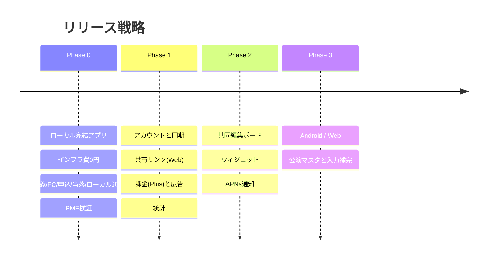

# 参戦名義帳 — 開発設計書

モック `../meigi-app-moc-dads.html` を実装可能な設計に落とした一式です。

> **参戦名義帳**: 複数のファンクラブ名義（自分・家族・友人）と、その名義で出したライブ申込・当落を1か所で管理し、
> 名義を貸してくれた人や同行者と必要な範囲だけ共有できるiOSアプリ。

---

## 結論サマリ

### 技術スタック

| レイヤ | 採用 | 決め手 |
|--------|------|--------|
| フロントエンド | **Swift 6 / SwiftUI（iOS 17+）+ SwiftData** | 指定要件。ローカルを唯一の読み取り源にしてオフライン完結 |
| バックエンド | **NestJS（TypeScript）+ Prisma** | ユーザー指定。認可・課金・共有をアプリ層で明示制御 |
| 実行環境 | **GCP Cloud Run** | コンテナ・scale-to-zero。低トラフィック時の常駐費を抑える |
| DB | **Supabase PostgreSQL**（ホスティングのみ） | 集計ビューと相性が良い。Free で ¥0 開始。NestJS + Prisma が唯一のクライアント |
| 共有ボード | iOS アプリ内 SharedBoard | トークン付きリンクをアプリで開く。NestJS `GET/PATCH /public/shares/:token`。**独立 Web ビューは作らない**（2026-08-05） |
| 課金 / 広告 | StoreKit 2 + RevenueCat / AdMob | Webhook は NestJS が受信 |

**BEは NestJS + Cloud Run です。** 認可（`owner_id`）・名義上限・共有トークン・RevenueCat Webhook を
NestJS の Guard / Service に載せ、DBは PostgreSQL（Prisma）に集約します。
Phase 0 は引き続きサーバーなし（SwiftDataのみ）で、PMF検証後に Cloud Run を立てます。

### インフラコスト（見込み・$1=¥155）

| 段階 | 月額の目安（Apple込み） |
|------|------------------------|
| Phase 0（ローカル完結） | **≈ ¥1,279**（Apple年会費のみ） |
| Phase 1 立ち上げ（Supabase Free） | **≈ ¥1,300〜1,700**（DB ¥0 が主因。Cloud Run 従量のみ） |
| Phase 1 本番安定（Supabase Pro 移行後） | **≈ ¥5,250〜5,600**（Pro ≈$25 ≈¥3,875 が支配項） |
| MAU 1万（Pro 前提） | **≈ ¥7,500〜10,800** |
| MAU 10万 | **≈ ¥26,000〜56,000**（DB 上位 or Cloud SQL 移行が主因になりうる） |

初期検証は **Cloud Run + Supabase Free（または Neon Free）** で合計 ≈ ¥1,300〜1,700。
MAU 増加・本番安定時は Supabase Pro へ移行。GCP 一体運用や大規模化時は **Cloud SQL** もオプション。
詳細は [06-infrastructure.md](./06-infrastructure.md)。損益対比・初年度一時費用は [07-monetization.md](./07-monetization.md) 8章。
要点: `min instances=0` / ローカル通知 / 画像なし / Realtimeなし / 共有はアプリ内 SharedBoard。

### 収益化

無料版は**名義10件まで**＋広告、Plus（月¥350 / 年¥2,800）で名義無制限・広告なし・同期・共有・統計。

**申込件数は制限しません。** 蓄積された記録こそが乗り換えコストであり、
制限すると記録習慣そのものが壊れて継続率が死ぬためです。制限は名義数だけに集中させます。
名義追加は「価値を認めた後」の行動なので、ペイウォールが自然な位置に来ます。

| MAU | 月間売上 | 月次費用 | 営業損益 | 内訳 |
|-----|---------:|---------:|---------:|------|
| 1,000 | ¥10,512 | ¥1,500（Free） | **¥9,012** | サブスク67% / 広告33% |
| 10,000 | **¥105,120** | ¥9,100（Pro） | **¥96,020** | 同上 |
| 50,000 | ¥525,600 | ¥25,500 | **¥500,100** | 同上 |

損益分岐は **MAU 約870**（Pro・費用¥9,100時）／ Phase 1 Free なら約140。前提は課金率3%・eCPM ¥250・Apple手数料15%（Small Business Program）で、
1契約あたり月間手取りブレンドは¥234。**広告を切ってもサブスクだけで黒字**の構造。詳細は [07-monetization.md](./07-monetization.md)。

### 設計初期から織り込むべき最大のリスク

**「名義貸し・転売支援アプリ」とストア審査で受け取られること。** これはリリース自体を不可能にします。
訴求を「家族・友人と一緒に応募した記録の管理」に統一し、譲渡・価格提示・取引に関わる機能を一切持たない設計にします。
次に**他人（家族・友人）の氏名とFC会員番号を預かる**という個人情報リスク。会員番号は任意項目。
全桁を平文で保存・常時表示する（2026-08-20 暗号化・下4桁表示を撤回）。共有時はマスキング既定を維持。詳細は [08-compliance-risk.md](./08-compliance-risk.md)。

---

## 読む順序

初めて読む場合は上から順に。特定の関心から入る場合は下の表を使ってください。

| # | ドキュメント | 内容 |
|---|-------------|------|
| 00 | [設計前提サマリ](./00-design-basis.md) | **まずこれ**。全設計書が共有する前提・決定事項の1枚まとめ |
| 01 | [プロダクト概要・要件定義](./01-product-overview.md) | 課題、ペルソナ、要件一覧、画面一覧（S1〜S12）、用語集 |
| 10 | [モック更新差分](./10-mock-delta-2026-07-31.md) | 2026-07-31 モック再レビュー。認証・カラー分離・ホーム再編など |
| 02 | [アーキテクチャ・技術スタック選定](./02-architecture.md) | NestJS + Cloud Run 構成、**Controller/UseCase/Service/Prisma**、ADR、同期設計、プラン上限 |
| 03 | [データベース設計](./03-database.md) | ER図、DDL、集計ビュー（認可はNestJSが正。RLSは任意） |
| 04 | [API設計](./04-api.md) | NestJS REST `/v1`、同期 pull/push、共有公開API、Webhook |
| 05 | [iOSクライアント設計](./05-ios-client.md) | モジュール構成、SwiftDataモデル、画面実装対応表、DADSデザイントークン、通知、課金・広告の組み込み |
| 06 | [インフラ・コスト](./06-infrastructure.md) | フェーズ別構成図、コスト試算4段階、削減の工夫、バックアップ、監視、環境戦略、CI/CD |
| 07 | [収益化設計](./07-monetization.md) | プラン仕様、ペイウォール、広告配置、**予想コストと売上・損益** |
| 08 | [法務・審査リスク](./08-compliance-risk.md) | ストア審査対策、App Store説明文ドラフト、個人情報保護、暗号化方針、セキュリティ、リスク一覧 |
| 09 | [ロードマップ](./09-roadmap.md) | フェーズ定義、工数見積り、ガント、リリース計画、KPI、意思決定ゲート、拡張候補 |
| 11 | [開発環境の接続手順](./11-dev-environment-setup.md) | Docker BE + iOSシミュレータの接続、Apple/Google/RevenueCat/AdMobキーの設定 |
| 12 | [App Store 提出手順](./12-app-store-release.md) | 署名設定、アーカイブ、TestFlight、審査提出チェックリスト |

### 関心別の入口

| 知りたいこと | 読む場所 |
|-------------|---------|
| なぜ NestJS + Cloud Run なのか | [02](./02-architecture.md) ADR-001 |
| NestJS の層構成（Controller/UseCase/Service） | [02](./02-architecture.md) ADR-009 |
| テーブル定義を見たい | [03](./03-database.md) |
| いくらかかるのか | [06](./06-infrastructure.md) / [07](./07-monetization.md) 8章 |
| いくら儲かるのか | [07](./07-monetization.md) 売上・損益試算 |
| リリースできないリスクは何か | [08](./08-compliance-risk.md) 1章 |
| いつ何を作るのか | [09](./09-roadmap.md) |
| モックのどの機能がどの要件になったか | [01](./01-product-overview.md) 3章・8章 |

---

## フェーズ方針

Phase 0 の継続率が基準を下回った場合、Phase 1 に進まない判断をします（基準値は [09-roadmap.md](./09-roadmap.md)）。
サーバーを持たないので、撤退コストはゼロです。

---

## 設計を貫く5つの判断

この設計書が繰り返し立ち返っている判断を明示しておきます。実装中に迷ったらここに戻ってください。

1. **UIが読むのはローカルDBだけ。** NestJS は同期の相手であって、画面の依存先ではない。
2. **認可の正は NestJS。** すべてのユーザーデータ操作に `owner_id` を強制する。RLSは任意の二重防衛。
3. **ユーザーが入力したデータを黙って消さない。** 上限超過・同期失敗・プラン降格でもデータは残して状態を明示する。
4. **蓄積を制限しない。** 課金の制限は名義数だけ。記録の量と質はプロダクトの価値そのもの。
5. **転売・譲渡に一歩も踏み込まない。** 便利そうな機能でも、この線を越えるものは実装しない。
